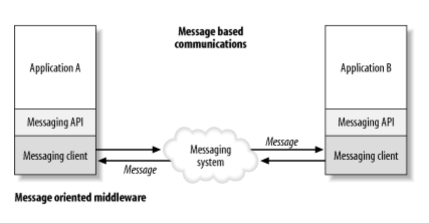

# Message-Oriented Middleware

## Message Middleware Intro

Message Oriented Middleware is a concept that involves the passing of data between applications using a communication channel that carries self-contained units of information (messages). 

## Message Middleware Option

Information transfer between different application can be achieved in many different ways, but most efficient solution so far (2021) is with Message Queue.

### Message Queue

A message queue provides an asynchronous communications protocol, which is a system that puts a message onto a message queue and does not require an immediate response to continuing processing. An example of this is IBM MQ

### Message bus （ESB）

A Message Bus is a messaging infrastructure to allow different systems to communicate through a shared set of interfaces(message bus). An example of message bus is TIBCO. 

**Message Queue vs. Message Bus**

The idea of BUS vs. QUEUE is now a legacy concept. It is stemming from systems like IBM MQ and Tibco Rendezvous. MQ was originally a 1:1 system, while Tibco by contrast was having multiple publishers and subscribers on the same topics.

### Web Services

Applications can communicate directly through web services or APIs based on standard protocols. However, one drawback is that web services cannot guarantee message delivery. Also web services are lack of pub/sub distribution models. 

### Databases

Databases can be used as an alternative to message queues, but they should serve different purposes and are not readily interchangeable. Database are used for storage, and and allow the same information being used over and over again. A message queue-like database is possible, but it cannot be scalable for larger applications.

## Message Queue Available in Market

### IBM MQ

### Kafka MQ

### Rabbit MQ
