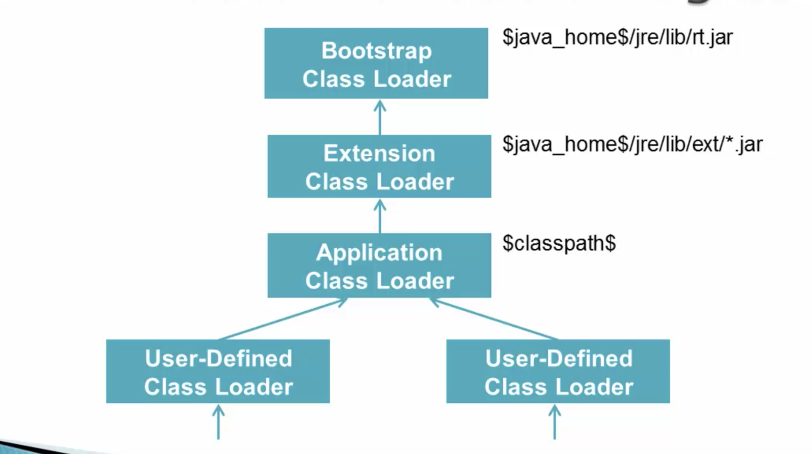

# JVM Object Initializaton


## Lifetime of a Type


This note discusses how JVM create a object type from class file. It has three stages, namely, loading, linking and Initialization.


### Loading 

Class loading is a process to create **java.lang.Class**, which stores the corresponding class information of a type.

#### java.lang.Class

java.lang.Class class instance represent classes, interfaces, primitives, void, and arrays in a running Java application. It has no public constructor.


Class object contains meta-information about class.

```
String getName();
Class getSuperClass();
boolean isInterface();
Class[] getInterface();
ClassLoader getClassLoader();
```

#### When is loading happens

The loading of Class happens:
1. new instance is created
2. invoking static method 
3. Accessing static field. Exception compile-time constants
4. Subclass is loaded or Sub-interface is loaded
5. Run from command line
6. Reflection

The loading of interface happens when the above mentioned happens except "new instance is created".


#### How loading happens


Classloader will try to find Class object in heap first. If not found, it will try to find the class file based on the type and path, and then create the object. If the class is not found, it will give ClassNotFoundException.


#### Type of Classloader



There are 4 different types of classloaders. They have parent-child relationships. Bootstrap classloader, is the top parent class, will start to search first, then extension class loader, then Application class loader, and last user-defined classload. There is no security check when being loaded by bootstrap classloaderm and more security check as go down from above figure.

```Java
public void printClassLoaders() throws ClassNotFoundException {

    // Application class loader loads our own files in the classpath.
    System.out.println("Classloader of this class:"
        + PrintClassLoader.class.getClassLoader());

    // Extension class loaders load classes 
    // that are an extension of the standard core Java classes.
    System.out.println("Classloader of Logging:"
        + Logging.class.getClassLoader());

    // The bootstrap one loads the ArrayList class.
    System.out.println("Classloader of ArrayList:"
        + ArrayList.class.getClassLoader());
}
```

```
Class loader of this class:sun.misc.Launcher$AppClassLoader@18b4aac2
Class loader of Logging:sun.misc.Launcher$ExtClassLoader@3caeaf62
Class loader of ArrayList:null //bootstrap class loader displayed as null
```


### Linking (Dynamic Linking in Java)

After class being loaded, the next stage is linking. Linking has three steps, namely, verification, preparation, and resolution.

#### Verification

**Bytecode verifier**: it checks for conformity with language rules. 
* final classes are not sub-classed
* final methods are not overridden
* No illegal method overloading
* bytecode integrity
  * jump instruction (if condition) does not send VM beyond end of method

#### Preparation

This steps is to allocate space for static variables, and initialize with default values. At this stage, if no space available, OutOfMemoryError will be thrown.

#### Resolution (Optional)

Resolution is the process of dynamically determining concrete values from symbolic references in the run-time constant pool. If an error occurs during resolution of a symbolic reference, then an instance of IncompatibleClassChangeError must be thrown at a point in the program that uses the symbolic reference.

"Symbolic references" are strings that can be used to retrieve the actual object.

Example

```java
if (obj.getClass() == String.class) {
    // do something
}
```

```
aload_1
invokevirtual   #21; //Method java/lang/Object.getClass:()Ljava/lang/Class;
ldc     #25; //class java/lang/String
if_acmpne       20
```

In this case, the `ldc` operation refers to a class that is stored symbolically. When the JVM executes this opcode, it will use the symbolic reference to identify the actual class within the current classloader, and return a reference to the class instance.


### Initialization  

The last stage is to initialize the variable
Initialize variable.

* Super classes are loaded first.
* Interface are loaded, but not initialized. It will only initialized when it's static method being accessed. (Before Java 8, interface doesn't have static method)
* Field initialized via method.
  


