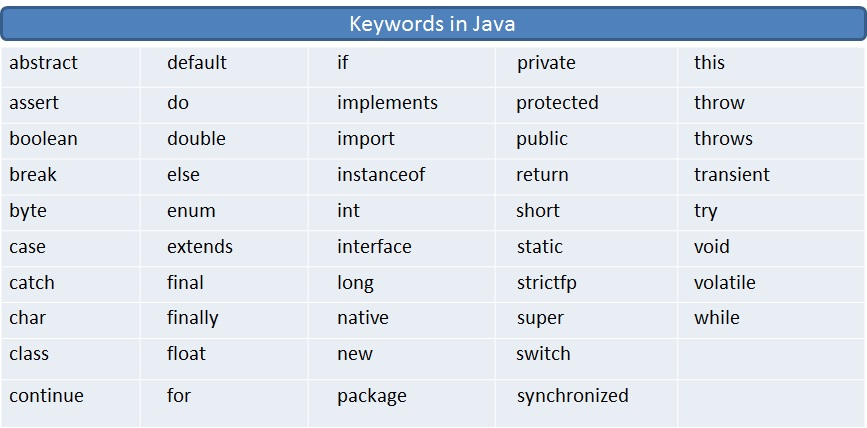

# Java Notes(0) Keyword Reference


# All 48 Java Keywords with Examples

Table below lists 48 Keywords in Java.



## 1) abstract

abstract keyword is used to implement the abstraction in java. A method which doesn’t have method definition must be declared as abstract and the class containing it must be declared as abstract. You can’t instantiate abstract classes. Abstract methods must be implemented in the sub classes. You can’t use abstract keyword with variables and constructors.

```java
abstract class AbstractClass
{
    abstract void abstractMethod();
}
```

## 2) assert

assert keyword is used in the assertion statements. These statements will enable you to test your assumptions about a program. Assertion statements provide the best way to detect and correct the programming errors. Assertion statements take one boolean expression as input and assumes that this will be always true. If the boolean expression returns false, AssertionError will be thrown.

```java
public class MainClass
{
    public static void main(String[] args) 
    {
        System.out.println("Enter your marks");
         
        Scanner sc = new Scanner(System.in);
         
        int marks = sc.nextInt();
         
        assert marks > 35 : "FAIL";
    }
}
```

## 3) boolean

boolean keyword is used to define boolean type variables. boolean type variables can hold only two values – either true or false.

```java
boolean isActive = true;
```

## 4) break

The break keyword is used to stop the execution of a loop(for, while, switch-case) based on some condition.


```java
public class MainClass
{
    public static void main(String[] args) 
    {
        for (int i = 0; i < 100; i++)
        {
            System.out.println(i);
             
            if(i == 50)
            {
                break;
            }
        }
    }
}
```

## 5) byte

byte keyword is used to declare byte type of variables. A byte variable can hold a numeric value in the range from -128 to 127.


```java
byte b = 50;
```

## 6) switch       7) case

Both switch and case keywords are used in the switch-case statement.


```java
public class MainClass
{
    public static void main(String[] args) 
    {
        Scanner sc = new Scanner(System.in);
         
        System.out.println("Enter Day :");
         
        int day = sc.nextInt();
         
        switch (day)
        {
            case 1 : System.out.println("SUNDAY");
            break;
             
            case 2 : System.out.println("MONDAY");
            break;
 
            case 3 : System.out.println("TUESDAY");
            break;
             
            case 4 : System.out.println("WEDNESDAY");
            break;
             
            case 5 : System.out.println("THURSDAY");
            break;
             
            case 6 : System.out.println("FRIDAY");
            break;
             
            case 7 : System.out.println("SATURDAY");
            break;
             
            default: System.out.println("Invalid");
            break;
        }
    }
}
```

## 8) try     9) catch     10) finally

try, catch and finally keywords are used to handle the exceptions in java. The statements which are to be monitored for exceptions are kept in the try block. The exceptions thrown by the try block are caught in the catch block. finally block is always executed.


```java
public class MainClass
{
    public static void main(String[] args) 
    {
        try
        {
            int i = Integer.parseInt("abc");
        }
        catch(NumberFormatException ex)
        {
            System.out.println(ex);
        }
        finally
        {
            System.out.println("This will be always executed");
        }
    }
}
```

## 11) char

char keyword is used to declare primitive char type variables. char represents the characters in java.


```java
char a = 'A';
         
char b = 'B';
         
char c = 'C';
```

## 12) class

class keyword is used to define the classes in java.


```java
class MyClass
{
    class MyInnerClass
    {
        //Inner Class
    }
}
```

## 13) continue

continue keyword is used to stop the execution of current iteration and start the execution of next iteration in a loop.


```java
public class MainClass
{
    public static void main(String[] args) 
    {
        for (int i = 0; i <= 100; i++)
        {
            if(i % 5 != 0)
            {
                continue;
            }
             
            System.out.println(i);
        }
    }
}
```

## 14) default

default keyword is used to define the default methods in an interface (From Java 8). default keyword is also used in the switch-case statements.


```java
interface MyInterface 
{
    public default void myDefaultMethod() 
    {
        System.out.println("Default Method");
    }
}
```

## 15) do

do keyword is used in a do–while loop. do-while loop is used to execute one or more statements repetitively until a condition returns false.


```java
public class MainClass
{
    public static void main(String[] args) 
    {
        int a = 10;
         
        int b = 20;
         
        do
        {
            a = a + b;
             
            b = b + 10;
             
            System.out.println("a = "+a);
             
            System.out.println("b = "+b);
             
        } while (a <= 100);
    }
}
```

## 16) double

double keyword is used to declare primitive double type of variables.


```java
public class MainClass
{
    public static void main(String[] args) 
    {
        double d1 = 23.56;
         
        double d2 = 56.23;
         
        double d3 = d1 + d2;
         
        System.out.println(d3);
    }
}
```

## 17) if         18) else

if and else keywords are used in if-else block.


```java
public class MainClass
{
    public static void main(String[] args) 
    {
        Scanner sc = new Scanner(System.in);
         
        System.out.println("Enter a string :");
         
        String input = sc.next();
         
        if(input.equalsIgnoreCase("JAVA"))
        {
            System.out.println("It's JAVA");
        }
        else
        {
            System.out.println("It's not JAVA");
        }
    }
}
```

## 19) enum

enum keyword is used to define enum types.


```java
enum MyEnums
{
    A, B, C, D;
}
```

## 20) extends

extends keyword is used in inheritance. It is used when a class extends another class.


```java
class SuperClass
{
    //Super Class
}
 
class SubClass extends SuperClass
{
    //Sub Class
}
```

## 21) final

final keyword is used when a class or a method or a field doesn’t need further modifications. final class can’t be extended, final method can’t be overridden and the value of a final field can’t be changed.

A final variable that is not initialized at the time of declaration is known as blank final variable. This can only be initialized in constructor.


```java
final class FinalClass
{
    final int finalVariable = 10;
     
    final void finalMethod()
    {
        //final method
    }
}
```

## 22) float

float keyword indicates primitive float type of variables.


```java
public class MainClass
{
    public static void main(String[] args) 
    {
        float f1 = 45.26f;
         
        float f2 = 84.25f;
         
        float f3 = f2 - f1;
         
        System.out.println(f3);
    }
}
```

## 23) for

for loop is used to execute the set of statements until a condition is true.


```java
public class MainClass
{
    public static void main(String[] args) 
    {
        for (int i = 0; i <= 10; i++)
        {
            System.out.println(i);
        }
    }
}
```

## 24) implements

implements keyword is used while implementing an interface.


```java
interface MyInterface
{
    void myMethod();
}
 
class MyClass implements MyInterface
{
    public void myMethod()
    {
        System.out.println("My Method");
    }
}
```

## 25) import

import keyword is used to import the members of a particular package into current java file.


```java
import java.sql.*;
import java.util.Arrays;
import java.util.Scanner;
```

## 26) instanceOf

instanceof operator is used to test whether the object is an instance of the specified type (class/subclass/interface). 
The syntax for using instanceOf keyword is “Object_Reference instanceOf Type“.


```java
class A
{
     
}
 
public class MainClass
{
    public static void main(String[] args) 
    {
        A a = new A();
         
        if(a instanceof A)
        {
            System.out.println("a is of type A");
        }
    }
}
```

## 27) int

int keyword is used to declare primitive integer type of variables.


```java
public class MainClass
{
    public static void main(String[] args) 
    {
        int i1 = 10;
         
        int i2 = 20;
         
        int i3 = i1 *  i2;
         
        System.out.println(i3);
    }
}
```

## 28) interface

interface keyword is used to define the interfaces in java.


```java
interface MyInterface
{
    void myMethod();
}
```

## 29) long

long is used to define the primitive long type variables.


```java
public class MainClass
{
    public static void main(String[] args) 
    {
        long l1 = 101;
         
        long l2 = 202;
         
        long l3 = l1 +  l2;
         
        System.out.println(l3);
    }
}
```

## 30) native

native keyword is used with a method to indicate that a particular method is implemented in native code using Java Native Interfaces(JNI).


```java
class AnyClass
{
    public native void anyMethod(int i, double d);
}
```

## 31) new

new keyword is used while creating the instances of a class.


```java
class A
{
     
}
 
public class MainClass
{
    public static void main(String[] args) 
    {
        A a = new A();
    }
}
```

## 32) package

Java package is used to categorize the classes and interfaces, provides access protection and removes naming collision.*
- Package inside the package is called the subpackage.
- If you import a package (package.* ), subpackages will not be imported.
- To import subpackage, use import package.classname.
- The standard of defining package is domain.company.package. eg - com.oracle.database
- There can be only one public class in a java source file and it must be saved by the public class name.


```java
package pack1;
 
class A
{
     
}
```

## 33) private

private keyword is used to declare a member of a class as private. private methods and fields are visible within the class in which they are defined.


```java
class A
{
    private int i = 111;   //private field
     
    private void method()
    {
        //private method
    }
}
```

## 34) protected

protected keyword is used to declare a member of a class as protected. protected members of a class are visible within the package only, but they can be inherited to any sub classes.


```java
class A
{
    protected int i = 111;   //protected field
     
    protected void method()
    {
        //protected method
    }
}
```

## 35) public

public keyword is used to declare the members of a class or class itself as public. public members of a class are visible from anywhere and they can be inherited to any sub classes.


```java
public class A
{
    public int i = 222;   //public field
     
    public A()
    {
        //public constructor
    }
     
    public void method()
    {
        //public method
    }
}
```

## 36) return

return keyword is used to return the control back to the caller from the method.


```java
class A
{
    int method(int i)
    {
        return i*i;     //method returning a value
    }
}
```

## 37) short

short keyword is used to declare primitive short type variables.


```java
short s1 = 11;
         
short s2 = 22;
```

## 38) static

- The static can be: variable (class variable), method (class method), block & nested class.
- Java static property is shared to all objects, no need to instantiate a class.
- A static method belongs to the class rather than object of a class.
- A static method can be invoked without the need for creating an instance of a class.
- A static method can access static data member and can change the value of it.
- The static method can not use non static data member or call non-static method directly.
- this and super cannot be used in static context.
- The main method is static because object is not required to call static method if it were non-static method, jvm create object first then call main() method that will lead the problem of extra memory allocation.
- A static block is used to initialize the static data member. It is executed before main method at the time of classloading.
- A constructor cannot be declared final because it is never inherited.
- A static final variable that is not initialized at the time of declaration is known as static blank final variable. It can be initialized only in static block


```java
class A
{
    static int staticField = 555;    //Static Field
     
    static void staticMethod()
    {
        //Static method
    }
}
 
public class MainClass
{
    public static void main(String[] args) 
    {
        System.out.println(A.staticField);    //Accessing staticField via class name
         
        A.staticMethod();     //Accessing staticMethod via class name
    }
}
```

## 39) strictfp

strictfp keyword is used to implement the strict precision of floating point calculations on different platforms. strictfp can be used with classes, interfaces and methods.


```java
strictfp interface I
{
    //strictfp applied on interface
}
 
strictfp class C
{
    //strictfp applied on class
}
 
class A
{
    strictfp void method()
    {
        //strictfp applied on method
    }
}
```

## 40) super

The **super** keyword is used to access super(the closest parent) class members inside a sub class.


```java
class A
{
    int i;
     
    public A(int i) 
    {
        this.i = i;
    }
     
    void methodA()
    {
        System.out.println(i);
    }
}
 
class B extends A
{
    public B()
    {
        super(10);    //Calling super class constructor
    }
     
    void methodB()
    {
        System.out.println(super.i);    //accessing super class field
         
        super.methodA();    //Calling super class method
    }
}
```

## 41) synchronized

synchronized keyword is used to implement the synchronization in java. only one thread can enter into a method or a block which is declared as synchronized. Any thread which wants to enter synchronized method or block must acquire object lock of those methods or blocks.


```java
class AnyClass
{
    synchronized void synchronizedMethod()
    {
        //Synchronized method
    }
     
    void anyMethod()
    {
        synchronized (this) 
        {
            //Synchronized block
        }
    }
}
```

## 42) this

The **this** keyword refers to the current object in a method or constructor.

The most common use of the **this** keyword is to eliminate the confusion between class attributes and parameters with the same name (because a class attribute is shadowed by a method or constructor parameter). 

```java
public class Main {
  int x;

  // Constructor with a parameter
  public Main(int x) {
    // If  omit the keyword in this example, the output would be "0" instead of "5".
    this.x = x;
  }

  // Call the constructor
  public static void main(String[] args) {
    Main myObj = new Main(5);
    System.out.println("Value of x = " + myObj.x);
  }
}
```


**this()** refers to the the first constructor.

```java
class AnyClass
{
    int i;
  
    AnyClass()
    {
        System.out.println("First Constructor");
    }
  
    AnyClass(int j)
    {
        this();    //calling statement to First Constructor
        System.out.println("Second Constructor");
    }
  
    void methodOne()
    {
        System.out.println("From method one");
    }
  
    void methodTwo()
    {
        System.out.println(this.i);  //Accessing same class field
        this.methodOne();      //Accessing same class method
    }
}
```

## 43) throw

throw keyword is used to throw the exceptions manually.


```java
public class MainClass
{
    public static void main(String[] args) 
    {
        try
        {
            //throwing NumberFormatException manually 
             
            throw new NumberFormatException();
        }
        catch(Exception ex)
        {
            System.out.println(ex);
        }
    }
}
```

## 44) throws

throws keyword is used to specify the exceptions which the current method may throw.


```java
class A
{
    void method() throws NumberFormatException
    {
        int i = Integer.parseInt("abc");
    }
}
```

## 45) transient

transient keyword is used in serialization. A variable which is declared as transient will not be eligible for serialization.


```java
class MyClass implements Serializable
{
    int a;
     
    transient String s;   //This will not be serialized
     
    double d;
}
```

## 46) void

void keyword is used to indicate that method returns nothing.


```java
class A
{
    void methodReturnsNothing()
    {
        //Method returns no value
    }
}
```

## 47) volatile

volatile keyword is used in the concurrent programming. The value of a variable which is declared as volatile will be written into or read from the main memory.


```java
class A
{
    public volatile int counter = 0;
}
```

## 48) while

while keyword is used in the while loop.


```java
public class MainClass
{
    public static void main(String[] args) 
    {
        int i = 10;
         
        while (i <= 100)
        {
            System.out.println(i);
             
            i = i + 10;
        }
    }
}
```
# Data Types in Java

<table class="alt"> 
<tbody><tr> 
  <th id="table_dvpt_datatype"><strong>Data Type</strong></th> 
  <th id="table_dvpt_defaultvalue"><strong>Default Value</strong></th> 
  <th id="table_dvpt_defaultsize"><strong>Default size</strong></th> 
</tr> 
<tr> 
<td headers="table_dvpt_datatype">boolean</td> 
<td headers="table_dvpt_defaultvalue">false</td> 
<td headers="table_dvpt_defaultsize">1 bit</td> 
</tr> 
<tr> 
<td headers="table_dvpt_datatype">char</td> 
<td headers="table_dvpt_defaultvalue">'\u0000'</td> 
<td headers="table_dvpt_defaultsize">2 byte</td> 
</tr> 
<tr> 
<td headers="table_dvpt_datatype">byte</td> 
<td headers="table_dvpt_defaultvalue">0</td> 
<td headers="table_dvpt_defaultsize">1 byte</td> 
</tr> 
<tr> 
<td headers="table_dvpt_datatype">short</td> 
<td headers="table_dvpt_defaultvalue">0</td> 
<td headers="table_dvpt_defaultsize">2 byte</td> 
</tr> 
<tr> 
<td headers="table_dvpt_datatype">int</td> 
<td headers="table_dvpt_defaultvalue">0</td> 
<td headers="table_dvpt_defaultsize">4 byte</td> 
</tr> 
<tr> 
<td headers="table_dvpt_datatype">long</td> 
<td headers="table_dvpt_defaultvalue">0L</td> 
<td headers="table_dvpt_defaultsize">8 byte</td> 
</tr> 
<tr> 
<td headers="table_dvpt_datatype">float</td> 
<td headers="table_dvpt_defaultvalue">0.0f</td> 
<td headers="table_dvpt_defaultsize">4 byte</td> 
</tr> 
<tr> 
<td headers="table_dvpt_datatype">double</td> 
<td headers="table_dvpt_defaultvalue">0.0d</td> 
<td headers="table_dvpt_defaultsize">8 byte</td> 
</tr> 
</tbody></table>

# Data Type Promotion in Java :


# Wrapper Classes in Java

In Java, there is a wrapper class. This is supported by autoboxing/unboxing feature, which converts primitive into object/object into primitive automatically.

<table class="alt">
<tbody><tr><th>Primitive Type</th><th>Wrapper class</th></tr>
<tr><td>boolean</td><td>Boolean</td></tr>
<tr><td>char</td><td>Character</td></tr>
<tr><td>byte</td><td>Byte</td></tr>
<tr><td>short</td><td>Short</td></tr>
<tr><td>int</td><td>Integer</td></tr>
<tr><td>long</td><td>Long</td></tr>
<tr><td>float</td><td>Float</td></tr>
<tr><td>double</td><td>Double</td></tr>
</tbody></table>

# Operators in Java

<table class="alt"> 
<tbody><tr><th>Operator Type</th><th>Category</th><th>Precedence</th></tr> 
<tr> 
<td rowspan="2">Unary</td><td>postfix</td><td><code><em>expr</em>++ <em>expr</em>--</code></td> 
</tr>  
<tr> 
<td>prefix</td><td headers="precedence"><code>++<em>expr</em> --<em>expr</em> +<em>expr</em> -<em>expr</em> ~ !</code></td> 
</tr> 
<tr> 
<td rowspan="2">Arithmetic</td><td>multiplicative</td><td headers="precedence"><code>* / %</code></td> 
</tr> 
<tr> 
<td>additive</td><td headers="precedence"><code>+ -</code></td> 
</tr> 
<tr> 
<td>Shift</td><td>shift</td><td headers="precedence"><code>&lt;&lt; &gt;&gt; &gt;&gt;&gt;</code></td>  
</tr> 
<tr> 
<td rowspan="2">Relational</td><td>comparison</td><td headers="precedence"><code>&lt; &gt; &lt;= &gt;= instanceof</code></td> 
</tr> 
<tr> 
<td>equality</td><td headers="precedence"><code>== !=</code></td> 
</tr>  
<tr> 
<td rowspan="3">Bitwise</td><td>bitwise AND</td><td headers="precedence"><code>&amp;</code></td> 
</tr> 
<tr> 
<td>bitwise exclusive OR</td><td headers="precedence"><code>^</code></td> 
</tr> 
<tr> 
<td>bitwise inclusive OR</td><td headers="precedence"><code>|</code></td> 
</tr>  
<tr> 
<td rowspan="2">Logical</td><td>logical AND</td><td headers="precedence"><code>&amp;&amp;</code></td> 
</tr> 
<tr> 
<td>logical OR</td><td headers="precedence"><code>||</code></td> 
</tr> 
<tr> 
<td>Ternary</td><td>ternary</td><td headers="precedence"><code>? :</code></td> 
</tr> 
<tr> 
<td>Assignment</td><td>assignment</td><td headers="precedence"><code>= += -= *= /= %= &amp;= ^= |= &lt;&lt;= &gt;&gt;= &gt;&gt;&gt;=</code></td> 
</tr> 
</tbody></table>

# Java Naming Conventions:

<table class="alt">
<tbody><tr><th>Name</th><th>Convention</th></tr>
<tr><td>class name</td><td> should start with uppercase letter and be a noun 
<br>e.g. String, Color, Button, System, Thread etc.</td></tr>
<tr><td>interface name</td><td>should start with uppercase letter and be an adjective 
<br>e.g. Runnable, Remote, ActionListener etc.</td></tr>
<tr><td>method name</td><td>should start with lowercase letter and be a verb 
<br>e.g. actionPerformed(), main(), print(), println() etc.
</td></tr>
<tr><td>variable name</td><td>should start with lowercase letter
<br>e.g. firstName, orderNumber etc.</td></tr>
<tr><td>package name</td><td>should be in lowercase letter 
<br>e.g. java, lang, sql, util etc.
</td></tr>
<tr><td>constants name</td><td>should be in uppercase letter.
<br>e.g. RED, YELLOW, MAX_PRIORITY etc.</td></tr>
</tbody></table>

