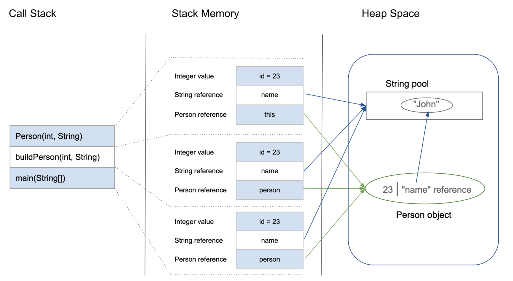

# Java Notes(14) Stack Memory and Heap Space


JVM divides memory into stack and heap memory. 

# Stack Memory

**Stack Memory in Java is used for static memory allocation and the execution of a thread**. 
It contains primitive values that are specific to a method and references to objects that are in a heap, referred from the method.

Access to this memory is in **Last-In-First-Out (LIFO)** order. Whenever a new method is called, a new block on top of the stack is created which contains values specific to that method, like primitive variables and references to objects.

When the method finishes execution, it’s corresponding stack frame is flushed, the flow goes back to the calling method and space becomes available for the next method.

### Key Features of Stack Memory
Apart from what we have discussed so far, following are some other features of stack memory:

- It grows and shrinks as new methods are called and returned respectively
- Variables inside stack exist only as long as the method that created them is running
- It's automatically allocated and deallocated when method finishes execution
- If this memory is full, Java throws java.lang.StackOverFlowError
- Access to this memory is fast when compared to heap memory
- This memory is threadsafe as each thread operates in its own stack

# Heap Space

**Heap space in Java is used for dynamic memory allocation for Java objects and JRE classes at the runtime.** 
New objects are always created in heap space and the references to this objects are stored in stack memory.

These objects have global access and can be accessed from anywhere in the application.

This memory model is further broken into smaller parts called generations, these are:

1. Young Generation – this is where all new objects are allocated and aged. A minor Garbage collection occurs when this fills up.
   
2. Old or Tenured Generation – this is where long surviving objects are stored. When objects are stored in the Young Generation, a threshold for the object's age is set and when that threshold is reached, the object is moved to the old generation.
   
3. Permanent Generation – this consists of JVM metadata for the runtime classes and application methods


### Key Features of Java Heap Space

- It's accessed via complex memory management techniques that include Young Generation, Old or Tenured Generation, and Permanent Generation
- If heap space is full, Java throws java.lang.OutOfMemoryError
- Access to this memory is relatively slower than stack memory
- This memory, in contrast to stack, isn't automatically deallocated. It needs Garbage Collector to free up unused objects so as to keep the efficiency of the memory usage
- Unlike stack, a heap isn't threadsafe and needs to be guarded by properly synchronizing the code


## Analyze Memory Example

```java
class Person {
    int id;
    String name;

    public Person(int id, String name) {
        this.id = id;
        this.name = name;
    }
}

public class PersonBuilder {
    private static Person buildPerson(int id, String name) {
        return new Person(id, name);
    }

public static void main(String[] args) {
      int id = 23;
      String name = "John";
      Person person = null;
      person = buildPerson(id, name);
    }
}
```

1. Upon entering the main() method, a space in stack memory would be created to store primitives and references of this method
   - The primitive value of integer id will be stored directly in stack memory
   - The reference variable person of type Person will also be created in stack memory which will point to the actual object in the heap
2. The call to the parameterized constructor Person(int, String) from main() will allocate further memory on top of the previous stack. This will store:
   - The this object reference of the calling object in stack memory
   - The primitive value id in the stack memory
   - The reference variable of String argument name which will point to the actual string from string pool in heap memory
3. The main method is further calling the buildPerson() static method, for which further allocation will take place in stack memory on top of the previous one. This will again store variables in the manner described above.
4. However, for the newly created object person of type Person, all instance variables will be stored in heap memory.

This allocation is explained in this diagram:




# Summary Table


<table class="alt"> 
<tbody><tr> 
  <th id="table_dvpt_datatype"><strong>Parameter</strong></th> 
  <th id="table_dvpt_defaultvalue"><strong>Stack Memory</strong></th> 
  <th id="table_dvpt_defaultsize"><strong>Heap Space</strong></th> 
</tr> 
<tr> 
<td headers="table_dvpt_datatype">Application</td> 
<td headers="table_dvpt_defaultvalue">Stack is used in parts, one at a time during execution of a thread</td> 
<td headers="table_dvpt_defaultsize">The entire application uses Heap space during runtime</td> 
</tr> 
<tr> 
<td headers="table_dvpt_datatype">Size</td> 
<td headers="table_dvpt_defaultvalue">Stack has size limits depending upon OS and is usually smaller then Heap</td> 
<td headers="table_dvpt_defaultsize">There is no size limit on Heap</td> 
</tr> 
<tr> 
<td headers="table_dvpt_datatype">Storage</td> 
<td headers="table_dvpt_defaultvalue">Stores only primitive variables and references to objects that are created in Heap Space</td> 
<td headers="table_dvpt_defaultsize">All the newly created objects are stored here</td> 
</tr> 
<tr> 
<td headers="table_dvpt_datatype">Order</td> 
<td headers="table_dvpt_defaultvalue">It is accessed using Last-in First-out (LIFO) memory allocation system</td> 
<td headers="table_dvpt_defaultsize">This memory is accessed via complex memory management techniques that include Young Generation, Old or Tenured Generation, and Permanent Generation</td> 
</tr> 
<tr> 
<td headers="table_dvpt_datatype">Life</td> 
<td headers="table_dvpt_defaultvalue">Stack memory only exists as long as the current method is running</td> 
<td headers="table_dvpt_defaultsize">Heap space exists as long as the application runs</td> 
</tr> 
<tr> 
<td headers="table_dvpt_datatype">Efficiency</td> 
<td headers="table_dvpt_defaultvalue">Comparatively much faster to allocate when compared to heap</td> 
<td headers="table_dvpt_defaultsize">Slower to allocate when compared to stack</td> 
</tr> 
<tr> 
<td headers="table_dvpt_datatype">Allocation/Deallocation</td> 
<td headers="table_dvpt_defaultvalue">This Memory is automatically allocated and deallocated when a method is called and returned respectively</td> 
<td headers="table_dvpt_defaultsize">Heap space is allocated when new objects are created and deallocated by Gargabe Collector when they are no longer referenced</td> 
</tr> 
</tbody></table>

# Reference:
https://www.baeldung.com/java-stack-heap


