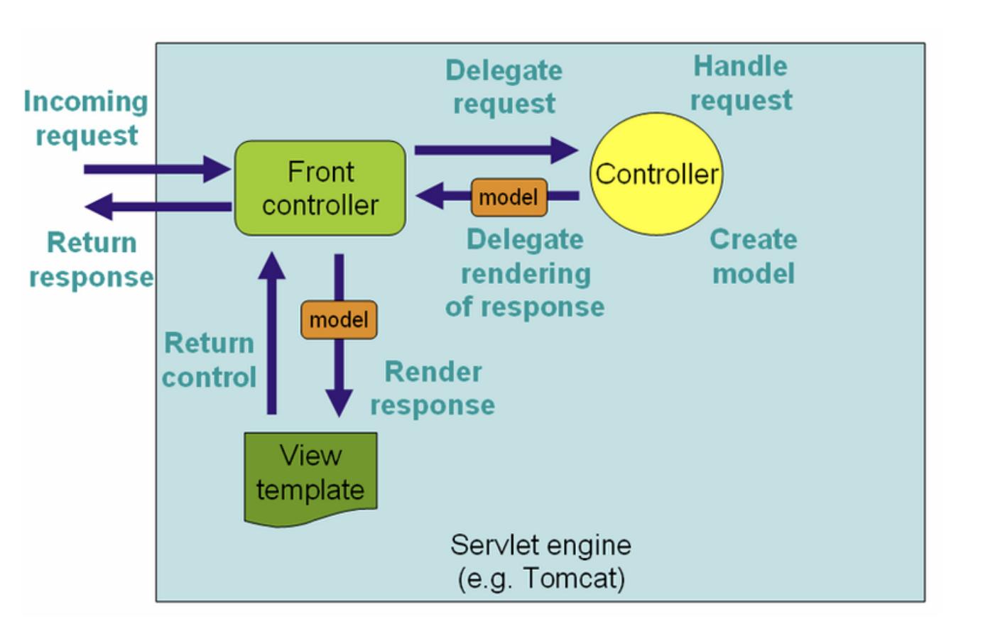

# Spring MVC

# Spring MVC

## Overview

A **Spring MVC** is a Java framework used to **build web applications** by following the **Model-View-Controller** design pattern with the help of **DispatcherServlet**.

**Model**: A model contains object of the application.
**Controller**: A controller contains the business logic of an application.
**View**: A view is a webpage rendered by template engine like JSP, FreeMarker, Thymelead and etc.
**Front Controller**: In Spring Web MVC, the Front Controller is DispatcherServlet, which manage the flow of the Spring MVC application.

## Request Mapping

Request mapping is to map http request with corresponding controller.

Detail of this can be found:
https://www.baeldung.com/spring-requestmapping

The @Requestmapping code can be simplified by following annotations.
* @GetMapping
* @PostMapping
* @PutMapping
* @DeleteMapping
* @PatchMapping

Detail of this can be found:
https://www.baeldung.com/spring-response-entity

## Model 
We can use model to supply attributes used for rendering views.

Detail of this can be found:
https://www.baeldung.com/spring-mvc-model-model-map-model-view

