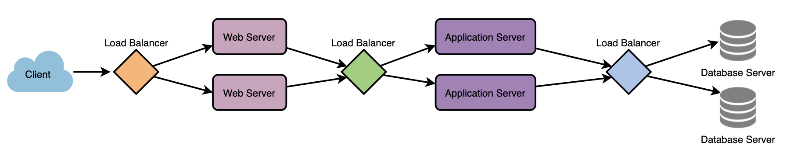
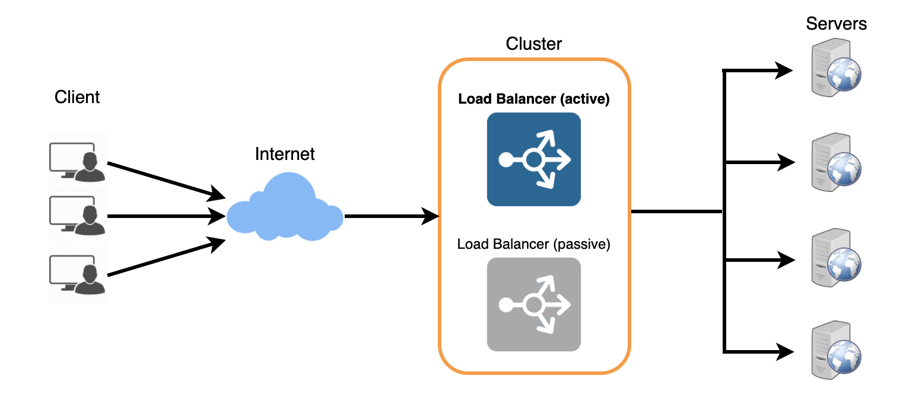

# Load Balancer

### Load Balancer

Load Balancer helps spread the traffic across a cluster of servers. Load Balancer also keeps track of the health status of all the resources while distributing requests. It will stop sending any traffic to a server that is not responding or has elevated error. To utilize full potential of load balancer, we can applies load balancer at three places:

   * Between the user and the web server
   * Between web servers and an internal platform layer, like application servers or cache servers
   * Between internal platform layer and database.

In the seven-layer Open System Interconnection (OSI) model, network firewalls are at levels one to three (L1-Physical Wiring, L2-Data Link and L3-Network). Meanwhile, **load balancing happens between layers four to seven (L4-Transport, L5-Session, L6-Presentation and L7-Application)**.

Load balancers have different capabilities, which include:

L4 — directs traffic based on data from network and transport layer protocols, such as IP address and TCP port.

L7 — adds content switching to load balancing. This allows routing decisions based on attributes like HTTP header, uniform resource identifier, SSL session ID and HTML form data.

### Load Balancing Algorithms

Load balancers consider two factors before forwarding a request to a backend server:

* If server is actually responding appropriately to requests.
* Use a pre-configured algorithm to select one from the set of healthy servers.

There are different types of algorithms serve for different needs:

* **Least Connection Method** — This method directs traffic to the server with the fewest active connections. This approach is quite useful when there are a large number of persistent client connections which are unevenly distributed between the servers.

* **Least Response Time Method** — This algorithm directs traffic to the server with the fewest active connections and the lowest average response time.

* **Least Bandwidth Method** - This method selects the server that is currently serving the least amount of traffic measured in megabits per second (Mbps).

* **Round Robin Method** — This method cycles through a list of servers and sends each new request to the next server. When it reaches the end of the list, it starts over at the beginning. It is most useful when the servers are of equal specification and there are not many persistent connections.

* **Weighted Round Robin Method** — The weighted round-robin scheduling is designed to better handle servers with different processing capacities. Each server is assigned a weight (an integer value that indicates the processing capacity). Servers with higher weights receive new connections before those with less weights and servers with higher weights get more connections than those with less weights.

* **IP Hash** — Under this method, a hash of the IP address of the client is calculated to redirect the request to a server.

### Redundant Load Balancers
load balancer can be a single point of failure. Thus a backup passive load balancer can be added. Both will monitor the health of each. In the case of failure detection, the backup load balancer can take over.

## Reference

https://www.educative.io/courses/grokking-the-system-design-interview/

https://avinetworks.com/what-is-load-balancing/
