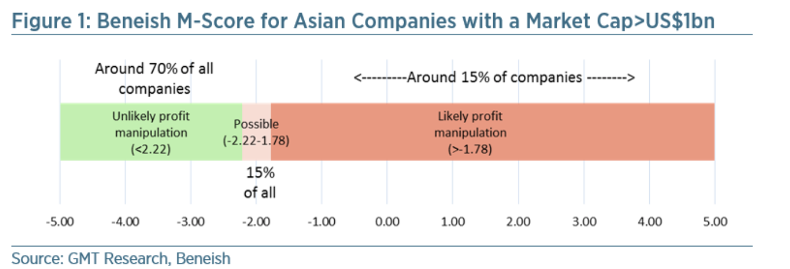

# Beneish Model

The Beneish model is a mathematical model that uses financial ratios and eight variables to identify whether a company has manipulated its earnings. It is used as a tool to uncover potential financial fraud. However, the result generated from beneish model can not be the evidence.

The variables are constructed from the data in the company's financial statements, and once calculated, create an M-Score to describe the degree to which the earnings have been manipulated.

Once these eight variables are calculated, they are then combined to achieve an M-Score for the company. An M-Score of less than -2.22 suggests that the company will not be a manipulator. An M-Score of greater than -2.22 signals that the company is likely to be a manipulator.

The Beneish model's eight variables are:

1. DSRI: Days' sales in a receivable index
2. GMI: Gross margin index
3. AQI: Asset quality index
4. SGI: Sales growth index
5. DEPI: Depreciation index
6. SGAI: Sales and general and administrative expenses index
7. LVGI: Leverage index
8. TATA: Total accruals to total assets

Beneish M-Score = -4.84 + 0.92*DSRI + 0.528*GMI + 0.404 * AQI + 0.892 * SGI + 0.115 * DEPI - 0.172 * SGAI + 4.679 *TATA - 0.327 * LVGI

 一，应收账款指数（DSRI，Days'Sales in Receivables Index）

$$ DSRI = \frac{本期应收账款占收入比例}{上期应收账款占收入比例} $$
$$ DSRI = \frac{(Net Receivables_t / Sales_t )}{(Net Receivables_{t-1} / Sales_{t-1})} $$

Sale的数据 如果没有在财报上，可以选择用Revenue来当Sale

一般公司的应收帐款应该比较稳定，如果有了突然的增长，则意味的企业经营可能出现恶化而被迫用信用销售来做调整。

二，毛利率指数（GMI，GrossMargin Index）

$$ GMI = \frac{上期毛利率}{本期毛利率} $$
$$ GMI = \frac{[(Sales_{t-1} - COGS_{t-1})/ Sales_{t-1}]}{[(Sales_t - COGS_t)/ Sales_t]}$$

如果指数大于1，则证明企业的盈利能力出现下滑。

CSGS - Cost of goods sold

三，资产质量指数（AQI，AssetQuality Index）

$$ AQI = \frac{本期非实物资产比例}{上期非实物资产比例} $$
$$ AQI = \frac{Non-current Asset_t/Total Assets_t}{Non-current Asset_{t-1}/Total Assets_{t-1}} $$

 如果指数大于1，则证明企业的资产质量出来下滑。

四，营业收入指数（SGI，SalesGrowth Index）

$$ SGI = \frac{本期销售收入}{上期销售收入} $$
$$ SGI = \frac{Sales_t}{Sales_{t-1}} $$

五，折旧率指数（DEPI，DepreciationIndex）

$$ DEPI = \frac{上期折旧率}{本期折旧率}$$
$$ DEPI = \frac{Depreciation_{t-1}/({PPE}_{t-1}+Depreciation_{t-1})}{Depreciation_{t}/({PPE}_{t}+Depreciation_{t})}$$

PPE is PP&E(Property, Plant, and Equipment)
公司如果折旧率下降，则证明公司有可能通过修改折旧的一些计算方法来提高公司的利润，这是一种常见的财务操作手法。

六，销售管理费用指数（SGAI，Sales,General, and Administrative Expenses Index）

$$ SGAI = \frac{本期销售管理占销售收入比例}{上期销售管理占销售收入比例} $$
$$ SGAI = \frac{SGA Expense_t/Sales_t}{SGA Expense_{t-1}/Sales_{t-1}} $$
如果销售管理费用增加，则表明企业在成本控制上遇到一定的问题。

七，财务杠杆指数（LVGI，LeverageIndex）

$$ LVGI = \frac{本期资产负债率}{上期资产负债率} $$
$$ LVGI = \frac{(Current Liabilities_t + Total Long Term Debt_t)/Total Assets_t}{(Current Liabilities_{t-1} + Total Long Term Debt_{t-1})/Total Assets_{t-1}} $$
如果公司的企业杠杆率越高，则财务风险越大。

八，应计系数（TATA，TotalAccruals to Total Asset）

TATA = \frac{应计项目}{总资产}$$
TATA = \frac{Income from Continuing Operations_t - Cash Flows from Operations_t}{Total Assets}$$
应计利润是一个重要的财务操纵指标，反应了公司所报出来的利润和实际的现金流收入的差值。

