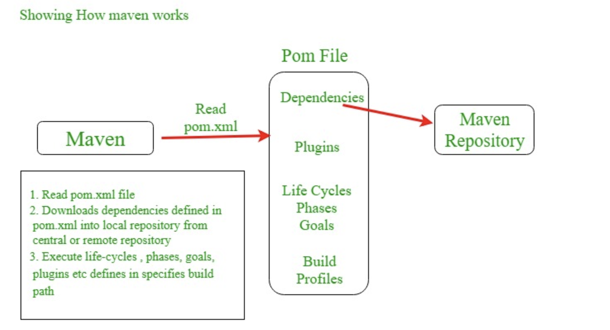
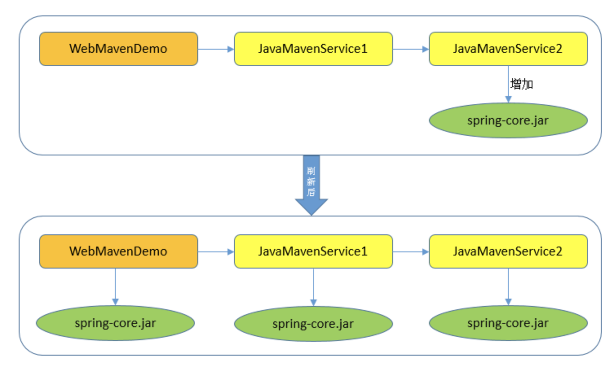
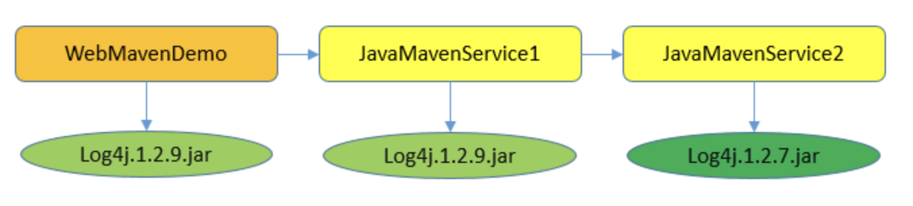
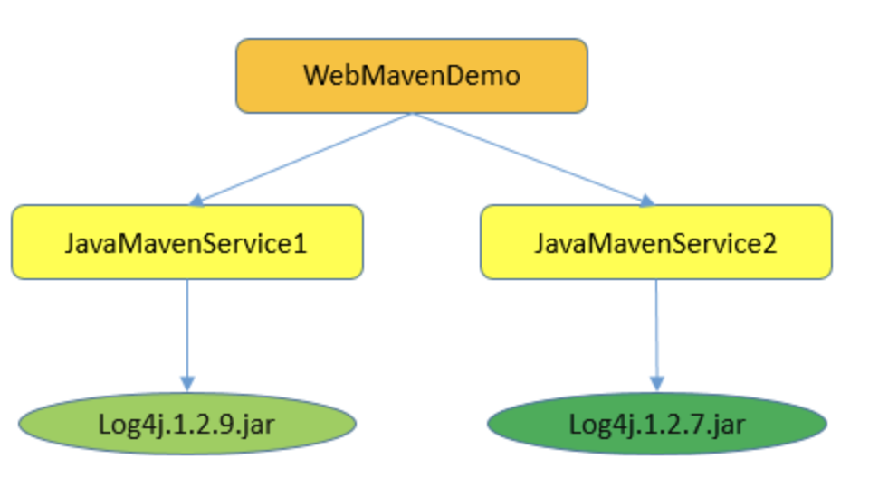
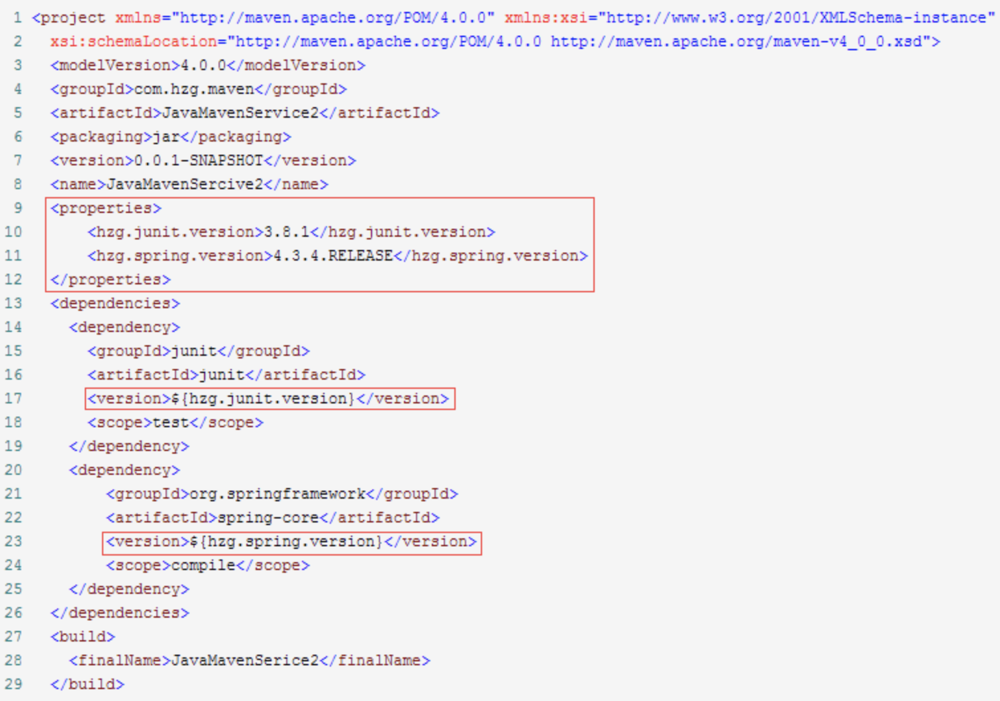
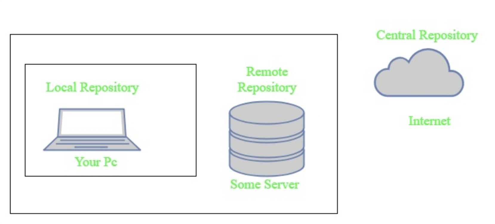

# Java Notes(16) Maven




## Core Concepts of Maven:

- POM Files: Project Object Model(POM) Files are XML file that contains information related to the project and configuration information such as dependencies, source directory, plugin, goals etc. used by Maven to build the project. When you should execute a maven command you give maven a POM file to execute the commands. Maven reads pom.xml file to accomplish its configuration and operations.

- Dependencies and Repositories: Dependencies are external Java libraries required for Project and repositories are directories of packaged JAR files. The local repository is just a directory on your machine hard drive. If the dependencies are not found in the local Maven repository, Maven downloads them from a central Maven repository and puts them in your local repository.


- Build Life Cycles, Phases and Goals: A build life cycle consists of a sequence of build phases, and each build phase consists of a sequence of goals. Maven command is the name of a build lifecycle, phase or goal. If a lifecycle is requested executed by giving maven command, all build phases in that life cycle are executed also. If a build phase is requested executed, all build phases before it in the defined sequence are executed too.
  
- Build Profiles: Build profiles a set of configuration values which allows you to build your project using different configurations. For example, you may need to build your project for your local computer, for development and test. To enable different builds you can add different build profiles to your POM files using its profiles elements and are triggered in the variety of ways.
  
- Build Plugins: Build plugins are used to perform specific goal. you can add a plugin to the POM file. Maven has some standard plugins you can use, and you can also implement your own in Java.


## Pom File

POM means Project Object Model is key to operate Maven. Maven reads pom.xml file to accomplish its configuration and operations. It is an XML file that contains information related to the project and configuration information such as dependencies, source directory, plugin, goals etc. used by Maven to build the project.

```xml
<project xmlns="http://maven.apache.org/POM/4.0.0" 
   xmlns:xsi="http://www.w3.org/2001/XMLSchema-instance"
    xsi:schemaLocation="http://maven.apache.org/POM/4.0.0 
http://maven.apache.org/xsd/maven-4.0.0.xsd"> 
          
         <modelVersion>4.0.0</modelVersion> 
         <groupId> com.project.loggerapi </groupId> 
         <artifactId>LoggerApi</artifactId> 
         <version>0.0.1-SNAPSHOT</version> 
           
       <!-- Add typical dependencies for a web application -->
       <dependencies> 
               <dependency> 
                       <groupId>org.apache.logging.log4j</groupId> 
                       <artifactId>log4j-api</artifactId> 
                       <version>2.11.0</version> 
                 </dependency> 
       </dependencies> 
   </project> 
```

Elements used for Creating pom.xml file

1. **project** - It is the root element of the pom.xml file.

2. **modelVersion** - modelversion means what version of the POM model you are using. Use version 4.0.0 for maven 2 and maven 3.

3. **groupId** - groupId means the id for the project group. It is unique and Most often you will use a group ID which is similar to the root Java package name of the project like we used the groupId com.project.loggerapi.

4. **artifactId** - artifactId used to give name of the project you are building.in our example name of our project is LoggerApi.

5. **version** - version element contains the version number of the project. If your project has been released in different versions then it is useful to give version of your project.

Other Elements of Pom.xml file

6. **dependencies** - dependencies element is used to defines a list of dependency of project.
7. **dependency** - dependency defines a dependency and used inside dependencies tag. Each dependency is described by its groupId, artifactId and version.
8. **name** - this element is used to give name to our maven project.
9. **scope** - this element used to define scope for this maven project that can be compile, runtime, test, provided system etc.
10. **packaging** - packaging element is used to packaging our project to output types like JAR, WAR etc.


## Dependency Scopes


### Compile
This is the default scope when no other scope is provided.

Dependencies with this scope are available on the classpath of the project in all build tasks and they're propagated to the dependent projects.

More importantly, these dependencies are also transitive:

```xml
<dependency>
    <groupId>commons-lang</groupId>
    <artifactId>commons-lang</artifactId>
    <version>2.6</version>
</dependency>
```

### Provided
This scope is used to mark dependencies that should be provided at runtime by JDK or a container, hence the name.

A good use case for this scope would be a web application deployed in some container, where the container already provides some libraries itself.

For example, a web server that already provides the Servlet API at runtime, thus in our project, those dependencies can be defined with the provided scope:

```xml
<dependency>
    <groupId>javax.servlet</groupId>
    <artifactId>servlet-api</artifactId>
    <version>2.5</version>
    <scope>provided</scope>
</dependency>
```

The provided dependencies are available only at compile-time and in the test classpath of the project; what's more, they aren't transitive.

### Runtime
The dependencies with this scope are required at runtime, but they're not needed for compilation of the project code. Because of that, dependencies marked with the runtime scope will be present in runtime and test classpath, but they will be missing from compile classpath.

A good example of dependencies that should use the runtime scope is a JDBC driver:
```xml
<dependency>
    <groupId>mysql</groupId>
    <artifactId>mysql-connector-java</artifactId>
    <version>6.0.6</version>
    <scope>runtime</scope>
</dependency>
```

### Test
This scope is used to indicate that dependency isn't required at standard runtime of the application, but is used only for test purposes. Test dependencies aren't transitive and are only present for test and execution classpaths.

The standard use case for this scope is adding test library like JUnit to our application:
```xml
<dependency>
    <groupId>junit</groupId>
    <artifactId>junit</artifactId>
    <version>4.12</version>
    <scope>test</scope>
</dependency>
```

### System
System scope is much similar to the provided scope. The main difference between those two scopes is that system requires us to directly point to specific jar on the system.

The important thing to remember is that building the project with system scope dependencies may fail on different machines if dependencies aren't present or are located in a different place than the one systemPath points to:

```xml
<dependency>
    <groupId>com.baeldung</groupId>
    <artifactId>custom-dependency</artifactId>
    <version>1.3.2</version>
    <scope>system</scope>
    <systemPath>${project.basedir}/libs/custom-dependency-1.3.2.jar</systemPath>
</dependency>
```

### Import
This scope was added in Maven 2.0.9 and it's only available for the dependency type pom. We're going to speak more about the type of the dependency in future articles.

Import indicates that this dependency should be replaced with all effective dependencies declared in it's POM:

```xml
<dependency>
    <groupId>com.baeldung</groupId>
    <artifactId>custom-project</artifactId>
    <version>1.3.2</version>
    <type>pom</type>
    <scope>import</scope>
</dependency>
```


## Dependency and Transitivity
Maven avoids the need to discover and specify the libraries that your own dependencies require by including transitive dependencies automatically.


**Dependency management** - this allows project authors to directly specify the versions of artifacts to be used when they are encountered in transitive dependencies or in dependencies where no version has been specified. 



**Dependency mediation** - this determines what version of an artifact will be chosen when multiple versions are encountered as dependencies. Maven picks the "**nearest definition**".



If the path are same in length, then it will depends on which version comes first.



A better approach is to specify the version in property file lik below.




## Scope and Transitivity
Each dependency scope affects transitive dependencies in its own way. This means that different transitive dependencies may end up in the project with different scopes.

However, dependencies with scopes provided and test will never be included in the main project.

Then:

For the compile scope, all dependencies with runtime scope will be pulled in with the runtime scope, in the project and all dependencies with the compile scope will be pulled in with the compile scope, in the project
For the provided scope, both runtime and compile scope dependencies will be pulled in with the provided scope, in the project
For the test scope, both runtime and compile scope transitive dependencies will be pulled in with the test scope, in the project
For the runtime scope, both runtime and compile scope transitive dependencies will be pulled in with the runtime scope, in the project


## Maven Repositories
Maven repositories are directories of packaged JAR files with some metadata. The metadata are POM files related to the projects each packaged JAR file belongs to, including what external dependencies each packaged JAR has. This metadata enables Maven to download dependencies of your dependencies recursively until all dependencies are download and put into your local machine.

Maven has three types of repository :


**Local repository** - A local repository is a directory on the machine of developer. This repository contains all the dependencies Maven downloads. Maven only needs to download the dependencies once, even if multiple projects depends on them (e.g. ODBC).
By default, maven local repository is user_home/m2 directory.
example – C:\Users\asingh\.m2

**Central repository** - The central Maven repository is created Maven community. Maven looks in this central repository for any dependencies needed but not found in your local repository. Maven then downloads these dependencies into your local repository. You can view central repository by this link.


**Remote repository** - remote repository is a repository on a web server from which Maven can download dependencies.it often used for hosting projects internal to organization. Maven then downloads these dependencies into your local repository.


Maven searches for dependencies in this repositories. First maven searches in Local repository then Central repository then Remote repository if Remote repository specified in the POM.




Reference: 
https://www.geeksforgeeks.org/introduction-apache-maven-build-automation-tool-java-projects/#:~:text=Maven%20is%20a%20powerful%20project,the%20build%20process%20like%20ANT.&text=In%20short%20terms%20we%20can,managing%20any%20Java%2Dbased%20project.
