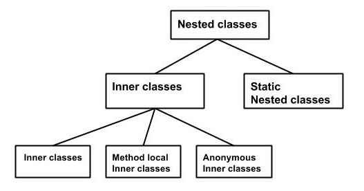

# Java Notes(8) Nested and Anonymous Class 


## Nested Class

In Java, just like methods, variables of a class too can have another class as its member. Writing a class within another is allowed in Java. The class written within is called the nested class, and the class that holds the inner class is called the outer class.


```java
public class Outer {

  public class Inner {
  }

}

Outer.Inner inner = outer.new Inner();
```

Nested classes are divided into two categories:
- Non-static nested classes : Non-static nested classes could only existed if the outer class object existing. In general, an object of the inner class is always strongly associated with an outer class object. 


- Static nested class : Nested classes that are declared static are called static nested classes. Static nested class object can exist, even if the outer class object is not existing. They are not strongly associated with outer classes.



### Non-static Nested Classes
Inner classes are a security mechanism in Java. We know a class cannot be associated with the access modifier private, but if we have the class as a member of other class, then the inner class can be made private. And this is also used to access the private members of a class.

Non-static Nested Classes are of three types depending on how and where you define them. They are −

* Inner Class
* Method-local Inner Class
* Anonymous Inner Class

#### Inner Class
Inner class is most obvious. 

```java
class Outer_Demo {
   int num;
   
   // inner class
   private class Inner_Demo {
      public void print() {
         System.out.println("This is an inner class");
      }
   }
   
   // Accessing he inner class from the method within
   void display_Inner() {
      Inner_Demo inner = new Inner_Demo();
      inner.print();
   }
}
   
public class My_class {

   public static void main(String args[]) {
      // Instantiating the outer class 
      Outer_Demo outer = new Outer_Demo();
      
      // Accessing the display_Inner() method.
      outer.display_Inner();
   }
}

```

#### Method-local Inner Class

A method-local inner class can be instantiated only within the method where the inner class is defined. 

```java
public class Outerclass {
   // instance method of the outer class 
   void my_Method() {
      int num = 23;

      // method-local inner class
      class MethodInner_Demo {
         public void print() {
            System.out.println("This is method inner class "+num);	   
         }   
      } // end of inner class
	   
      // Accessing the inner class
      MethodInner_Demo inner = new MethodInner_Demo();
      inner.print();
   }
   
   public static void main(String args[]) {
      Outerclass outer = new Outerclass();
      outer.my_Method();	   	   
   }
}

```


#### Anonymous inner class

Anonymous inner class is a class that we declare and instantiate it at same time.

```java
abstract class AnonymousInner {
   public abstract void mymethod();
}

public class Outer_class {

   public static void main(String args[]) {
      AnonymousInner inner = new AnonymousInner() {
         public void mymethod() {
            System.out.println("This is an example of anonymous inner class");
         }
      };
      inner.mymethod();	
   }
}
```

Anonymous inner class could also be passed as parameter of one method.

```java
// interface
interface Message {
   String greet();
}

public class My_class {
   // method which accepts the object of interface Message
   public void displayMessage(Message m) {
      System.out.println(m.greet() +
         ", This is an example of anonymous inner class as an argument");  
   }

   public static void main(String args[]) {
      // Instantiating the class
      My_class obj = new My_class();

      // Passing an anonymous inner class as an argument
      obj.displayMessage(new Message() {
         public String greet() {
            return "Hello";
         }
      });
   }
}
```


### Static Nested Class

```java
Live Demo
public class Outer {
   static class Nested_Demo {
      public void my_method() {
         System.out.println("This is my nested class");
      }
   }
   
   public static void main(String args[]) {
      Outer.Nested_Demo nested = new Outer.Nested_Demo();	 
      nested.my_method();
   }
}
```


