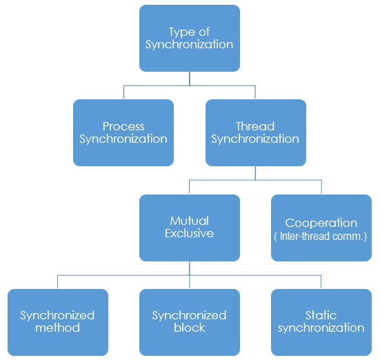
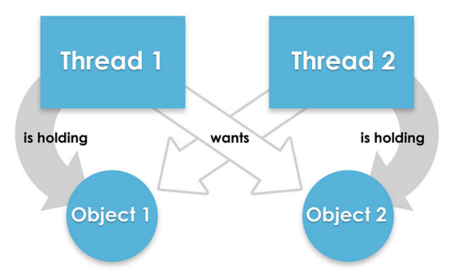
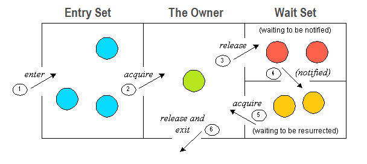

# Java Notes(11) Synchronization


Synchronization in java is the capability to control the access of multiple threads to any shared resource. Java Synchronization is better option where we want to allow only one thread to access the shared resource.

**The synchronization is mainly used to :**
- To **prevent Thread Interference** (Thread interference is a condition which occurs when more than one threads, executing simultaneously, access same piece of data.).
- To **prevent Consistency Problem** (Memory consistency errors occur when different threads have inconsistent views of what should be the same data.).

## Types of Synchronization :


## Thread Synchronization
There are two types of thread synchronization mutual exclusive and inter-thread communication.
1. Mutual Exclusive
2. Cooperation (Inter-thread communication in java)

**Mutual Exclusive :**
Mutual Exclusive helps keep threads from interfering with one another while sharing data. 
This can be done by three ways in java :
1. by synchronized method
2. by synchronized block
3. by static synchronization

**Concept of Lock in Java :**
Synchronization is built around an internal entity known as the lock or monitor. Every object has an lock associated with it. By convention, a thread that needs consistent access to an object's fields has to acquire the object's lock before accessing them, and then release the lock when it's done with them. The package java.util.concurrent.locks contains several lock implementations.

## Synchronized Method in Java :**
If you declare any method as synchronized, it is known as synchronized method. Synchronized method is used to lock an object for any shared resource. When a thread invokes a synchronized method, it automatically acquires the lock for that object and releases it when the thread completes its task.
```java
synchronized void printTable(int n){  //synchronized method  
   for(int i=1;i<=5;i++){  
     System.out.println(n*i);  
     try{  Thread.sleep(200);  
     }catch(Exception e){System.out.println(e);}  
   } }  
```

## Synchronized Block in Java
Synchronized block can be used to perform synchronization on any specific resource of the method. Suppose you have 50 lines of code in your method, but you want to synchronize only 5 lines, you can use synchronized block. Scope of synchronized block is smaller than the method. If you put all the codes of the method in the synchronized block, it will work same as the synchronized method. Syntax - synchronized (object reference expression) { ... }  
```java
void printTable(int n){  
   synchronized(this){      //synchronized block  
     for(int i=1;i<=5;i++){  
      System.out.println(n*i);  
      try{  Thread.sleep(200);  
      }catch(Exception e){System.out.println(e);}  
     } } }
```

## Static Synchronization in Java
If you make any static method as synchronized, the lock will be on the class not on object.

**Problem without static synchronization :**


Suppose there are two objects of a shared class(e.g. Table) named object1 and object2.In case of synchronized method and synchronized block there cannot be interference between t1 and t2 or t3 and t4 because t1 and t2 both refers to a common object that have a single lock.But there can be interference between t1 and t3 or t2 and t4 because t1 acquires another lock and t3 acquires another lock.I want no interference between t1 and t3 or t2 and t4.Static synchronization solves this problem.
```java
synchronized static void printTable(int n){  
   for(int i=1;i<=10;i++){  
     System.out.println(n*i);  
     try{  Thread.sleep(200);  
     }catch(Exception e){System.out.println(e);}  
   }  }  
```

## Deadlock in Java



Deadlock can occur in a situation when a thread is waiting for an object lock, that is acquired by another thread and second thread is waiting for an object lock that is acquired by first thread. Since, both threads are waiting for each other to release the lock, the condition is called deadlock.
```java
public class TestDeadlockExample1 {  
  public static void main(String[] args) {  
    final String resource1 = "John";  
    final String resource2 = "Tom";  
    
    // t1 tries to lock resource1 then resource2  
    Thread t1 = new Thread() {  
      public void run() {  
          synchronized (resource1) {  
           System.out.println("Thread 1: locked resource 1");  
           try { Thread.sleep(100);} catch (Exception e) {}  
           synchronized (resource2) {  
            System.out.println("Thread 1: locked resource 2");  
           } } } };  
  
    // t2 tries to lock resource2 then resource1  
    Thread t2 = new Thread() {  
      public void run() {  
        synchronized (resource2) {  
          System.out.println("Thread 2: locked resource 2");  
          try { Thread.sleep(100);} catch (Exception e) {}  
          synchronized (resource1) {  
            System.out.println("Thread 2: locked resource 1");  
          } } } };  
      
    t1.start();  
    t2.start();  
  } } 
```
**Output:** 
```
Thread 1: locked resource 1
Thread 2: locked resource 2
```

## Inter-Thread Communication in Java
Inter-thread communication or Co-operation is all about allowing synchronized threads to communicate with each other. Cooperation (Inter-thread communication) is a mechanism in which a thread is paused running in its critical section and another thread is allowed to enter (or lock) in the same critical section to be executed.

It is implemented by following 3 methods of **Object class:**
1. wait()
2. notify()
3. notifyAll()

### wait() Method
Causes current thread to release the lock and wait until either another thread invokes the notify() method or the notifyAll() method for this object, or a specified amount of time has elapsed. The current thread must own this object's monitor, so it must be called from the synchronized method only otherwise it will throw exception.
- public final void wait()throws InterruptedException	
- public final void wait(long timeout)throws InterruptedException

### notify() Method
Wakes up a single thread that is waiting on this object's monitor. If any threads are waiting on this object, one of them is chosen to be awakened. The choice is arbitrary and occurs at the discretion of the implementation.
- public final void notify()

### notifyAll() Method
Wakes up all threads that are waiting on this object's monitor.
- public final void notifyAll()

## Understanding the process of inter-thread communication



**Explanation of the above diagram :**
1. Threads enter to acquire lock.
2. Lock is acquired by one thread.
3. Now thread goes to waiting state if you call wait() method on the object. Otherwise, it releases the lock & exits when done.
4. If you call notify() or notifyAll() method, thread moves to the notified state (runnable state).
5. Now thread is available to acquire lock.
6. After completion of the task, thread releases the lock and exits the monitor state of the object.

**NOTE :** wait(), notify() and notifyAll() methods are defined in Object class not Thread class because they are related to lock and object has a lock.

## Difference between wait and sleep
<table class="alt">
<tbody><tr><th>wait()</th><th>sleep()</th></tr>
<tr><td>wait() method releases the lock</td><td>sleep() method doesn't release the lock.</td></tr>
<tr><td>is a method of Object class</td><td>is a method of Thread class</td></tr>
<tr><td>is a non-static method</td><td>is a static method</td></tr>
<tr><td>should be notified by notify() or notifyAll() methods</td><td>after the specified amount of time, sleep is completed.</td></tr>
</tbody></table>

**Sinple Example :**
```java
class Customer {
 int amount = 10000;

 synchronized void withdraw(int amount) {
  System.out.println("going to withdraw...");
  if (this.amount < amount) {
   System.out.println("Less balance; waiting for deposit...");
   try { wait(); } catch (Exception e) {} 
  }   // Simple Eg. So, doesn't consider if amount is again low after notify()
  this.amount -= amount;
  System.out.println("withdraw completed...");
 }
 
 synchronized void deposit(int amount) {
  System.out.println("going to deposit...");
  this.amount += amount;
  System.out.println("deposit completed... ");
  notify();
 }
}

class Test {
 public static void main(String args[]) {
  final Customer c = new Customer();
  new Thread() { public void run() { c.withdraw(15000); }}.start();
  new Thread() { public void run() { c.deposit(10000); }}.start();
 }
}
```

## Interrupting a Thread
An interrupt is an indication to a thread that it should stop what it is doing and do something else. It's up to the programmer to decide exactly how a thread responds to an interrupt, but it is very common for the thread to terminate.

The 3 methods provided by the Thread class for interrupting a thread :
- public void interrupt()
If any thread is in sleeping or waiting state (i.e. sleep() or wait()) is invoked, calling the interrupt() method on the thread, breaks out the sleeping or waiting state throwing InterruptedException. If the thread is not in the sleeping or waiting state, calling the interrupt() method performs normal behaviour and doesn't interrupt the thread but sets the interrupt flag to true.
```
t1.interrupt();  
```
- public static boolean interrupted()
The static interrupted() method returns the interrupted flag afterthat it sets the flag to false if it is true.
```
t1.interrupted()
```
- public boolean isInterrupted()
The isInterrupted() method returns the interrupted flag either true or false.

**NOTE :** If we interrupt a thread, and propagate the exception, it will stop working. If we don't want to stop the thread, we should handle it where sleep() or wait() method is invoked.
```java
class TestIntrpt extends Thread {
 public void run() {
  try { Thread.sleep(1000);
   System.out.println("task");
  } catch (InterruptedException e) {
   System.out.println("Exception handled " + e); }
  System.out.println("thread is still running after exception...");
 }
 public static void main(String args[]) {
  TestIntrpt t1 = new TestIntrpt();
  t1.start();
  t1.interrupt();
 }}
```

## Reentrant Monitor in Java
According to Sun Microsystems, **Java monitors are reentrant** means java thread can reuse the same monitor for different synchronized methods if method is called from the method.

**Advantage of Reentrant Monitor:** It eliminates the possibility of single thread deadlocking.

**Example :**
```java
class Reentrant {  
    public synchronized void m() {  
    n();  
    System.out.println("this is m() method"); }  
    
    public synchronized void n() {  
    System.out.println("this is n() method"); }  
}  

public class ReentrantExample {
 public static void main(String args[]) {
  final ReentrantExample re = new ReentrantExample();
  
  Thread t1 = new Thread() { //creating thread using annonymous class
   public void run() {
    re.m(); }};  //calling m() method of Reentrant class  
   
  t1.start();
 }}


