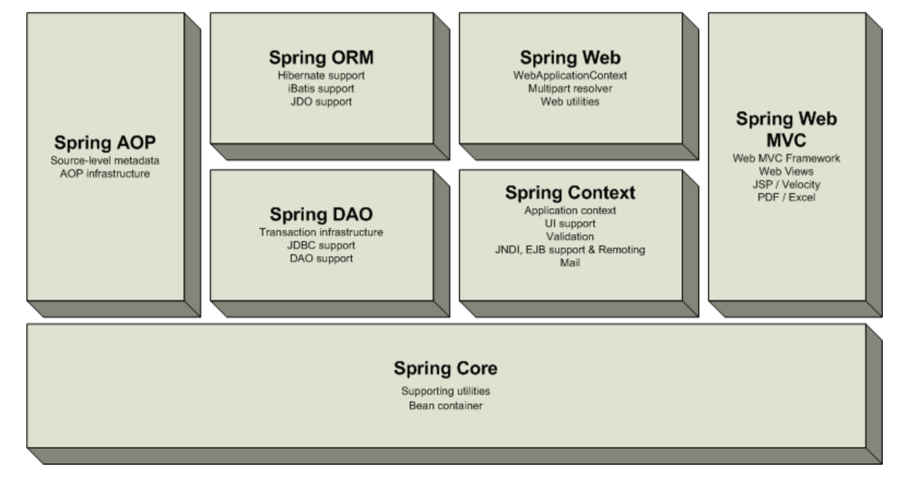

# Spring Framework Notes - Overview

The **Core package** is the most fundamental part of the framework and provides the Dependency Injection features allowing you to manage bean container functionality. The basic concept here is the BeanFactory, which provides a factory pattern removing the need for programmatic singletons and allowing you to decouple the configuration and specification of dependencies from your actual program logic.

On top of the Core package sits the **Context package**, providing a way to access beans in a framework-style manner, somewhat resembling a JNDI-registry. The context package inherits its features from the beans package and adds support for text messaging using e.g. resource bundles, event-propagation, resource-loading and transparent creation of contexts by, for example, a servlet container.

The **DAO package** provides a JDBC-abstraction layer that removes the need to do tedious JDBC coding and parsing of database-vendor specific error codes. Also, the JDBC package provides a way to do programmatic as well as declarative transaction management, not only for classes implementing special interfaces, but for all your POJOs (plain old java objects).

The **ORM package** provides integration layers for popular object-relational mapping APIs, including JDO, Hibernate and iBatis. Using the ORM package you can use all those O/R-mappers in combination with all the other features Spring offers, like simple declarative transaction management mentioned before.

Spring's **AOP package** provides an AOP Alliance compliant aspect-oriented programming implementation allowing you to define, for example, method-interceptors and pointcuts to cleanly decouple code implementing functionality that should logically speaking be separated. Using source-level metadata functionality you can incorporate all kinds of behavioral information into your code, a little like .NET attributes.

**Spring's Web package** provides basic web-oriented integration features, such as multipart functionality, initialization of contexts using servlet listeners and a web-oriented application context. When using Spring together with WebWork or Struts, this is the package to integrate with.

**Spring's Web MVC package** provides a Model-View-Controller implementation for web-applications. Spring's MVC implementation is not just any implementation, it provides a clean separation between domain model code and web forms and allows you to use all the other features of the Spring Framework like validation.
