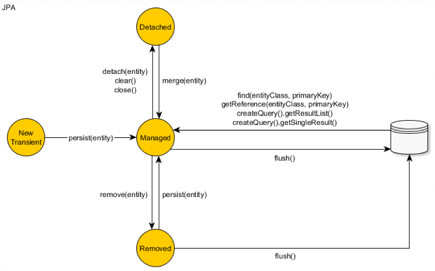

# Java Persistence API JPA

## Object Relational Mapping

Object Relational Mapping (ORM) that maps object state to data in a relational database.

Mismatch issues between OO and relational models exist and need to be taken into account: 

- Subtyping: Fundamental to OO, absent in RDBMS 
- Granularity: One object's data could be stored in multiple tables
- Relationships: Associations in OO, foreign keys in RDBMS

## Java Persistence API JPA
JPA is a Java API specification for relational data management in applications using Java SE and Java EE. JPA defines a standard way for simplifying database programming for developers, reduce development time and increase productivity. When using JPA, you have to import interfaces and classes from the package javax.persistence.

JPA defines Java Persistence Query Language (JPQL) which is an object-oriented query language. The syntax of JPQL is similar to SQL but it operates against Java objects rather than directly with database tables.

JPA is a specification, and Hibernate is one of its implementations, among others such as EclipseLink and OpenJPA.

## Hibernate Framework
Hibernate is a popular Object Relational Mapping (ORM) framework that aims at simplifying database programming for developers. Object Relational Mapping (ORM) that maps object state to data in a relational database.


# Architecture

## Entity
Entity classes are the Object data we want to persist

Entity classes have following requirement:
1. Entity class must be annotated with Entity or described in the XML configuration fie JPA
2. Entity class must contain a public or protecedconstructor with no arguments(It can also have constructors with arguments)
3. Entity class must be a top-level class
4. Entity class cannot be enum or interface
5. Enity class cannot be final class
6. Entity class cannot contain final fields or methods if they participate in mapping (persistent final methods or persistent final instance variables)
7. If an Entity class object is passed by values as a separate object(detached object), for example through a remote interface, it must also implement a serializable interface.
8. The Entity class fields should be directly accessible only to the methods of the Entity class and should not be directly accessible to other classes using this entity. Such classes should refer only to methods(getter/setter) methods or other business logic methods in the Entity class.
9. The Entity class must contain a primary key, that is, an attribute or group of attributes that uniquely defines the record of this Enity class in the database.

## @Entity
This annotation indicates that the class is mapped to a database table. By default, the ORM framework understands that the class name is as same as the table name. The @Entity annotation must be placed before the class definition.

# @Id
This annotation specifies that a field is mapped to a primary key column in the table. 

**Example 1**
```
// Entity annotation
@Entity
public class Employee{
    // Mandatory Id with Id annotation
    @Id 
    private int empId;
    private String empName;
    // Mandatory non-argument constructor
    public Employee(){
    }

}
```

## @Table
This annotation is used if the class name is different than the database table name, and it is must placed before the class definition. 

## @Column
This annotation is used to map an instance field of the class to a column in the database table

## @Transient
This annotation is used to ignore the data when storing in the SQL
**Example 2**
```
@Entity
// Optional to give the table name
@Table(name= "EMP")
public class Employee{
    @Id
    // Optional to give column name
    @Column(name = "EMP_ID")
    private int empIdl
    @Column(name = "EMP_NAME")
    private String empName;  
    //  Transient annotation to ask not to write this data
    @Transient
    private int age; 
    public Employee(){
    } 
}
```

## Create JPA Configuration File (persistence.xml)
An XML configuration file for JPA called persistence.xml is required to tell Hibernate how to connect to the database. This file must be present in the classpath, under the META-INF folder.

```
<?xml version="1.0" encoding="UTF-8"?>
<persistence version="2.1" xmlns="http://xmlns.jcp.org/xml/ns/persistence"
    xmlns:xsi="http://www.w3.org/2001/XMLSchema-instance"
    xsi:schemaLocation="http://xmlns.jcp.org/xml/ns/persistence
        http://xmlns.jcp.org/xml/ns/persistence/persistence_2_1.xsd">
    <persistence-unit name="UsersDB">
        <properties>
            <property name="javax.persistence.jdbc.url" value="jdbc:mysql://localhost:3306/usersdb" />
            <property name="javax.persistence.jdbc.user" value="root" />
            <property name="javax.persistence.jdbc.password" value="P@ssw0rd" />
            <property name="javax.persistence.jdbc.driver" value="com.mysql.jdbc.Driver" />
            <property name="hibernate.show_sql" value="true" />
            <property name="hibernate.format_sql" value="true" />
        </properties>
    </persistence-unit>
</persistence>
```
The values for url, user, and password are changed accordingly.

## Key Interfaces and Classes
### Persistence
Javax.persistence is the only class available in JPA. Persistence is the starting point for JPA implementation.

Persistence creates **EntityManagerFactory** instances.

### Entity ManagerFactory
An EntityManagerFactory is used to create an **EntityManager**. And EntityManagerFactory is associated with a persistence unit. 

### Entity Manager
An EntityManager instance is associated with a persistence context, and it is used to interact with the database. A persistence context is a set of entity instances, which are actually the objects or instances of the model classes. 

The EntityManager is used to manage entity instances and their life cycle, such as create entities, update entities, remove entities, find and query entities.

### Entity Transaction
Entity Transaction groups operations on persistent data into units of work that completely succeed or fail.


# Entity LifeCycle



### Trasient(New)
- A newly created object that hasn't been associated with persistence context and is not mapped to any database below

### Managerd (Persisted)
- To convert transient object to be managed by calling the persist().
- Persistent entity has been associated with a database table row and is being managed by current running persistence context.

### Detached 
- Detached represents entity objects that have been disconnected from EntityManager
- Once The current running persistence context is closed all previously managed entities becomes detached.

### Merge
- Opposite to detached. It helps disconnected entity object to merge back to managed entities 
  
### Removed
Only the managed entities are allowed to be removed. The remove process in actual database will be executed during flush(). The flush() in Java is called by using commit().


# Implementation in Java

## Persistence Context
1. The persistence context is the set of Entity instances in the application, managed by the EntityManager.
2. Each EntityManger instance is associated with a persistence context
3. The EntityManger interface defines the methods that are used to interact with the persistence context.


A persistence unit is used to configure:
    - Which Entit classes are to be managed
    - Persistence provider details
    - Database connection details and other properties


## Configuration


1. Start a new Java Project.
2. Convert the new Java Project to Maven Project by right click -> configure.
3. Add following dependency into pom.xml file
   1. hibernate-core
   2. hibernate-c3p0  (This is for connection pool)
   3. ojdbc6
4. Right click of the project -> property -> Project Facets -> check the JPA -> Further configuration required -> Disable Library
5. Add a persistence.xml file to the META-INF folder.
    - An XML file that **defines persistence units**
    - Should be placed in a directory called META-INF

## implementation

The typical steps to manage entity instances via JPA:

1. Get an EntityanagerFactory from the class Persistence
```
EntityManagerFactory emFactory = Persistence.createEntityManagerFactory("PersistenceUnitName");
// PersistenceUnitName could be find from persistence.xml
```
It will be configured according to details in the given persistence units

2. Once a factory is in place, EntityManager instances can be obtained:

```
EntityManager em = emFactory.createEntityManager();
```

3. Managing Entities
Finding by ID
```
Employee employee = em.find(Employee.class, 158)
```

Persisting
```
Employee employee = new Employee(158);
em.getTransaction().begin();
em.persist(employee);
em.getTransaction().commit();
```

Deleting 
```
Employee employee = em.find(Employee.class, 158);
em.getTransaction().begin();
em.remove(employee);
em.getTransaction().commit();
```

Update
```
Employee employee = em.find(Employee.class, 158);
em.getTransaction().begin();
employee.setSalary(50000)
em.getTransaction().commit();
```

detach and merge
```
Employee pojoEmployee = new Employee(158);
em.detach(pojoEmployee)
em.getTransaction().begin();
Employee managedEmployee = em.merge(pojoEmployee);
em.getTransaction().commit();
```

# Java Persistence Query Language (JPQL)

Query finds persistent objects that meet certain criteria. It allows use of both Java Persistency Query Language(JPQL) and Structured Query Language(SQL). The implementation of it is vendor specific.

Java persistence API provides JPQL for querying entites.

The methods used to query the entities using JPQL are
- createQuery()
- createNamedQery()
- createNativeQuery()
- createStoredProcedureQuery()

## Dynamic Queries createQuery()
Dynamic queries defines directly within an application’s business logic.

```
Query query = em.createQuery("SELECT e FROM Employee e", Employee.class")
List<Employee> allEmployees = query.getResultList();
```


## Static Queries - createNamedQuery ()
static queries are defined in metadata by using the @NamedQuery annotation. 

```
@NamedQuery(
   	 name="findAllCustomersWithName",
   	 query="SELECT c FROM Customer c WHERE c.name LIKE :custName"
)
```
```
em.createNamedQuery("findAllCustomersWithName");
```

## Parameter
### Named Parameters:
Query parameters that are prefixed with a colon (:).

```
Dynamic Queries - createQuery()
public List findWithName(String Name){
    Query query =em.createQuery("SELECT c FROM Customer c WHERE c.name LIKE:custName")
}
```
	
### Positional Parameters:
Prefixed with a question mark (?) followed the numeric position of the parameter in the query.

```
public List findWithName(String name) { 

	Query query = em.createQuery( “SELECT c FROM 			Customer c WHERE c.name LIKE ? 1”);
	query.setParameter(1, name) 
	return query.getResultList(); 

}
```