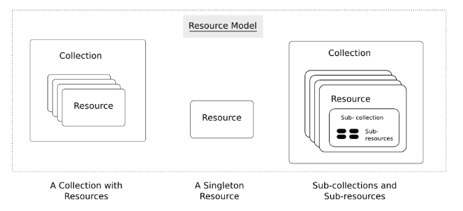

# Rest
REST, stands for Representational State Transfer, is an architectural style for distributed system. A service which is built on the REST architecture is called a RESTful service. The underlying protocol for REST is HTTP, which is the basic web protocol. 

# Key Elements of RESTful Implementation

## Resources 
**Resource** could be considered as **data** stored in the server. **Each resource has unique URL**. Multiple resources with same type could be grouped into **collection**. Resource could also exist outside any collection. Collection could also be stored within a resources. The Figure below demonstrated the relationship. 

### Resource Example
A web application on a server has records of several employees. Let's assume the URL of the web application is http://demo.com. Now in order to access an employee record resource via REST, one can issue the command http://demo.com/employee/1 - This command tells the web server to please provide the details of the employee whose employee number is 1.

## Request Method
**Request Method** describe a set of methods that you could do with resource. A browser issues a **GET** verb to instruct the endpoint it wants to get data. However, there are many other verbs available including things like **POST**, **PATCH**, **PUT**, and **DELETE**. 

| HTTP Verb | CRUD           | Entire Collection                                                                                    | Specific Item (e.g. /customers/{id})                                       |
|-----------|----------------|------------------------------------------------------------------------------------------------------|----------------------------------------------------------------------------|
| POST      | Create         | 201 (Created), 'Location' header with link to /customers/{id} containing new ID.                     | 404 (Not Found), 409 (Conflict) if resource already exists..               |
| GET       | Read           | 200 (OK), list of customers. Use pagination, sorting and filtering to navigate big lists.            | 200 (OK), single customer. 404 (Not Found), if ID not found or invalid.    |
| PUT       | Update/Replace | 405 (Method Not Allowed), unless you want to update/replace every resource in the entire collection. | 200 (OK) or 204 (No Content). 404 (Not Found), if ID not found or invalid. |
| PATCH     | Update/Modify  | 405 (Method Not Allowed), unless you want to modify the collection itself.                           | 200 (OK) or 204 (No Content). 404 (Not Found), if ID not found or invalid. |
| DELETE    | Delete         | 405 (Method Not Allowed), unless you want to delete the whole collection—not often desirable.        | desirable.200 (OK). 404 (Not Found), if ID not found or invalid.           |

### Request Method Example
So in the case of the earlier example http://demo.com/employee/1 , the web browser is actually issuing a **GET** Verb because it wants to get the details of the employee record.

## Request Headers 
These are additional instructions sent with the request. These might define the type of response required or the authorization details.

## Request Body
Data is sent with the request. Data is normally sent in the request when a POST request is made to the REST web service. In a POST call, the client actually tells the web service that it wants to add a resource to the server. Hence, the request body would have the details of the resource which is required to be added to the server.

## Response Body
This is the main body of the response. So in our example, if we were to query the web server via the request http://demo.com/employee/1 , the web server might return an XML document with all the details of the employee in the Response Body.

## Response Status codes
The respnse status code could be found on the table above. This is normally returned along with the response from the web server.

# RESTful Architecture

An application or architecture considered RESTful or REST-style has the following characteristics

State and functionality are divided into distributed resources – This means that every resource should be accessible via the normal HTTP commands of GET, POST, PUT, or DELETE. So if someone wanted to get a file from a server, they should be able to issue the GET request and get the file. If they want to put a file on the server, they should be able to either issue the POST or PUT request. And finally, if they wanted to delete a file from the server, they an issue the DELETE request.
The architecture is client/server, stateless, layered, and supports caching –
Client-server is the typical architecture where the server can be the web server hosting the application, and the client can be as simple as the web browser.
Stateless means that the state of the application is not maintained in REST.
For example, if you delete a resource from a server using the DELETE command, you cannot expect that delete information to be passed to the next request.

In order to ensure that the resource is deleted, you would need to issue the GET request. The GET request would be used to first get all the resources on the server. After which one would need to see if the resource was actually deleted.

# RESTFul Principles and Constraints
The REST architecture is based on a few characteristics which are elaborated below. Any RESTful web service has to comply with the below characteristics in order for it to be called RESTful. These characteristics are also known as design principles which need to be followed when working with RESTful based services.

## RESTFul Client-Server
This is the most fundamental requirement of a REST based architecture. It means that the server will have a RESTful web service which would provide the required functionality to the client. The client send's a request to the web service on the server. The server would either reject the request or comply and provide an adequate response to the client.

## Stateless

## Cache

## Layered System

## Interface/Uniform Contract

# Reference 
https://www.guru99.com/restful-web-services.html
https://restful-api-design.readthedocs.io/en/latest/resources.html
