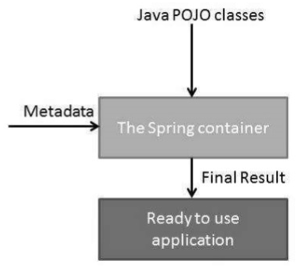

# Core Container

The Container consists of the Core, Beans, Context, and Expression Language modules:

- **Core module**: It provides the fundamental parts of the framework, including the **IoC and Dependency Injection features**.

- **Bean module**: It provides **BeanFactory**, which is a implementation of the factory pattern.

- **Context module**: It builds on the solid base provided by the Core and Beans modules and it is a medium to access any objects defined and configured. The ApplicationContext interface is the focal point of the Context module.

- **SpEL module**: It provides a powerful **expression language for querying and manipulating an object graph at runtime**.

The above modules could be imported by Maven. Required resources could be found in Maven repository. The Core, Bean and Context are Key dependencies for a Spring project.


# Spring container


The Spring IoC container makes use of Java POJO classes and configuration metadata to produce object. The main life cycles is 
1. Creation: The container will look for the configuration metadata of given bean. Once found, the container will create an instance of the object by reflection.
2. Injection: After creation, its dependencies will be injected into the bean. If these dependencies are other beans, they are created first.
3. Validation:
4. Registration:
5. Destruction:


# Spring bean
Spring beans are Java objects that are managed by the Spring container.

To declare bean in Spring.xml configuration file.
```
<bean id="beanName" class="package.classname" />
```

## BeanFactory Interface and Application Context Interface

### BeanFactory Interface
The BeanFactory interface is the root interface for accessing the Spring container.


### Application Context Interface
ApplicationContext interface implements BeanFactory Interface. Thus, it has all the functionality of BeanFactory as well as other additional functionality.
```
ApplicationContext context = 
        new ClassPathXmlApplicationContext(“context.xml”);
```


## Bean Scope
Bean Scope dictate how beans are created. There are two types:
1. Singleton – (Default)
   - Maintains a single instance per Spring Container
2. Prototype
   - Produces a new instance each time it is referenced

```
<bean id="user" class="com.User" scope="prototype">
  <property name="password" ref="password" />
</bean>
```


# Ambiguities and Issues
There are two major issues that may happens
- Constructor ambiguity
- Dependency problem (Spring 3.1 and earlier)
  
## Constructor ambiguity
Overloaded constructors with different types of arguments but the same number of arguments

### Solution to COnstructor ambiguity
index – specify the index of the argument
type – specify the data type of the argument

```
<bean id="user" class="com.User" scope="prototype">
  <constructor-arg value=“Username” index="0" type="java.lang.String" />
  <constructor-arg value="16" index="1" type="int" />
</bean>
```

## Dependency problem
One class may depend on another class being fully configured
Spring can inject classes before they are fully initialised

The dependency problem does not exist after Spring 3.2. Prior to that the solution involves using the depends-on attribute

```
<bean id="password" class="com.Password">
  <constructor-arg value="myPassword" />
</bean>

<bean id="user" class="com.User" depends-on="password">
  <property name="password" ref="password" />
</bean>

```