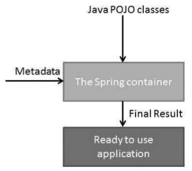

# Overview
Spring framework is an open source Java platform that provides comprehensive infrastructure support for developing robust Java applications. It is made up of a series of JAR files (The dependencies could be add in Maven). The technologies that Spring are most indentified with are **inversion of Control(IOC)** and **aspect oriented programming(AOP)**.


## Inversion of Control (IoC)
The general concept of Inversion of Control says that **you do not create your objects but describe how they should be created**. If an object depends on another, you do not connect them together yourself – you merely describe which objects are needed by which. The IoC container is then responsible for hooking it all up, which reduces code in the application. 


## Aspect Oriented Programming

Another key component is the Aspect Oriented Programming(AOP framework. Aspect oriented programming addresses the problem of **cross-cutting concerns**, which would be any kind of code that is repeated in different method, but can't normally be completely refactored into its own module. Aspect oriented programming enables cohesive development by **separating business logic from cross-cutting concerns**. An example is like logging or verification.

# Spring Architecture


The Spring Framework consists of features organised into about 20 modules. These modules can be used individually or in conjunction with each other. For example, an application that needs to connect to a database might use the JDBC  module. If this application is a web application, it might also use the web module.


# Spring Terminology
### Spring Core Container



The Spring IoC container makes use of Java POJO classes and configuration metadata to manage the life cycle of bean.

### Life Cycle 
The life cycle is maintained by Spring IoC container:

1. Creation: The container will look for the configuration metadata of given bean. Once found, the container will create an instance of the object by reflection.
2. Injection: After creation, its dependencies will be injected into the bean. If these dependencies are other beans, they are created first.
3. Validation:
4. Registration:
5. Destruction:

### Spring Bean

Spring beans are Java objects that are managed by the Spring container.
To declare bean in Spring.xml configuration file.

```
<bean id="beanName" class="package.classname" />
```

### BeanFactory Interface

The BeanFactory interface is the root interface for accessing the Spring container.


### Application Context Interface

ApplicationContext interface implements BeanFactory Interface. Thus, it has all the functionality of BeanFactory as well as other additional functionality.
```
ApplicationContext context = 
        new ClassPathXmlApplicationContext(“context.xml”);
```


### Bean Scope

Bean Scope dictate how beans are created. There are two types:
1. Singleton – (Default)
   - Maintains a single instance per Spring Container
2. Prototype
   - Produces a new instance each time it is referenced

```
<bean id="user" class="com.User" scope="prototype">
  <property name="password" ref="password" />
</bean>
```

### **Cross-Cutting Concerns**
A piece of code that is repeated in different method, but can't normally be completely refactored into its own module.