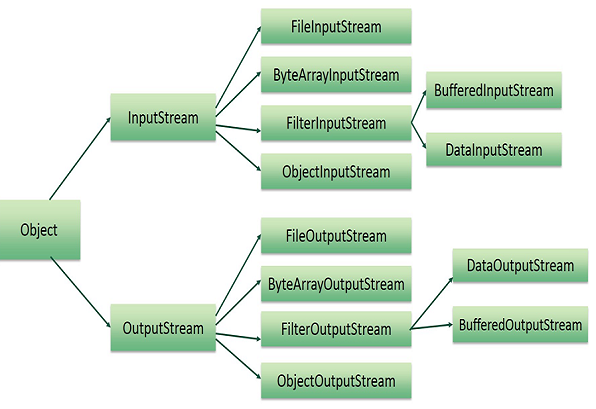

# Stream



**Stream** is a flow of data with **a writer** at one end and **a reader** at the other.

**Input Stream**: Input stream connect source to program.

**Output Stream**: Output stream connect program to destination


```
import java.io.*;
public class ReadConsole{
    public static void main(String args[]) throws IOException {
        InputStreamReader cin = null;
        try{
            cin = new InputStreamReader(System.in)
        }
    }
}
```

# Basic IO

The system has already provided some basic applications.

* **Standard Input**: This is used to feed the data to user's program and usually a keyboard is used as standard input stream and represented as **System.in**

* **Standard Output**: This is used to output the data produced by the user's program and usually a computer screen is used for standard output stream and represented as **System.output**.

* **Standard Error**:This is used to output the error data produced by the user's program and usually a computer screen is used for standard error stream and represented as **System.err**

The above three system streams are created by the JVM when application starts, and are destroyed when application stops

# File IO

The JVM will recognise both relative and absolute path.

## FileInputStream(extends inputStream)

  * Reads raw bytes from a file
  * Good for reading image data
  **Constructors:** 
  * FileInputStream(String name)
  * FileInputStream(File file)
  * FileInputStream(FileDescriptor fdObj)
  
## FileOutputStream(extends OutputStream)
* Writes raw bytes to a file
  **Constructors**
  * FileOutputStream(String name)
  * FileOutputStream(FileDescriptor fdObj)
  * FileOutputStream(String name, boolean append)
  * FileOutputStream(File file)
  * FileOutputStream(File file, boolean append)

# Data IO

The Data IO add the ability to read and write simple data types, such as numeric primitives:

## DataInputStream (extends FilterInputStream)
- Reads any primitive except char
- Constructor: DataInputStream(InputStream in)
- Methods: boolean readBoolean(), double readDouble, int readInt(),...
  
## DataOutputStream (extends FilterOutputStream)
- Writes any primitive except char
- Constructor: DataOutputStream(OutputStream out)
- Methods: void writeBoolean(boolean b), void writeDouble(double d),...

# Reader - Writer

## InputStreamReader/OutputStreamWriter
These two are **extends from Reader and Writer classes**. 

They provides a concrete implementation that reads/writes characters from/to any I/O stream.
* **InputStreamReader**
  * Reads bytes and decodes them into characters
  * InputStream must be provided in the constructor
* **OutputStreamWriter**
  * Characters written to it are encoded into bytes.
  * OutputStream must be provided in the constructor.


## FileReader/FileWriter

These two are **extends InputStreamReader and OutputStreamWriter**
They provides concrete implementation that reads/writers characters from/to files on the local filesystem:
  * **FileReader**
    * Constructors: 
      * FileReader(String Filename)
      * FileReader(File file)
      * FileReader(FileDescriptor fdObj)
  * **FileWriter**
    * Constructors: 
      * FileWriter(String name)
      * FileWriter(FileDescriptor fdObj)
      * FileWriter(String name, boolean append)
      * FileWriter(File file)
      * FileWriter(File file, boolean append)

## Buffered Streams
BufferedReader and BufferedWriter classes provide buffering.
* Provide methods to read/write larger blocks of characters at a time.
  * readLine()
  * writeLine()
* Can increase efficiency by reducing number of physical read/write operations