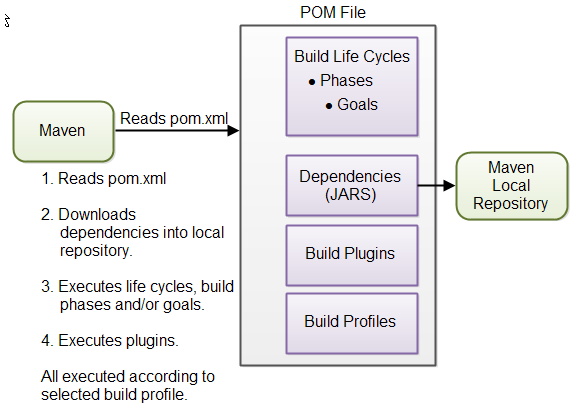

# Maven

Maven is a build automation tool used primarily for Java projects.



# Build Life Cycles, Phases and Goals
The build process in Maven is split up into **build life cycles, phases and goals**. 
A build life cycle consists of a sequence of build phases, and each build phase consists of a sequence of goals. 
When you run Maven you pass a command to Maven. This **command is the name of a build life cycle, phase or goal**. If a life cycle is requested executed, all build phases in that life cycle are executed. If a build phase is requested executed, all build phases before it in the pre-defined sequence of build phases are executed too.

# Dependencies and Repositories
One of the first goals Maven executes is to check the dependencies needed by your project. Dependencies are external JAR files (Java libraries) that your project uses. If the dependencies are not found in the local Maven repository, Maven downloads them from a central Maven repository and puts them in your local repository. The local repository is just a directory on your computer's hard disk. You can specify where the local repository should be located if you want to (I do). You can also specify which remote repository to use for downloading dependencies. All this will be explained in more detail later in this tutorial.


# Build Plugins
Build plugins are used to insert extra goals into a build phase. If you need to perform a set of actions for your project which are not covered by the standard Maven build phases and goals, you can add a plugin to the POM file. Maven has some standard plugins you can use, and you can also implement your own in Java if you need to.

# Build Profiles
Build profiles are used if you need to build your project in different ways. For instance, you may need to build your project for your local computer, for development and test. And you may need to build it for deployment on your production environment. These two builds may be different. To enable different builds you can add different build profiles to your POM files. When executing Maven you can tell which build profile to use.

# POM file

```
<project xmlns="http://maven.apache.org/POM/4.0.0"
         xmlns:xsi="http://www.w3.org/2001/XMLSchema-instance"
         xsi:schemaLocation="http://maven.apache.org/POM/4.0.0
                      http://maven.apache.org/xsd/maven-4.0.0.xsd">
    <modelVersion>4.0.0</modelVersion>
    <groupId>com.shihao</groupId>
    <artifactId>hello-world</artifactId>
    <version>1.0.0</version>
</project>
```
This is a minimal pom.xml file.

The **groupId** identifies your organization.

The **artifactId** identifies the project. More specifically, it identifies the artifact built from the project, like for instance a JAR file.

The **version** identifies the version of the artifact which the POM file builds. When you evolve the project and you are ready to release, remember to update the version numbe

## Testing the POM File

To test the pom.xml file, open a command prompt and change directory (cd) into the project root directory. Then execute this command:

```
mvn clean
```
The mvn clean command will clean the project directory for any previous temporary build files. Since the project is all new, there will be no previous build files to delete. The command will thus succeed.

```
D:\data\projects\my-first-maven-project>mvn clean
[INFO] Scanning for projects...
[INFO]
[INFO] ------------------------------------------------------------------------
[INFO] Building hello-world 1.0.0
[INFO] ------------------------------------------------------------------------
[INFO]
[INFO] --- maven-clean-plugin:2.5:clean (default-clean) @ hello-world ---
[INFO] ------------------------------------------------------------------------
[INFO] BUILD SUCCESS
[INFO] ------------------------------------------------------------------------
[INFO] Total time: 0.873 s
[INFO] Finished at: 2015-07-05T14:57:00+02:00
[INFO] Final Memory: 4M/15M
[INFO] ------------------------------------------------------------------------
```
The above information tells that Maven understand you POM

# Building the Project

When creating the Java source file, open a command prompt and change directory into the project root directory. Then execute this command:

```
mvn package
```
The mvn package command instructs Maven to run the package build phase which is part of the default build life cycle.
Maven should now run. Maven will compile the Java source file and create a JAR file containing the compiled Java class.
Maven creates a target subdirectory inside the project root directory. Inside the target directory you will find the finished JAR file, as well as lots of temporary files (e.g. a classes directory containing all the compiled classes).
The finished JAR file will be named after this pattern:
```
artifactId-version
```
So, based on the POM shown earlier in this tutorial, the JAR file will be named: hello-world-1.0.0.jar


# Maven Command Structure
A Maven command consists of two elements:

1. mvn
2. One or more build life cycles, build phases or build goals
Here is a Maven command example:

Maven contains three major build life cycles:

1. clean
2. default
3. site

Inside each build life cycle there are build phases, and inside each build phase there are build goals.

You can execute either a build life cycle, build phase or build goal. When executing a build life cycle you execute all build phases (and thus build goals) inside that build life cycle.

When executing a build phase you execute all build goals within that build phase. Maven also executes all build phases earlier in the build life cycle of the desired build phase.

Buid goals are assigned to one or more buid phases. When the build phases are executed, so are all the goals in that build phase. You can also execute a build goal directly.

# Executing Build Life Cycles, Phases and Goals
When running the mvn command you pass one or more arguments to it. These arguments specify either a build life cycle, build phase or build goal. 

For instance to execute the clean build life cycle you execute this command:
```
mvn clean
```

To execute the site build life cycle you execute this command:
```
mvn site
```
## Executing the Default Life Cycle
The default life cycle is the build life cycle which generates, compiles, packages etc. your source code.

You cannot execute the default build life cycle directly, as is possible with the clean and site. Instead you have to execute a specific build phase within the default build life cycle.

The most commonly used build phases in the default build life cycle are:

```
Build Phase	Description
validate	Validates that the project is correct and all necessary information is available. This also makes sure the dependencies are downloaded.
compile	Compiles the source code of the project.
test	Runs the tests against the compiled source code using a suitable unit testing framework. These tests should not require the code be packaged or deployed.
package	Packs the compiled code in its distributable format, such as a JAR.
install	Install the package into the local repository, for use as a dependency in other projects locally.
deploy	Copies the final package to the remote repository for sharing with other developers and projects.
```
Executing one of these build phases is done by simply adding the build phase after the mvn command, like this:
```
mvn compile
```

This example Maven command executes the compile build phase of the default build life cycle. This Maven command also executes all earlier build phases in the default build life cycle, meaning the validate build phase.

## Executing Build Phases
You can execute a build phase located inside a build life cycle by passing the name of the build phase to the Maven command. Here are a few build phase command examples:

```
mvn pre-clean

mvn compile
    
mvn package
```

Maven will find out what build life cycle the specified build phase belongs to, so you don't need to explicitly specify which build life cyle the build phase belongs to.


# Common Maven Commands

```
Maven Command	Description
mvn clean: Clears the target directory into which Maven normally builds your project.
mvn package: Builds the project and packages the resulting JAR file into the target directory.
mvn install: Builds the project described by your Maven POM file and installs the resulting artifact (JAR) into your local Maven repository
```