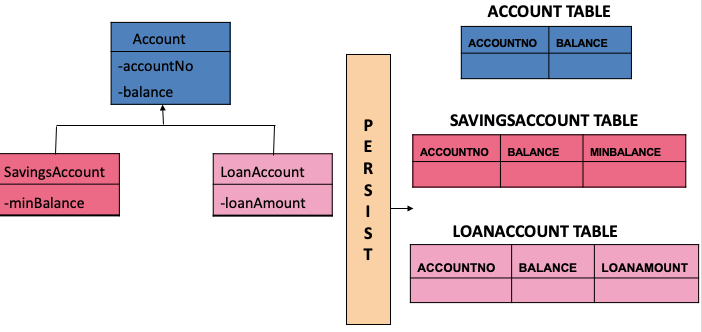
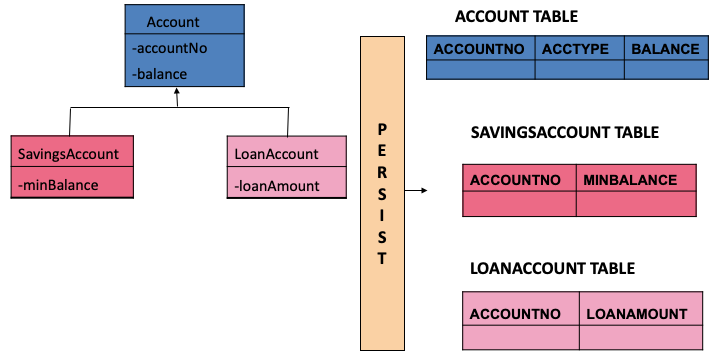

# Entity Relationship

## Direction of Relationships
Unidirectional: One class has reference of another class. Another class doesn't have reference of it.
Bidirectional: Both classes have reference of them.

```
// Only one class has reference of it
public class Employee{
    int empID;
    Address address;
}

public class Address{
    int doorNO;
    String street;
}
```
```
// Both classes have reference for each other
public class Employee{
    int empID;
    Address address;
}

public class Address{
    int doorNO;
    String street;
    Employee employee;
}
```
## Cascade Operation
Entities that use relationships often have dependencies on the existence of the other entity in the relationship.

Cascade means the operation that are applied on the entity will be applied on the relationships the entity contains.

They are some options.
1. PERSIST: If the parent entity is persisted into the persistence context, the related entity will also be persisted.
2. REMOVE: If the parent entity is removed from the current persistence context, the related entity will also be removed.
3. MERGE: If the parent entity is merged into the persistence context, the related entity will also be merged.
4. DETACH: If the parent entity is detached from the persistence context, the related entity will also be detached.
5. REFRESH: If the parent entity is refreshed in the current persistence context, the related entity will also be refreshed.
6. ALL: All cascade operations will be applied to the parent entity’s related entity. 

Example:
```
// cascade option happens right after the relation annotation
@OneToOne (cascade = CascadeType.ALL)
```
# 4 Types of Entity Relationship

## OnetoOne

```
// Example 1 Unidirectional
@Entity
public class Employee{
    @Id
    int empId;
    String name;
@OneToOne(cascade=CascadeType.ALL)
@JoinColumn(name="accNo")
Account account;
}

@Entity
public class Account{
    @Id
    int accNo;
    String bankName;
}
```

```
// Example 2 Bidirectional
@Entity
public class Employee{
    @Id
    int empId;
    String name;
@OneToOne(cascade=CascadeType.ALL)
@JoinColumn(name="accNo")
Account account;
}

@Entity
public class Account{
    @Id
    int accNo;
    String bankName;
    @OneToOne(mappedBy="account")
    Employee employee;
}
```

## ManyToOne and OneToMany
In Many to One relationship, the Many is always the owning side.

```
//Example 1 Many to One Unidirectional
@Entity
  public class Employee{
   @Id
   int empId;
   String name;   
 
   @ManyToOne(cascade= CascadeType.ALL)
   // If we don't define this, it will give default name of two class
   @JoinColumn(name=“deptId”)
   Department dept;
}
@Entity
public class Department{
    @Id
    int deptId;
    String deptName;
}
```

```
//Example 2 Many to One Bidirectional
@Entity
public class Employee{
    @Id
    int empId;
    String name;   
 
@ManyToOne(cascade= CascadeType.ALL)
@JoinColumn(name=“deptId”) 
    Department dept;
}

@Entity
public class Department{

    @Id
    int deptId;
    String deptName;

    @OneToMany (mappedBy="dept")
    List<Employee> employeeList;

}
```

## ManyToMany

### Many to Many Unidirectional
```
@Entity
public class Employee{
    @Id
    int empId;
    String name;
@ManyToMany
(cascade=CascadeType.ALL)
@JoinTable(name=“MyJoin”, 
joinColumns={
@JoinColumn(name=“fk_employee)}, 
inverseJoinColumns={
@JoinColumn(name=“fk_project”)}) 
 List<Project> project;
}

@Entity
public class Project
    @Id
    int projectId;
    String projectName;
}
```

### Many to Many Bidirectional
```
@Entity
public class Employee{
    @Id
    int empId;
    String name;
@ManyToMany(cascade=CascadeType.ALL)
@JoinTable(name=“MyJoin”) 
 List<Project> projectList;
}

@Entity
public class Project
    @Id
    int projectId;
    String projectName;
    @ManyToMany (mappedBy=“projectList”)
    List<Employee> empList;  
}
```

# Entity Inheritance
* Inheritance is the ability of the sub class to derive the state and behaviour of super class
* JPA supports Entity Inheritance
* Entity Inheritance is the feature of deriving an entity from another entity
* Inheritance persistence strategies are
  - Mapped Superclass Strategy
  - A single table per class hierarchy
  - A table per Concrete entity class
  - Joined Subclass Strategy

## Mapped Superclass Strategy


Entities may inherit from super classes that contain persistent state and mapping information but are not entities. 

This could be implemented by using Annotation @MappedSuperclass. The parent class should not be one Entity. Thus, only two table will be found. The major disadvantage is this implementation doesn't support polymorphic queries.

## Single Table per Class Hierarchy Strategy


## Table Per Concrete Class


## Joined Subclass



# Primary Key Generation


## GenerationType.AUTO


## GenerationType.IDENTITY


## GenerationType.SEQUENCE


## GenerationType.TABLE

