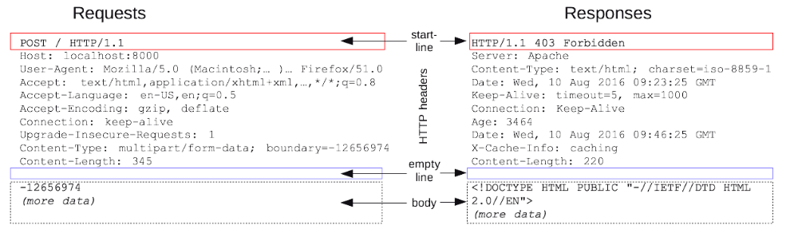
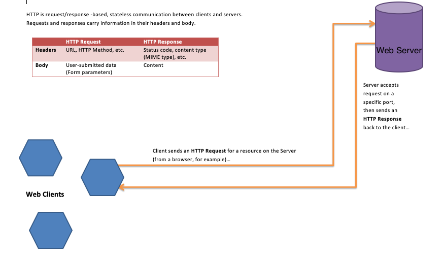

## What is HTTP Protocol (HyperText Transfer Protocol)

HTTP is the **stateless** underlying protocol used by the World Wide Web(www). This protocol defines how **messages** are formatted and transmitted, and what action web servers and browsers should take in response to various commands.

**Stateless Protocol**: A statelss protocol means that server does not retain user information. HTTP is connetionless protocol that only use **HTTP message** transfer information.

**Message**: HTTP messages are how data is exchanged between a server and a client. There are two types of messages: **HTTP requests** sent by the client to trigger an action on the server, and **HTTP responses**, the answer from the server.

HTTP requests, and responses, share similar structure and are composed of:
1) A **start-line** describing the requests to be implemented or its **status** of whether successful or a failure. This start-line is always a single line.
2) An optional set of **HTTP headers** specifying the request, or **describing the body** included in the message.
3) A **blank line** indicating all meta-information for the request have been sent.
4) An optional **body** containing **data associated with the request** (like content of an HTML form), or the document associated with a response. The presence of the body and its size is specified by the start-line and HTTP headers.

## GET and POST message
Both are methods used in the **form** 

POST requests supply additional data from the client (browser) to the server in the message body. POST method is not displayed in URL, and has no size limitation

GET requests include all required data in the URL, and is the **default method**. GET method is **less secure** as it is visible at the browser's address bar and has size limitation

## Status
**1xx Informational:** Communicates transfer protocol-level information.
**2xx Success:** Success
**3xx Redirection:** Client must take some additional action in order to complete their request.
**4xx Client Error:** Error with client
**5xx Server Error:** Error with the server

## Real Example
**Example**: In real example, when you enter an URL in your browser, this actually sends an HTTP command from web clients to the Web server directing it to fetch and transmit the requested Web page. This is demonstrated in the following diagram.

