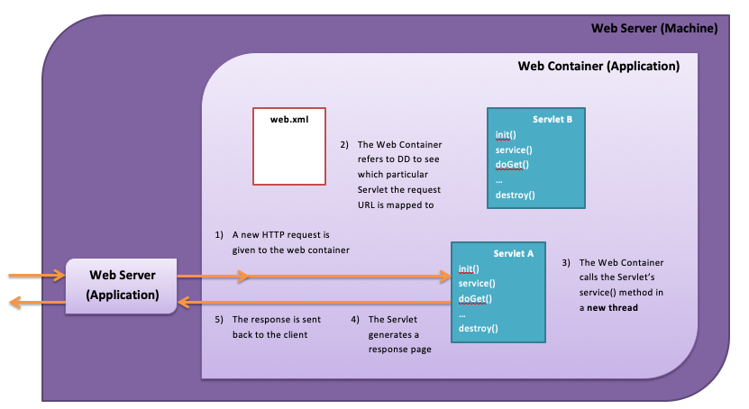

# What is Web container


# What is a Servlet?

Java Servlet are programs that run on a Web or Application server and act as a middle layer between a requests coming from a Web browser or other HTTP client and databases or applications on the HTTP server.

## Servlet Lifecycle

For each servlet, the web container will do the following:
1. Load its class
2. Create an instance – only one for each servlet!
   1. Can be done at startup
   2. Can be done when it is requested for the first time
3. Initialize by calling its init() method 
   The init method is called only once. It is called only when the servlet is created, and not called for any user requests afterwards.
   ```
   public void init() throws ServletException {
   // Initialization code...
    }
   ```
4. Call its service() method in a new thread for each request addressed to the servlet
   The service() method is the main method to perform the actual task. The servlet container (i.e. web server) calls the service() method to handle requests coming from the client( browsers) and to write the formatted response back to the client.
   Each time the server receives a request for a servlet, the server spawns a new thread and calls service. The service() method checks the HTTP request type (GET, POST, PUT, DELETE, etc.) and calls doGet, doPost, doPut, doDelete, etc. methods as appropriate.
5. Call its destroy() method (sometimes done to reclaim memory)
    The destroy() method is called only once at the end of the life cycle of a servlet. This method gives your servlet a chance to close database connections, halt background threads, write cookie lists or hit counts to disk, and perform other such cleanup activities.

## The Depolyment Descritor

A configuration file called **the deployment descriptor(web.xml)** specify how the application is deployed
    - Servelet, Filter and Listener decarations
    - Which URLs are mapped to which Servlets
    - Security constraints
    - Login configuration

```
<servlet>
  <servlet-name>Servlet name</servlet-name>
  <servlet-class>com.fdmgroup.MyServlet</servlet-class>
</servlet>

<servlet-mapping>
  <servlet-name>Servlet name</servlet-name>
  <url-pattern>/location</url-pattern>
</servlet-mapping>
```
```
<servlet-name> is the deployment name, known to the deployer. The servlet name should be same in the file.
<servlet-class>  is the full class name (including package name).
<url-pattern> is the servlet’s URL, known to the public.
```
After Jave EE 6, much of this information can be supplied via annotations.

## GET and POST Method

### GET Method
The GET method sends the encoded user information appended to the page request. The page and the encoded information are separated by the ? (question mark) symbol as follows 
```
http://www.test.com/hello?key1 = value1&key2 = value2
```
* The GET method has size limitation: only 1024 characters can be used in a request string.

This information is passed using QUERY_STRING header and will be accessible through QUERY_STRING environment variable and Servlet handles this type of requests using doGet() method.

### POST Method

A generally more reliable method of passing information to a backend program is the POST method. This packages the information in exactly the same way as GET method, but instead of sending it as a text string after a ? (question mark) in the URL it sends it as a separate message. This message comes to the backend program in the form of the standard input which you can parse and use for your processing. Servlet handles this type of requests using doPost() method.

## Sending Information to the Server

HTML’s  form tag lets us send a GET or POST HTTP request:

```
<form method=“POST” action=“location”>
<input type=“text” name=“parameterName” />
	<input type=“submit” value=“Submit” />
</form>

```

Hitting the ‘Submit’ button sends an HTTP request to the server
The container forwards it to a Servlet mapped to **/location**

The **input** elements become the request parameters
parameterName is the key
What the user types into the text box is the value

## Navigate to a Servlet from an HTML Form


## Retrieving Client Information Server-side


## Request Redirection


## Request Forwarding


