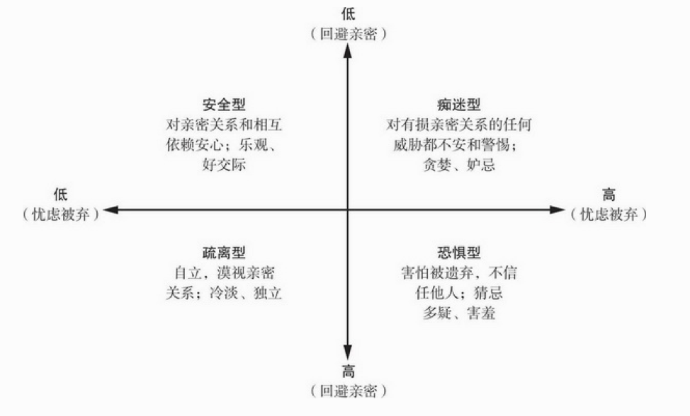
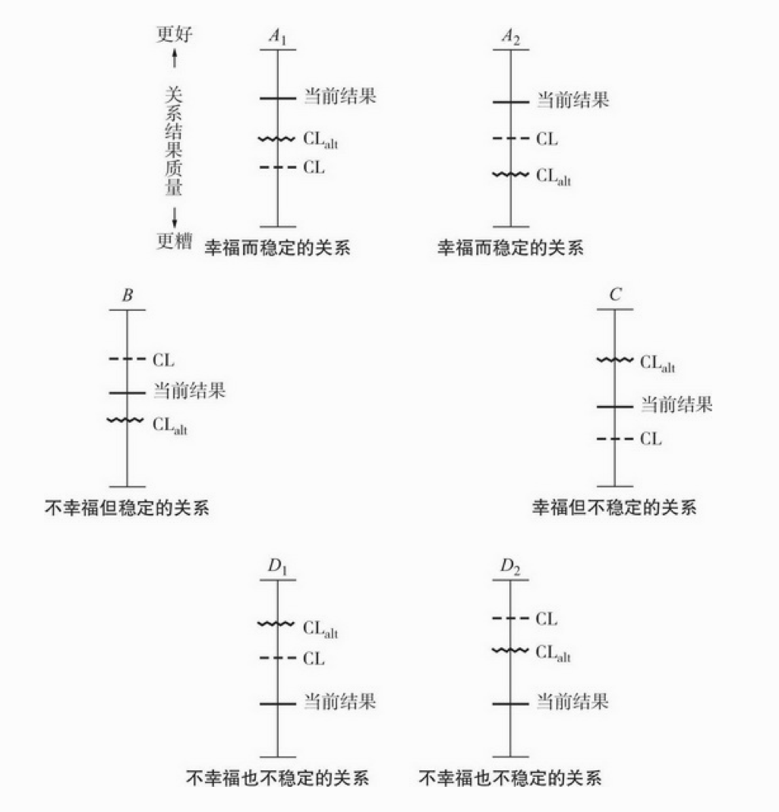
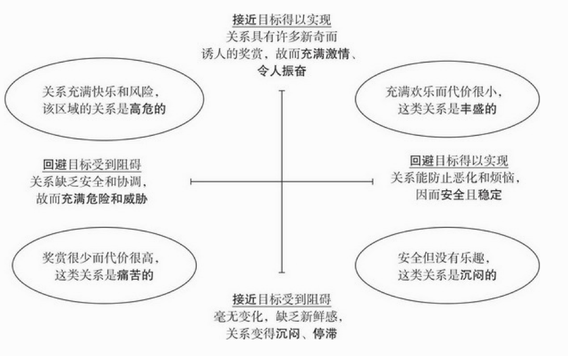
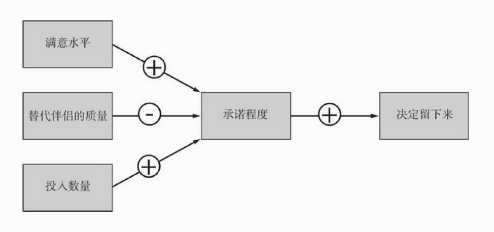
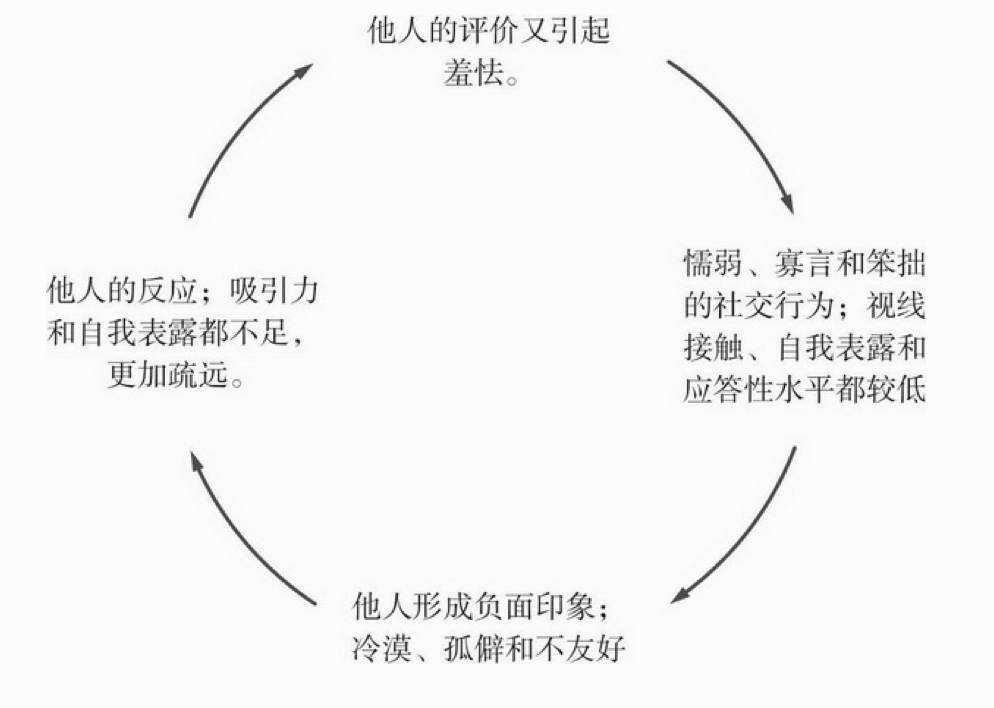
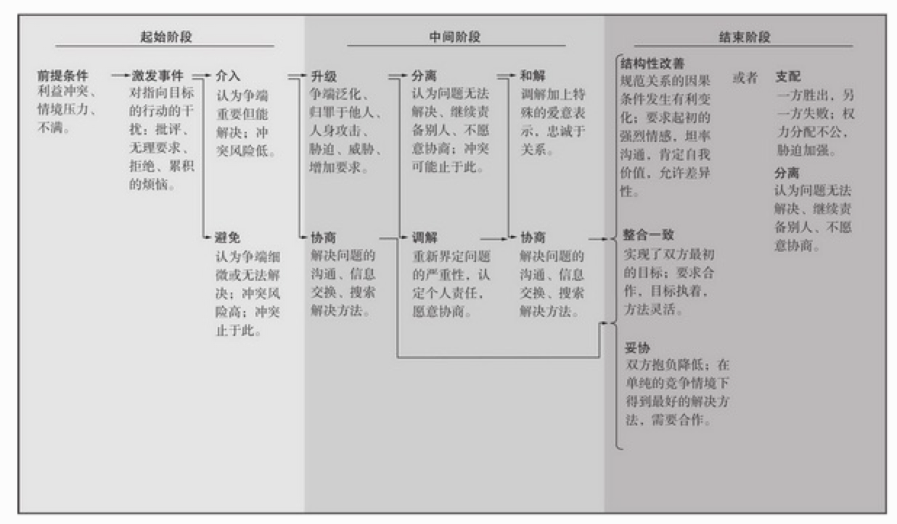
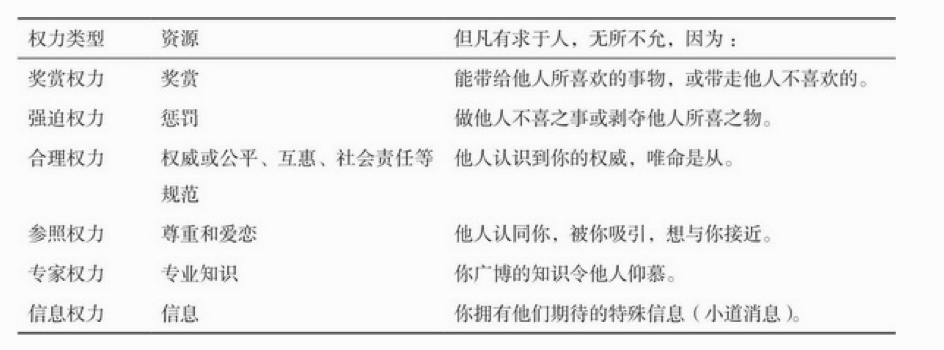
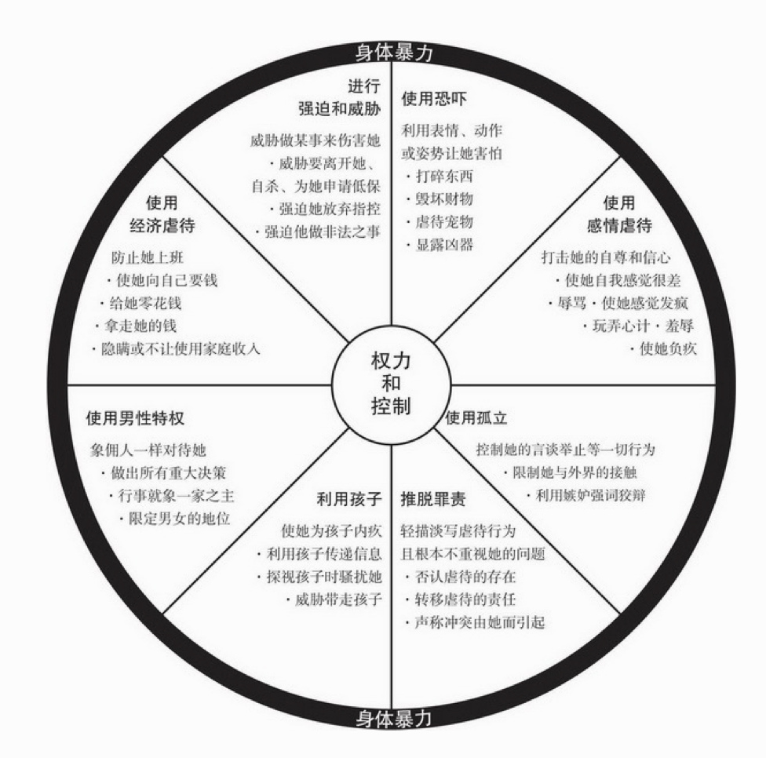
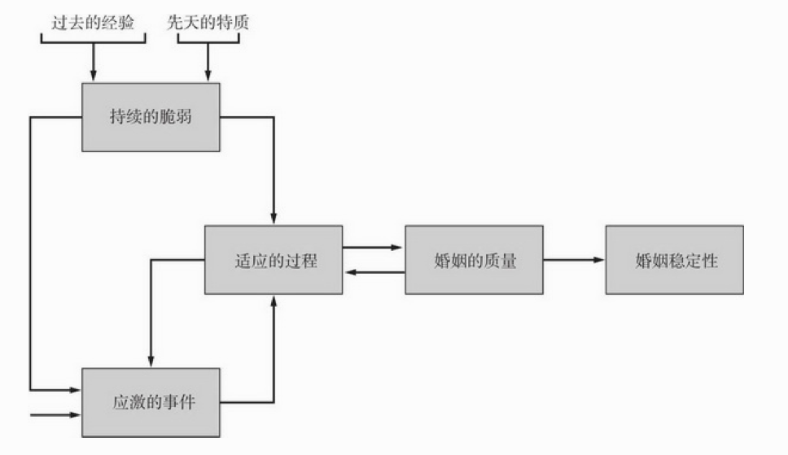

# 亲密关系

## 本书的总结

* 通常期望男性具有的行为风格——鼓励他们果断自信、自强自立而非温情脉脉、亲切体贴——并不能把他们训练成长期亲密关系中最理想的伴侣。
* 低自尊的人常常会小题大做或者知觉到根本不存在的排斥，从而破坏他们自己的亲密关系。
* 临近、熟识和方便能决定有奖赏价值的亲密关系到底能否开始。我们与许多人都可以建立美满的亲密关系，只不过我们遇不见他们而已。
* 长相很重要，如果你的外貌没有吸引力，很多人会忽视你，不想与你结识
* 我们并不如我们认为的那般了解或理解自己的浪漫伴侣；甚至在成功的亲密关系之中也会持续存在很多错误认知。
* 当我们开始结识别人时，他们会努力给我们留下好印象，但一旦我们喜欢或爱上他们，他们就很少努力保持礼貌、端庄和愉悦。
* 在非言语沟通方面男性一般不如女性做得好，非言语沟通的缺陷与亲密关系的不满存在相关。
* 我们常常认识不到：当我们与伴侣谈话时，伴侣并没有接受到我们想要传递的信息。
* 坏的比好的更有力量，我们与伴侣偶尔刻薄或挑剔的交往比我们为他们做的千桩好事更有影响力。
* 长期来看，亲密关系需要付出的代价往往比我们预计得要大得多。
* 浪漫、激情之爱是我们选择结婚的主要的理由之一，但久而久之它一般会减少。
* 约有三分之一人的不能轻松舒适地对待相互依赖的亲密感；他们要么担心伴侣不够爱自己，要么在走得太亲近时感觉不自在。
* 男性一般比女性期望更多的性行为，挫折感常常由此而起。
* 或迟或早，我们的伴侣都可能以某种方式背叛我们，给我们造成伤害和痛苦。
* 冲突是不可避免的。
* 平均来看，婚姻并不如过去那样幸福，离婚现在更为普遍。

亲密关系的维持的一个重要机制就是忠诚。总的来说，忠诚有两方面的作用：

1.  忠诚改变并维持人们的认知：当人们忠诚于他们的亲密关系时，他们在自我认知上就会变得相互依赖，其次，他们会以积极错觉来对待彼此。此外，因为承诺和忠诚带来的优越感也有助于亲密关系的维持。忠诚的伴侣还会表现出对替代选择的无视。甚至，他们会贬低诱人的替代选择。
   
2.  忠诚会带来行为维持机制：这包括来愿意牺牲的意愿、愿意互相成就彼此、愿意忍受伴侣的一些不严重的苛刻对待而不还击。

但是这些都需要人们有意识的努力。有满意、持续的亲密关系是需要维持的。一个有效且实用的维持机制是富有创造性的共同玩乐和探索。一个好的维持机制是包括：积极性、开放、保证、共有社交网络、分担任务、共同活动、支持、冲突管理、回避、幽默。但这些维持机制都不是一劳永逸的，它们的效果是短暂的，需要不断地坚持、富有创造力。

-------------

## 人际关系的构成

### 亲密关系的性质和重要性

亲密关系与泛泛之交的差异在于**了解(knowledge)**，**关心(care)**、**相互依赖性(interdependence)**、**相互一致性(mutuality)**、**信任(trust)**以及**承诺(commitment)**。这六个方面未必全部出现在亲密关系中，任何一个要素都可以单独出现于亲密关系之中。最令人满意和最有意义的亲密关系应当包括亲密关系的所有六个特征。如果只有部分特征，亲密程度就会减弱。

人们之所以需要亲密关系，是因为其包含了人们的**归属需要**，从演化视角来看，归属让人类能够团结一致，从测量的角度来说，归属可以在各种身体指标上有所体现，包括愉悦程度、应激反应、身体健康如免疫力、死亡率等以及心理健康如幸福感或是心理问题上。与不能满足归属需要的个体相比，满足了归属需要的人拥有系统性的优势。

### 影响亲密关系的因素

影响亲密关系的因素多种多样。本书从文化，个人经历，个体差异还有人类本性的方面进行了分析，归纳和总结。

#### 文化的影响

文化对亲密关系有所影响。不同的文化可能有不同的亲密模式，不同时代的文化变化也能在亲密关系中体现出来。就当今的美国（1960-2010）社会而言：
*	越来越少的人结婚成家
*	结婚的年龄越来越大
*	婚前同居变多
*	未婚先育的情况变多
*	近一半的婚姻以离婚告终
*	单亲家庭的儿童变多
*	全职母亲的人数变少

这些变化有着当下经济和法律等因素的推动，但是社会文化在其中的影响也不可忽视。譬如人们对未婚同居的看法，对于单亲家庭的看法，对于婚姻、爱情的看法，都发生了巨大的改变。这种社会看法的认同改变了人们生活模式也因此导致了亲密关系的变化。以未婚同居举例，如今人们可能认为未婚同居可以考察彼此、适应共同生活，因而是个好主意。但是通过数据调查显示，婚前同居会导致分手以及未来离婚风险的上升。对此，有关研究给出的解释是，随意同居会损害人们对婚姻的积极态度和维持婚姻的决心，而这两者是婚姻的支柱。

社会文化的形成也是有许多隐藏的因素。例如，社会经济发展水平的提高，教育程度的提高，西方个人主义的价值观，科技因素等，都对人际规范产生了深刻的影响。有一个容易被人们忽略因素就是性别比率。高性别比率的社会倾向于传统的两性性别角色，低性别比率的社会倾向于颠覆传统，更为开放。这并不是偶然现象，从冲突论或者女权主义的假设来看，这反映了男性的主导地位，因为人际关系规范总是迎合男性的需要而变动。

#### 个人经历的影响

个人经历和经验会影响每个人的依恋类型(attachment style)。依恋类型是人们对人际关系的适应行为。依恋类型的形成可以追溯到婴儿时期。婴儿本身的气质和对待婴儿的不同方式会塑造其依恋类型：

* **安全型（secure）依恋**：婴儿哭喊时，慈爱的照料者总是如约而至，得到此种呵护的小宝贝们就能舒心地依赖他人，觉得他人可以信任，能从别人那里获得安全和友善。结果，这些儿童就发展出安全型（secure）依恋：他们快乐地与他人交往，很容易与他人发展出轻松信任的人际关系。
* **矛盾型(anxiousambivalent)依恋**: 如果大人对孩子的照料无法预测而且并不持续，照料者有时热情关注，有时却心不在焉、焦急烦躁，有时根本就不出现。这些孩子就会对他人产生焦虑、复杂的情感，这种依恋类型就是焦虑—矛盾型（anxiousambivalent）。这些孩子由于不能确定照料者是否以及何时会回来关照自己，与他人的关系就会变得紧张和过分依赖，表现出对他人的过分贪求。
* **回避型（avoidant）依恋**: 照料者在关照孩子时，带着拒绝或敌对的态度勉强为之。孩子就会认为他人是靠不住的，因而在与他人的关系上畏缩不前，表现出回避型（avoidant）依恋。回避依恋型的孩子经常怀疑和迁怒他人，不容易形成信任和亲密的人际关系。

而之后在成人后经历的影响会形成四种依恋类型。

* **安全型(secure)依恋**：在感情上很容易接近他人，不管是依赖他人还是被人依赖都感觉心安，不会担忧独处和不为人接纳
* **痴迷型(preoccupied)依恋**:希望在亲密关系中投入全部的感情，但经常发现他人并不乐意把关系发展到如自己期望的那般亲密。没有亲密关系时会不安，还会担心伴侣不会付出全部感情。
* **恐惧型(fearful)依恋**:和他人发生亲密关系会不安。感情上渴望亲密关系，但很难完全相信他人或依赖他人。担心和他人太近会受到伤害。
* **疏离型(dismissing)依恋**:即使没有亲密关系也安心。独立和自给自足更加重要。不喜欢依赖别人或让人依赖。

但是不能简单的的把一个人归入一个依恋类型。现在的学说(Fraley et al.,2000)普遍认为可以在两个维度的基础上区分这四种依恋类型。这两个维度是回避亲密(avoidance of intimacy)和忧虑被弃(anxiety about abandonment).人们在回避亲密的程度上有差别，这会影响人们接纳相互依赖的亲密关系的难度和信任程度。在亲密关系中感到舒心和轻松的人，回避亲密的程度就低；而与伴侣亲密接触时烦躁不安的人，其回避亲密的程度就高。其次，人们还在忧虑被弃的程度上有差别，即害怕他人认为自己没有价值而远离自己.如图：

依恋类型会不断地受到我们人生经历的影响，只要这些影响足够全面、深刻、系统，是有可能改变依恋类型的，但是依恋类型同样也是一种稳定的趋势，一旦确定，不仅稳定，持久，而且会倾向于自我保持，自我实现，影响人们建立新的人际关系，加强现有的行为倾向。

#### 个体差异的影响

很多时候我们会发现与某些人相处融洽，但与另一些人则格格不入。这是源于个体的差异。在这里会探讨四种不同类型个体差异：**性别差异**、**性认同差异**、**人格差异**和**自尊差异**对亲密关系的影响。

##### 性别差异和性认同差异

性别差异指的是源自身体的两性生物性差异。大部分人过分的夸大了男女之间行为和观点的差别。事实上，两性差异的确存在，但非常小。**两性性别内个体的行为和观点差异通常远大于两性之间的平均差异。**

与性别差异其相对的，性认同差异指的是由文化和教育引起的两性在社会性和心理上的差异，或者叫社会性别。即社会文化所期待的“正常”男女应有的行为模式。男人是应该具有”男子汉“特性。其具体表现为自信、独立、果敢、能干、领导力。女人要有”女人味“。其具体表现是热情、敏感、多情、友善，有同情心。在这里把”男子汉“特性称作**工具性特质**。而女人味特性称作**表达性特质**。工具性和表达性对于男女两性的健全的人际交往来说都是必不可少的，理想的亲密关系双方应该兼有工具性和表达性。

##### 人格差异

人格特质会影响人们一生的人际交往行为，人格特质较稳定，长期也只会缓慢地变化。

五大人格特质

* 开放性：想象力，不墨守成规，艺术气质。对应的是拘泥，僵化和教条
* 外倾性：开朗，合群，热情。对应的是谨慎，内敛和害羞
* 尽责性：勤劳，可依赖性有序。对应的是不可靠，粗心大意
* 宜人性：同情心，合作性，对人信任。对应的是 易怒，暴躁和充满敌意
* 神经质：善变，容易担忧，焦虑和愤怒的程度

神经质维度对亲密关系的作用最为消极，其余几个特质则正相关。不同与依恋类型和性认同差异那样主要由经验塑造，人格的遗传因素相当大，而且他非常稳定和持久。它影响人际关系的程度远大于人际关系影响人格的程度。

##### 自尊差异

自尊是我们的“社会关系测量仪”，用来测量我们与他人人际关系的质量。如果他人喜欢我们，我们就会喜欢自己，如果他人讨厌我们，我们就讨厌自己，即低自尊。我们的自我评价极大地收到我们假想的或是知觉的他人看法的影响。低自尊的坏处不仅仅是让人感觉糟糕，还在于低自尊的人的认知收到了他们的情绪体验的损害。低自尊的人会低估伴侣对他们的爱，会察觉到其实并不存在的漠视，并且很难真心相信伴侣爱自己，这也导致他们悲观，对于伴侣的好处视而不见，对于坏处则反应过度。而如果亲密关系出现了问题，自尊低的人会更加难以建设性地行动，而是把自己隔离起来，生闷气。因此，低自尊的人总受到自身自尊心的困扰，将其脆弱的自尊心置于亲密关系之上。从时间上来讲，低自尊一旦形成就很难克服，所以低自尊既来自于人际关系，也深刻地影响着随后发生的人际关系。

#### 人类本性的影响

人们的心理机制是为了适应人类的需要而被选择出来的。

演化心理学的三个假设

* 性选择（sexual selection）使人类成为今天这样的物种
  * 归属需求这类动机具有适应性，赋予了有这些动机的个体某种繁殖优势
  * 任何普遍的心理机制之所以以它目前的形式存在，是因为它有利于人类解决过去的生存或生殖问题
* 演化心理学认为两性之所以存在差异，只是因为某种程度上他们在过去面临着不同的繁殖困境
  * 男女在生育孩子问题上的不一致代价导致他们在选择伴侣时谨慎程度不一致
  * 女性可以明确某个孩子是不是自己的，而男性不能。所以男性对红杏出墙格外警惕
  * 男女在短期和长期性行为的不同策略
    * 男性更渴望短期性关系，更喜欢与多个性伴侣保持短期风流关系，更早的发生性关系
    * 女性在选择短期性伙伴时更看重性感，有魅力，强势的阳刚之气的男人。在选择丈夫时，经济前景为首选。女性比男性更关注长期伴侣的经济前景和社会地位
* 文化影响决定了演化形成的行为模式是否具有适应性
  * 对于男人而言，对多个性伴侣的渴望可能不如数百万年前那般具有适应意义了
    * 生殖技术的发明（例如避孕药）能让女性完全掌握自己的生育行为
    * 通过性接触而传染的致命病毒

----------

## 吸引力

人类是社会动物。人际关系赋予我们的是一种归属感。这种归属感也是人际关系的根本驱力，而吸引力是这种这种驱动力的一种表现。吸引力的基础在于一种奖赏价值，包括直接奖赏和间接利益。他人的出现对于我们是有奖赏意义。

吸引力与多种因素有关联。概括来讲，包括五种情况：距离、长相、相似、障碍（得不到的就喜欢）。下面分析了五种情况内包含的要素以及需要注意的点。

### 近距离产生的吸引力

距离近意味着**方便**与**熟识**。首先与远距离的伙伴交往消耗的金钱和付出的努力成本更高。其次，远距离的人际关系奖赏价值也低。重复的接触导致的**曝光效应**也更容易导致喜欢。但是近距离的作用其实是中性的，它相当于一个放大器，它可以让我们对喜欢的更喜欢，讨厌的更讨厌。所以我们不能忽略距离对吸引力的作用。

### 长相吸引力

长相吸引力对人们第一印象的形成有着重要的正面影响。具体影响也取决于当下文化。但人们对美的偏见会导致混淆容貌和才能。人们容易为美貌的人加上许多品质上的光环。

从演化论来看，人们的审美也是进化的产物。首先，审美很大程度上是跨文化一致的。婴儿也更加偏爱漂亮面孔。这说明了审美有遗传性。最重要的是，审美的那些特性是具有适应性，并且人的健康或生殖有关。文化在个人审美上也是有影响的，在不同的社会经济条件和文化氛围下，吸引力的标准会有些许甚至重大的改变。

在获得与异性交往的机会方面，男人长相吸引力比女人更重要。长相平庸的女性也能花大量时间在与男性交往上，但是长相平庸的男人与任何女性的交往机会都少。

长相吸引力在性选择上是有优势的。由于社交机会多且环境友好、轻松，他们经常不那么孤独、社交技能也较好，自尊也高。但这并不意味着它毫无代价。对他们来说，外人更有可能对俊美之人撒谎，因而俊美之人无法分辨真诚的夸奖和奉承讨好，这部分损害了他们对别人的信任，以及享受他人真心对待的幸福。

人们或许都想找到俊美的伴侣，但从调查结果来看通常是与自己容貌相当的人配成对。这种现象称为匹配。在亲密关系越严肃、投入程度越多时，匹配就越明显。有时运气好的话人们偶尔能与长相胜于自己的人约会，但这种恋爱关系并不稳定，也很难发展到订婚，因为双方并不是“同一类人“。所以要想享有成功的亲密关系，我们应该追求最有可能回报我们的伴侣。

*	计算公式：对未来伴侣的期望值=伴侣的外表吸引力×伴侣接纳自己的可能性

通常来说，我们总是喜欢那些同样也喜欢我们的人。喜欢报以喜欢，讨厌报以讨厌。**伴侣接纳自己的可能性这个参数很大程度上与我们自身的适配价值有关**。

专栏里面还介绍了搭讪时不同的开场白所导致的不同后果：中性或直接的开场白最好，幽默的开场白往往不太好，带有轻浮意味或是性意味的开场白效果最差。

### 相似性带来的吸引力

人际吸引最基本的原则之一就是相像律。相似的人总是能感到愉悦快乐的。但是，相似性也有一定的排序，首先是年龄、教育程度、社会地位等人口统计学上的相似，其次是态度和价值观的相似，最后是性格上的相似。

但是很多人认为相异相吸。这个观点被人际关系学家认为是错的。这里的误区在于

**匹配是一个广泛的过程**

匹配是广泛的过程。**在匹配相似性时候要考虑到价值上的匹配或是认同等级上的差异**。例如，有钱的丑陋男子与年轻漂亮的女子的结合，看似相异，但从价值匹配上来讲，是相同的，而价值匹配在这段关系中是比长相匹配更重要的。又例如，某男和某女爱好不同，价值观却相似，但是两者对于价值观的重视甚于爱好，那在这里也应该认为是相似主导了吸引力

**发现差异有时需要时间**

人们往往需要一段时间来充分了解彼此的共同点和差异。在很多时候，我们只是自我的认为对方有着相似的价值观。而纠正这个错误的知觉是需要时间的。随着时间的差异，实际上的不同会逐渐暴露出来，但这并不表明相异相吸，只不过是知觉与现实的不匹配罢了。此时，人们在亲密关系的不同阶段关注的信息也不同，起初是年龄长相等明显的外部特征，随后是价值观，最后是彼此的角色承担，有时候重大的差异婚后才显现出来。夫妻也并没有离婚，但这并不能证明相异相吸，而是说明这种差异恰恰起到了负面的效果。最后，一些相异的品质最初可能看起来有吸引力，但是后来显得令人厌恶。例如一开始的热情主动风趣，后来变成了拈花惹草。这只是**相异相吸的假象**而已，一旦时间推移，问题会逐渐暴露出来。

**理想自我的因素**

很多时候，我们往往喜欢那些与我们的理想自我相像的人。即那些拥有我们期望得到却并不具备的品质的人。这种倾向性比较复杂，如果那些人超过了我们的理想自我，让我们相形见绌，就具有威胁意义和令人不快了。最有吸引力的伴侣仍然是那些在很多方面和我们相像，但又拥有我们通过努力就能实现的理想特征的人。

**差异可能随着时间减少**

一些夫妻或情侣即便因相异以外的原因在一起，他们的差异也会在他们有意识的努力或是无意识的磨合中消失。亲密关系会使人们之间的差异性发生改变。

**某些相像比其他相像更重要**

某些相像或许十分重要，而另一些相像（或者相异）可能无关痛痒。如果伴侣双方都不太看重这种差异的话，相异或许一点影响都没有。比如说如果伴侣双方在宗教上都非常虔诚，共同的宗教信仰就非常有满足意义；而如果双方都不是积极的信徒，宗教上的相像就没什么影响，

**“相异”可能其实是互补**

互补不是相异，而是相似。不同类型的行为有时却能和谐共存。有助于我们实现目标的行为都是受欢迎的。如果伴侣双方有不同的技能，一方往往乐于让另一方在其优势项目上发挥特长。这样的行为就是取长补短，即互补性（complementarity），它能弥补我们的不足，因此具有吸引力。

**相像具有吸引力的原因**

遇见相像的人通常令人心安、具有奖赏价值。发现他人与自己相像令人快慰，提醒我们自己的样子是没有问题的。这种奖赏价值是相像具有吸引力的原因。

### 欲求不得带来的吸引力

最后一个影响吸引力的因素是人们努力克服障碍以实现期望的基本倾向。如果我们面临失去某种事物的危险时，我们可能反而想得到更多。

### 期望的理想伴侣

如果有选择的话，大多数人都期望伴侣有以下的特点：
* 热情和忠诚，值得信赖、亲切友善、给予支持、善解人意；
* 吸引力和活力，长相俊美、性感、外向；
* 社会地位和资源，经济宽裕、生活安心。

男女两性的理想伴侣所具有的品质是相似的，但是排序根据性别或关系的短期长期性质略有不同，这在某种意义上也是演化观的体现。就长期而言，男性的理想伴侣为热情与忠诚>吸引力和活力>社会地位和资源，女性则为热情忠诚>社会地位和经济资源>吸引力和活力，男同性恋与女同性恋与此类似。在短期关系中，两性的要求则都比较低，但女性更看中长相一点。

## 社会认知

社会认知一般指我们**理解社会现象的知觉**和**判断过程**。我们看待事实的方式并非被动的、客观的。而是时时刻刻受到知觉、信念、认知的影响。我们的行为方式不仅依赖于外在的影响事实，还受到我们如何对它进行主观建构的影响。

### 第一印象及其影响

第一印象很重要。第一次与人短暂的谋面后，对别人所形成的印象深刻而持久，初期的认知在数月之后还影响着人们的判断。在初次交往时如果十分厌恶某人，那么我们就会回避与他发生任何进一步的接触.即使发现了新朋友的其他特点，第一印象仍会持续地影响着我们的评价。这可以看作是认知上的一种偏差。第一印象很大程度是根据刻板印象来形成的。**刻板印象是概括**，这种概括可能正确，也可能错误，**但是如果我们过分依赖于概括，以至于忽略了个体差异，它就偏向了错误的方向**。一般而言，人们判断一个人时会受到刻板印象的影响，这让我们的判断变得方便快捷，但却容易误判的，甚至是一种自我实现的误判。最先获得的信息印象深刻。这是因为首先获得的信息将引导人们的注意力。**前面的信息也会影响后续新信息的解释**。此外，还有一个系统性的认知偏误在于，**人们往往拥有“验证性偏差”**，**他们常常寻找那些能够证明自己正确的信息，而不是相反**。因此，人们往往会过度自信，即便是那些站不住脚的第一印象，人们也倾向于维护它而不是推翻它。这个现象被叫做**首因效应**。这种效应让我们无法对人际关系有客观的知觉。在这个时候可以去征求父母或朋友对于一段亲密关系的意见和前景。

### 伴侣理想化

当然这种自我实现的效应也会让我们以一种“积极错觉”来看待自己的伴侣。譬如，虽然伴侣优缺点，但我们会认为这种缺点是局部的且有限的。这也会让彼此更努力地维护这份关系，因而最终收获满意的爱情。但是如若这种积极错觉与现实差距过大就会收获失望。保护自己免遭幻想破灭的聪明方法是：随着对伴侣了解程度的增加，不断调整自己对理想伴侣的期望，这样，对伴侣的期望标准就能切合伴侣的现状。

### 归因过程

另一个知觉的强大力量之体现在于归因过程。归因（attribution）就是指人们对正在发生的事情提出的解释。归因能确定事件的起因，强调某些因素而忽视其他因素的作用。人们的归因不同，对事物的看法、情绪都会大大不同。人际关系的归因研究发现三个普遍存在的现象：

*	**行动者/观察者效应**：人们作为行动者时，容易感受到环境因素，但是作为观察者时则不然，这导致我们**评价自己时容易做出外部归因，但评价别人时则相反**。这种偏差往往双方都不会意识到。

*	**自利偏差**：这里仍然是**信息和判断上的不对称的体现**，因为许多信息只有在自己身上才让人印象深刻。因此，人们在失败时容易归因为外界，成功时容易归因于自己。自利偏差还体现在，人们能够估计到别人的自利偏差，却不能认识到自己的自利偏差。例如，丈夫上床睡觉时想着帮妻子做早餐。但是第二天他睡过了头，不得不飞奔去上班，根本没有任何善意之举，却可能仍感觉良好：毕竟自己有颗为对方着想的心。相形之下，妻子只能从丈夫的行动来评价他；她又不会读心术怎能懂得丈夫心中所想，这里没有任何证据证明丈夫的好心好意。不同的信息来源使丈夫认为自己是位尽心尽力、周到体贴的好伴侣，但妻子却不这么认为。

* **伴侣双方的归因模式能够预测亲密关系的满意程度**：幸福的伴侣对彼此的积极行为通常给**以内部的、稳定的归因**，同时**淡化彼此过失**，认为那是外部、偶然的因素导致的。而不幸福的伴侣的归因模式与此相反。我们发现，如同前述积极错觉，积极的归因和消极的归因也是一种自我实现。
  * 安全型依恋模式的人更多采用积极归因模式，不安全的人则相反。依恋类型的两个维度的作用有所差别：忧虑背弃的人倾向于责备伴侣的不当行为，回避亲密的人对伴侣的体贴行为不放在心上。

### 记忆

针对过往事物的记忆也会影响亲密关系。但是随着新事物的发生，记忆也是会被人们进行修正和更新。这称为“**重构性记忆**”。重构性记忆与当下的亲密关系是互相影响。如果当前幸福，人们倾向于忘记过去的不愉快；但如果伴侣感到痛苦，亲密关系在走下坡路，人们会低估过去曾经的幸福和情意。

### 信念

人们会带着人际关系的固有信念或图式进入一段关系。。一种常见的图式是浪漫主义。浪漫主义认为 1）与伴侣的爱情是完美无瑕的；2）每个人只能有一个完美的“真”爱；3）真爱能克服一切障碍；4）一见钟情是可能存在的。这会提高了人们的对伴侣的期待，但因为这不易满足，也会导致亲密关系的不稳定性。

书中总结了一些**最为错误**的理论观点：
1. 争吵具有破坏性，如果相爱，就不会有争吵。
2. 读心术很重要，好的伴侣应该如同会读心术那样了解自己
3. 伴侣不会发生改变，一旦关系变糟糕，也是如此，不会好转。
4. 每一次的性生活都应该是完美的
5. 男人和女人差异很大，无法沟通协调
6. 美好姻缘天注定，不需要用心经营。

### 期望

人们会期望他人做出某些特殊行为，即使这些期望一开始是错误的，后来却能变成现实。这里列举了自我实现期望的步骤：

1. 基于刻板，偶然的了解，以前的交往或第三方的影响对他人形成的期望
2. 微妙地传递自己的期望
3. 目标的解释会影响他自己的反应
4. 目标做出反应 
5. 知觉者解释目标反应，但是没有意识到自己在引起反应中所起的作用。

**实验**：

研究者先误导参与者的期望：陌生人要么喜欢他们，要么讨厌他们，然后让他们与该陌生人交谈。预期自己将被人喜欢的参与者与陌生人打招呼时富有魅力，开朗而积极——他们的言谈举止讨人喜爱——并且真的得到了陌生人的喜爱。然而，预期自己被人讨厌的参与者则显得小心翼翼、戒心重重、畏畏缩缩，对方也的确讨厌他们。

**结论**：

对他人的期望能引导我们对他人做出的行为反应，所以期望具有促动作用。积极的期望对人际交往有所裨益，而消极的预期则相反。经常忧虑被他人拒绝的人，其行为方式往往更可能遭人拒绝。

### 自我知觉

在社会交往中，自我概念比较重要的两个功能是**自我提升**和**自我证实**。听到与自己信念矛盾的信息会令人不安。拥有正面自我概念的人获得他人的恭维时，获得的反馈同时具有自我提升和自我证实作用。但对于那些真正认为自己能力不足和不招人喜欢的人而言。他人赞扬会威胁到他们的自我形象。对于拥有**负面自我概念**的人，自我提升与自我证实是冲突的。他们会希望**逃避赞同他们的对象**。在爱情关系中，这情况会更加复杂。即使拥有负面自我概念的人也会需求给予积极反馈的伴侣，不过如果他们发现爱人不断表演和欣赏他们时，就会逐渐逃避。对于负面自我概念，即使贬低也能够与其相处。这与正面自我概念的人相反。

### 印象管理

**印象管理**是通过控制自己给他人**传递**出的**信息**来**管理我们在别人眼中的形象**。大多数印象管理的策略是向别人**有选择性**地披露自己**真实的特性**。

人们通常会用到四种印象管理策略：

1. **寻求他人的接纳和喜欢**：会用到逢迎讨好（ingratiation）策略，帮别人的忙，夸赞别人，谈及共识，装作可爱而大方。
2. **得到他人的认可和尊重**：自我推销（self-promotion）策略来向他人描述自己的成就，或颇具策略地公开展示自己的技能。
3. **恐吓**：把自己描绘成无情、危险和凶恶的形象，以使他人顺从自己。这样的行为令人反感，会使人避而远之。不过如果只是偶尔为之，或者对待的是儿童和无家可归的流民，恐吓或许能达到一些目的。
4. **恳求**：表现出无能或体弱，以逃避责任或求取他人的帮助和支持。

大多数人会避免使用恐吓和恳求。因为我们都希望自己讨人喜欢和受人尊敬，而不是让人害怕或者要人怜悯。但几乎人人都偶尔会用到恐吓和恳求策略。

但是在亲密关系中的印象管理有几个尤其值得注意的点：
1. 人们印象管理的动机存在个体差异，自我监控高的人印象管理动机强，自我监控低的人则各种社交场景都一个样。这两种风格总的来说有利有弊，甚至在不同阶段的影响也不一样，自我监控高的人在第一次见面时往往更为擅长，但是他们经常只是泛泛之交。他们的人际关系维持的时间更短，投入更少，起初的社交优势，关系稳固、深化时却可能成为障碍。
2. 人们在熟悉的人心中的形象更为重要，但是花费的心思往往较少。

## 沟通

信息沟通是从传递者脑中的意图，再到传递者通过一定的编码特点将意图转化为行动，然后是接受者将信息和影响接受入自己的脑内。这里的重点在于，**传递的意图只有本人了解**，**接受者的影响也只有本人了解**。在这传递和接受过程中存在着噪音和干扰了。这也是人际隔阂的根本原因所在。

### 非言语沟通

非语言沟通包括面部表情、注视行为(注视多关系好)、身体动作(身体动作比面部表情更加真实)、身体接触(接触多关系好)、人际距离(距离近关系好)、副语言(嗓音)等六个方面。这些非语言的敏感性和准确性能够预测亲密关系的幸福程度。一般来说，女性更为擅长这一点。

### 言语沟通

言语沟通可以和自我表露联系起来。自我表露指向他人透露个人信息的过程，它是亲密程度的指标之一。随着亲密关系的加强，沟通的深度和广度都不断加深，而且我们倾向于匹配彼此的开放程度。如果一方一次说的太快、太多是危险的。因为这不符合人们的期望而会给人留下糟糕的印象。但是随着人际关系稳定，这种相互作用就减少了，对于长期亲密关系来说，重要的是对方的应答性。在伴侣的亲密关系中往往存在着一些禁忌话题，但是禁忌话题越多，一般来说满意程度就越低，除非他们相信避开这些话题有助于改善关系。

言语沟通中存在着一定的性别差异，包括交谈话题、谈话风格、自我表露、工具性对表达性。需要注意的是，男性倾向于不太亲密和不带私人色彩的话题。比如“物品和活动，聊些名人和政治人物而非朋友，找些乐子而非支持和忠告。而女性经常进行的是情感和私人生活。谈话风格上，女性一般较为间接和具有试探性，同时很少长篇大论。但是在男女互动的对话时，男性对女性较为开放，女性彼此之间也较为开放，但男性不怎么对其他男性进行自我表露。在屏蔽性别的对话实验中，研究者不能很好的分辨出参与者的性别。

### 沟通的不良表现

#### 沟通不良有几种典型表现。

1. **无法精准的描述问题，并且经常数怨并诉，谈话经常偏离主题**。这通常使最为关注的事情掩埋在同时责难的许多沮丧事件之中。书中举例：如果因为伴侣迟还录像店的影碟被罚款而感到恼怒，他们可能会说，“不只是因为你粗心，都是你和你那帮狐朋狗友瞎玩，对家里的事情从来不上心”。
2. **彼此倾听上也存在问题，缺乏耐心，以及自以为是的读心术来消极的打断别人的谈话**。书中举例：“你这么说就是要惹我生气，是因为昨天的事向我报复”
3. **经常进行反向抱怨，谈话因此而陷入互相埋怨之中，无法推进**。书中举例：一方说“我讨厌你把盘碟堆在洗涤池里不洗。” 另一方说“哼，我讨厌你把衣服随便扔在地板上。”
4. **交谈时表现出消极情感** 这类有破坏性的交往通常以批评（criticism）开场，**攻击伴侣的人格和品德，而不是针对引起抱怨的具体行为**。比如不去讨论某个特定的令人懊恼的事件（“你把用过的湿毛巾丢在地板上让我很生气”），而是全面指责对方的性格缺陷，这样的批评只能使伴侣交往的矛盾更加激化。

#### 正确的沟通表现在于：

1. **精确表述**：就事论事。将谈话聚焦在单个行为上，而不要分散注意力、用第一人称描述——让双方都明晰地辨识我的情感。用“当你在Y情况下做X时我感到Z”来陈述。
书中提供的对比：
* “你怎么这么不为我着想！从来不让我把话说完！”
* “你刚刚打断我讲话的时候，我感到很生气。”

这两者的效果差别很大。其中一个陈述有可能得到伴侣体贴的、表达歉意的回应，但另一个则可能适得其反。

2. **积极倾听**：在沟通中当我们接受到他人的信息时，有两个重要的任务要完成。第一是要**准确地理解对方话语所表达的意思**，第二是要**向对方传达关注和理解**。其中一个倾听技巧是**复述**。用复述可以可以保证自己能理解对方的意识，并且避免自己失控。另外一个技巧是**知觉检验**。这要求对方阐述自己说过的话，澄清某些说辞，从而能评价自己的感受所做的推断是否准确。例子：“你好像对我说的话感到很不安，对吗？”

3. **守礼而镇定**：在生气和被激怒时能保持冷静是可贵的技能。书中也介绍了两个小技巧：（1）如果认为他人强词夺理、有失公允而造成本可避免的悲痛和不幸，这种认知就会引起愤怒反应。在这个时候或许要换种观点来看问题。可以思考为什么对方持有反对意见。（2）在任何情况下都要**避免双方彼此来回反复地侮辱和讥讽**。在这个情况下，需要暂时打断一下这种恶性循环。

4. **尊重和确认的力量**：我们要**明确地**表现出**对他人观点的关心和尊重**。确认并不需要你一定与伴侣观点一致。即使与伴侣的观点相左，你也能对其观点表示适当的尊重和认可。

## 相互依赖

### 以经济学来看待亲密关系

相互依赖理论认为我们在寻求**以最小代价获取能提供最大奖赏价值**的人际交往，不过，由于每个人都这样做，所以亲密关系中的伴侣**双方**都必须**满足**自己的**利益**。

以这个理论为前提，我们可以量化成一个公式：**结果=奖赏-代价**。这其中的**结果的正负并不重要**。重要的是这结果和另外两个变量的相对关系：
*	**期望比较水平CL**（comparison level）：CL建立在过去经验的基础之上。如果人们曾有过奖赏价值很高的伴侣关系，就可能有较高的CL，表明他们现在还期望并觉得自己理应得到非常好的交往结果。相反，如果过去经历过困难的亲密关系，那么CL就会很低。满意度=结果-CL。
*	**替代的比较水平CLalt**：CLalt指假如没有现在伴侣，我们认为自己会过得怎么样。CLalt的估算包含了离开亲密关系的代价，投入的损失，他人产生的诱惑。CLalt与结果的关系决定了人们会不会离开当前关系。即可以预测亲密关系的稳定性，依赖度=结果-CLalt。

CL、CLalt和实际上的关系结果。这三者会产生六种不同的相对关系，但是可以归纳为四种模式，即幸福稳定、幸福不稳定、不幸福稳定、不幸福不稳定。

期望比较水平CL和替代的比较水平CLalt是会改变的。人们一旦彼此生活在一起，可以得到的满意度会降低。这些让亲密关系的恶化有五种典型的原因：
1.	**缺乏努力的动机和实际行为**：没有之前追求时候的动机。生活平淡化。
2.	**相互依赖的放大镜作用**：频繁的交往也意味着琐碎的烦恼由于不断重复，可能会渐渐引起真正的痛苦，
3.	**人们用私密信息伤害彼此**：利用或泄露私密信息让人难堪。
4.	**情况有变，曾经的奖赏变为代价**：了解了那些我们自以为已知事情的真相。
5.	**不现实的期望**：期望和现实之间的差距会让人感觉失望。对亲密关系之未来保守而慎重的期望远比浪漫的理想主义更明智和理性。

这些行为都会导致满意度的下降。此外，文化也会影响CLalt水平，经济独立，无过错离婚，也会提高了人们寻找替代伴侣的机会和动机。

### 奖赏和代价

在追求美满的关系结果时，双方都应该深思熟虑地保护和维持对方的幸福。**这需要彼此，宽容大度地对待对方是非常有益的，能增加伴侣的利益，从而使对方留在自己身边。如果想要别人对你好，你必须先要对别人好。**但是长期保持的亲密关系**无可避免会发生很多生气和恼怒**的事件。在一些场合下，如果关系亲密的人处在最糟糕的状态，对待彼此可能比对待完全陌生的人更粗鲁、无礼、愠怒、自私和麻木。根据本书，要保持满意的亲密关系，至少需要保持至少5:1的奖赏-代价比率。

奖赏和代价对亲密关系的影响则是各自独立，彼此相异的。**寻求奖赏时**，我们企图满足自己喜好体验的欲望即**接近动机**（approach motivation）。这种动机驱使下我们追求快乐。**渴望逃避代价**的是另一种不同的驱力，即**回避动机**。我们会努力逃避不合意的体验，减少诸如焦虑和恐惧等负面情感。这两种动机并不是一块硬币的正反面；实现了接近目标所带来的愉悦，并不是回避目标失败所带来的痛苦的对立面。他们的关系可以从下图中表现出来

只有这接近动机和回避动机都同时实现时，人们才会有十足的幸福感。

人们之间的关系分为交换和共有型关系。交换关系仍然以个人主义为前提，但共有关系中，自我概念已经相互渗透，因而伴侣中无论谁获益，都不再有必要那么泾渭分明。在共有关系下，我们乐意保证他人的幸福，这种结果虽然可能自利，但不自私。与之相应的，在情侣之间，**只有人们满意度不足时，公平问题才显得重要，如果关系非常令人满意，公平上的瑕疵并不会困扰双方。**

### 承诺

亲密伴侣的幸福依赖可以孕育承诺。影响承诺因素有三种：
1.	满意水平，正相关。
2.	替代伴侣的质量，负相关。
3.	投入数量，正相关。

这三种因素可以用来评估亲密关系的持续时间。

三种类型的承诺

1.	**个人承诺**：人们受到伴侣的吸引、亲密关系令人满意，而希望关系继续时表现出的承诺。
2.	**强迫承诺**：即因为离开关系的代价过高，人们觉得不得不继续现有关系时表现出的承诺。
3.	**道德责任感承诺**：认为维持婚姻是一种庄严的社会或宗教责任

个人承诺常常是这三种类型里最强烈的，但强迫承诺和道德承诺也有影响力。道德承诺就比个人承诺能更好地预测伴侣关系能否艰难地度过分离的日子。

承诺带来的效果主要也有三个方面：
1.	**承诺会促进顺应性行为**：有意识不陷入互相报复的努力。
2.	**牺牲意愿**：为了关系的融洽而牺牲自我利益
3.	**改变人们对伴侣关系的认知**：承诺后会认为自己的亲密关系比别人的更好

## 友谊

友谊的构成要素与爱情一样，但是各个因素的结合和重要性不同。友谊一般比爱情承担的**责任更少**，**情感强度更弱**，**排他程度更低**。

友谊的属性：

1. **尊重**：钦佩和重视朋友值得尊重的特质。
2. **信任**：当我们自信地认为朋友会仁慈地对待我们，无私地考虑我们最大的利益时，我们就对他们产生了信任。
3. **分享快乐**：好友通常会为我们的成功感到欣喜，他们的兴奋能增加我们的欢乐
4.	**支持**：帮助我们克服困难。支持的形式一般有四种：
	*	表现为关爱、接纳和安慰等形式的感情支持；
	*	表现为拥抱或搂抱的身体安慰；
	*	表现为资讯和指导形式的建议支持；
	*	表现为金钱或物品的物质支持或有形援助；
5.	**应答性**：感到有人理解、关心和珍视自己

### 友谊的变化

友谊也会随着我们的成长而变化。社会情绪选择理论认为，之所以有这些区别，是因为不同的年龄段有着不同的人际目标。友谊中也存在着系统的性认同差异。男性友谊以共同活动为纽带，女性友谊则是以情感分享和自我表露为特征。男性之间并非没有能力分享情感，而是**社会对男性同性亲密的接纳程度远低于女性**。男性没有能力和其他男性分享有意义、亲密的相互依赖或许是社会文化压力之下迫不得已的选择。

### 友谊发展的障碍

发展友谊的典型障碍包括**羞怯**与**孤独**。

频繁感到羞怯的人与坦荡的人相比有三个特点：
   * 他们对社会指责的担忧要甚于其他人
   * 他们倾向于怀疑自我。
   * 在与人交往的过程中，他们会感到自己能力不足

羞怯者这种负面认知和行为缺陷令人生厌，使得他们与人交往时进退两难。他们担心别人的看法，害怕别人的指责，却又觉得自己没有能力营造良好的印象，以消除此类指责。结果，他们的社会交往通常显得小心谨慎、畏畏缩缩，这会打断、转移别人对自己的兴趣和热情。

羞涩的行为风格往往不能给人们留下好印象，这确证了他们的自我评价，因而陷入恶性循环。打破这个循环的关键在于调整心态，因为在社交能力上害羞者其实不存在问题，只要精神放松，不再担心别人的评判，就可以表现得坦荡豁达。对于羞涩者来说，结交新朋友时不要光想着自己，而是要尽可能地努力寻找对方的特点即可

孤独指我们想拥有与他人更多，更加亲密接触却不得而产生的感觉。这和独处不同。孤独包括**社会隔离**和**情感隔离**。

社会隔离：指的是我们不满于缺少朋友和熟人的社交网络而引起的孤独
情感隔离：指的是我们缺乏深厚的人际关系而引起的孤独

孤独存在两性认同上的差别。一般来说，男性比女性更加孤独。孤独的个体差异与依恋类型和自尊有关——忧虑背弃和回避亲密都与孤独有关，低自尊一般同孤独联系在一起。同害羞一样，克服孤独的方法要在心态上**关注他人的优秀品质，期望他们愉悦友善，并且耐心地承认友谊的建立需要花费时间和精力。**

## 爱情

对于爱情的社会认同大多与文化有关。许多年来，人们对爱情的态度体验至少在以下四个方面有所变化：

* 文化价值：爱情是值得拥有的还是可有可无的情感体验？
* 性欲：爱情应该有性行为还是与性无关？
* 性取向：异性之间和同性之间都能相爱吗？
* 婚姻状况：爱情只专属于婚姻，还是可以保留给第三者？

### 不同文化的爱情观

不同的社会文化对这四个问题的回答不尽相同，从而会形成截然不同的爱情模式。**古希腊人崇尚柏拉图式的爱情**，表现为两位男性之间不带性欲色彩的爱慕。在**古埃及**，具有王室血统的人通常与他们的**同族结婚**；在**古罗马**，**婚姻的目的是为了生养小孩、结交盟友和建立血缘纽带**。幸福和肉体享乐都不是婚姻生活的内容。性行为只是为了生养婴儿。在**12世纪的欧洲**，异性之间的爱情被冠以“宫廷爱情”（courtly love）的美誉。宫廷爱情需要**骑士们把爱情作为一种高贵的精神追求，孜孜以求地献身于贵妇人。**但宫廷爱情显然对现在的我们来说是**不合礼仪的婚外情**。宫廷爱情中的男主角通常未婚，但女主角却是有夫之妇。在**中世纪**，婚姻是与政治和财产有关的非常严肃的主题。对异性产生的强烈的性欲望被人们视为“通往地狱的险恶之门，即使在夫妻之间也不能容忍。**在随后的500年**，人们开始认为**充满激情的爱情**也是**值得拥有**的，但这种爱情常常**注定要失败**。一直到**17和18世纪**，欧洲人才相信**浪漫的激情偶尔也会有“幸福的结局”**。然而他们也认为**充满激情和浪漫的婚姻并不普遍**。在现在，美国人对这一择偶观的理解和重视程度要远胜于大多数其他国家的人。他们认为年轻人应该离开父母，自由地恋爱，自主地决定婚姻，并把恋人带回家与家人见面。但这种恋爱婚姻观对许多地方人看来也是荒谬的。

### 爱情三角理论

对爱情的认识是多种多样的，直到最近的年代、西方国家内才成为主流共识。这里引出一个重要的理论：“爱情三角理论”，即**亲密、激情和忠诚**：
  * 亲密是情感性的
  * 激情是一种动机或驱动力
  * 忠诚主要是认知性的

爱情三角理论认为这三个成分是爱情的三个维度，并且有高低变化，所以不同的组合有着不同的后果，即不同类型的爱情：
1.	无爱(nonlove)，三者都缺失
2.	喜欢(liking)，亲密高，激情和忠诚低
3.	迷恋(infatuation)，激情高，亲密忠诚低 
5.	空爱(empty love)，忠诚高，激情亲密低。
6.  浪漫之爱(romantic love)，亲密和激情高，忠诚可高可低。
7.	相伴之爱(companionate love)，亲密忠诚高，激情低。
8.	愚昧之爱(fatuous love)，缺乏亲密，但有激情和忠诚，通常会闪婚，但是彼此还不够了解或喜欢。
9.	完美之爱(consummate love)，三者全部具备。

爱情的三个成分都会变化，但激情无疑是变化最大，最不容易控制的部分。这是因为激情激活的脑区与爱慕、忠诚激活的不同。他们也是由不同的奖赏系统所调控：**性欲由荷尔蒙调控**，**吸引力的奖赏价值由多巴胺和5-羟色胺调控**，而**长期的依恋和满足由神经肽催产素调节**，且依恋的时间越长催产素含量越高。不过，这三种系统似乎也会互相激发。

### 三种成功的浪漫关系

#### 浪漫之爱

激情洋溢的浪漫之爱通常根源于两个因素：
1. 生理唤醒：如心跳加快，并伴随着
2. 相信另一个人是唤醒的原因

这个和吊桥效应一样是一种错误归因和兴奋转移。但这种生理唤醒只是更加夸大了吸引力的效果。这会让人们更加喜欢有吸引力的异性，更不喜欢无吸引力的异性。而且这种唤醒并不取决于正性的唤醒或负性的唤醒。

* 负性的唤醒：负面的让人心跳加快的事情。

* 正性的唤醒：正面的让人心跳加快的事情

即便人们认识到了自己的错误归因和兴奋转移，唤醒仍然可以增加异性的吸引力。

浪漫之爱也会改变我们的思维方式，它会改变我们对对象的看法并一定程度上理想化他们，忽视他们的缺点。但是浪漫的激情并不是随后岁月中能维持婚姻的原因。一定范围内的理想化可以促进良性循环，成为一种积极错觉。但是这不切实际的幻想即使一开始会让与我们差异很大的人看起来有吸引力，但随着时间流逝，这种效应消失了，爱情也就受到了损害。爱情关系的持久更可能与相伴之爱有关。

#### 相伴之爱

相伴之爱不依赖于激情，因而比浪漫之爱更为稳定。相伴之爱与友情更为相似。在这样的关系中容易察觉友谊的重要性。亲密会伴随忠诚一起出现。 相对应的，在浪漫之爱中不易察觉友谊。亲密和激情是浪漫之爱的主旋律。不过，当友谊也成为浪漫爱情的一部分时，友谊就会和性唤醒及激情相结合。

#### 同情之爱

同情之爱结合了亲密中的信任及理解与同情及关爱，关爱中包含同理心、无私和为爱人牺牲的意愿。同情包含了对他人的同理心和帮助他人的仁慈愿望。具有同情之爱的人往往会与爱人同甘共苦，宁愿自己受苦，也不让自己亲近的人受到伤害。他们大方且有同理心。同情之爱不是盲目的，其根源于对伴侣优点和缺点更准确的理解之上；认识到他们的不足，但我们不管怎样还是爱他们。

### 爱恋风格

爱情体验的体系是取决于在爱恋情感的强烈程度、对爱人的承诺程度、期待的爱人特征以及得到对方回报的爱情期望。

* 情欲之爱（Eros）：四处寻找外表长相适宜的人，并急于建立深厚的关系
* 游戏之爱（Ludus）：视爱情为游戏，玩弄别人的感情
* 友谊之爱（Storge）：偏好缓慢建立依恋，然后产生持久的承诺
* 狂热之爱（Mania）：难以满足并且有强烈的占有欲
* 利他之爱（Agape）：无偿付出，利他，无私，把爱情视为一种责任
* 现实之爱（Pragma）：寻找适合的关键指标：工作年龄宗教...

## 性爱

### 性行为的态度的转变

人们在过去几十年间对性行为的态度发生了很大的转变。父辈们在意的是性行为是否在结婚之后，而现在的年轻人则是认为在只要满足忠诚和情感的前提，就可以发生性行为。第二点个差异是在于对随意性行为的态度。女性比男性更加认为性行为以亲密为前提，男性在对待婚外性行为上比女性更为宽容。但是从社会观念来讲，对女性的要求比男性更为严厉，这是男权社会的一个缩影。

另一个与性态度联系的问题是对待同性恋的看法。对同性恋的支持与否的关键在于，人们将同性恋视为先天铸就还是后天选择。大体而言，人们仍然反对同性婚姻，但这部分人正在减少。就心理学而言，否认同性恋的法律权利是没有道理的，这对任何人都没有好处，因为
1.  同性关系与异性关系并无本质不同
2.  性取向与父母是否有爱心、同情心无关
3.  婚姻对同性恋也是有益的。

## 亲密关系间的压力与紧张

负面事件（感情创伤，伴侣排斥，嫉妒，说谎和背叛）对亲密关系有害。负面事件的出现，表明我们得不到伴侣的爱慕和尊敬。一个衡量指标即是“关系评价”，当我们知觉到**他人对我们的关系评价低于我们的期望时**，我们**就会苦恼**。评价从高到低分别为

* 最大接纳：他人希望我没出现并且刻意与我们交往
* 主动接纳：他人欢迎我们但并不会寻求我们的露面
* 被动接纳：他人允许我们加入他们的圈子
* 矛盾情感：他人并不关心我们是否参与
* 被动拒绝：他人忽视我们，但不会可以避开我们
* 主动拒绝：他人避开我们，只有在必要时才容许我们的出现
* 最大拒绝：他人驱逐，遣散或者抛弃我们
  
被拒绝的损害程度取决于期望别人的接纳程度，以及它们的接纳对于我们的意义。

### 感情创伤

拒绝程度不断增加的现象特别令人痛苦，甚至比稳定的拒绝激起更多的消极行为反应。

轻微的厌烦和彻底的厌恶之间通常实际差别并不大

拒绝程度不断增加，往往比稳定的拒绝更让人消极、绝望。

高忧虑被弃的人受到关系贬值的伤害要远甚于那些忧虑较低的人

高回避亲密的人在他人回避时体验到的痛苦较小；当你在一开始就不希望和别人太亲近时，拒绝带来的伤害就较小

### 伴侣排斥

伴侣排斥是指**故意克制对他人做出反应，有时装作对方根本不存在**。

排斥者们往往会**冠冕堂皇**地认为他们的**排斥行为是一种惩罚伴侣**、**避免对抗**或者在**冲突之后平复心绪**和**低调处理的有效手段**，而且他们通常还相信排斥有助于实现他们的人际目标。但是因为很少排斥者会对其排斥行为进行解释。所以排斥行为通常会使被排斥者感到疑惑。在大多数时候，被排斥者体验到的情感更多是愤怒、沮丧和伤害，而不是内疚和悔恨。因此，被排斥者一般并不认为伴侣的退避行为是友善或者有效之举，相反，他们通常认为排斥只会损害他们的亲密关系。

人们被排斥后，其归属需要受到威胁。受到排斥的人或许会努力重新获取伴侣的尊重，但也可能寻找新的较为宽容的伴侣。高自尊的人相对不太可能容忍排斥。如果遭遇冷遇，高自尊的人比低自尊的人更有可能结束与排斥者的人际关系，去寻找能更友好相处的新伴侣。相比之下，低自尊的人会经历更多的排斥，更可能心怀怨隙、对他人报以排斥。低自尊的人不会离开那些排斥他们的人，而会继续接近却心存恨意。

## 嫉妒

嫉妒是多种情感体验的混合，包括伤害、愤怒、恐惧。嫉妒有两种主要类型：
* 反应性嫉妒：指人们在觉察到自己所珍视的亲密关系面临实际的威胁时产生的嫉妒心理。其是是针对现实的危险而产生的。 
* 怀疑性嫉妒：指伴侣并没有不端行为，个体只是由猜疑所引起的嫉妒。这种怀疑完全没有事实根据，纯属子虚乌有。如果产生怀疑性嫉妒的伴侣要确证自己的猜忌，就会引起疑惧不安的警惕和窥探，这种行为既可表现为稍微过激的臆想，又可表现为彻头彻尾的偏执。

这两种嫉妒之间的分类是模糊的，而且有可能相互转化。比如，对伴侣偶尔出轨的嫉妒反应可能挥之不去，持续数年而变成怀疑性嫉妒的。

嫉妒心是有个体差异。一般来说，**在亲密关系中如果感到自身能力不足，则嫉妒会增强**。这类嫉妒产生的根源之一在于亲密关系中每个人适配价值的差距。如果伴侣一方比另一方条件更好，比如外貌上更有吸引力、更富有或更有才华，较弱一方的适配价值就较低，这就可能出现问题。居于劣势的伴侣有可能认为其他人更加适合自己的爱人，但是又想留住伴侣。因此会对真实或臆想的情敌信号产生强烈的反应。

人们嫉妒的对象也有性别差异，男性嫉妒资源丰富、自信、强势的男性，而非英俊的男性，女性嫉妒漂亮的情敌，而非强势、富有的女性。很多时候，我们都会过分的夸大情敌的吸引力。嫉妒的内容上，由于父系不确定和男性的亲代投资存在。**男性对伴侣的肉体出轨更为敏感，女性则对情感不贞更为敏感**。

**对嫉妒的反应**也存在**个体差异**和**性别差异**。安全型和痴迷型的人会表达自己的忧虑病修复关系，疏离型和恐惧型的则会假装一切正常或者满不在乎，以逃避问题。而两性的差异在于女性嫉妒时会设法改善亲密关系，男性则会努力保护自尊，甚至转而考虑离开，追求别人。女性也会更有可能设法引起伴侣的嫉妒。但这不是正确的应对嫉妒的方式。这会导致男性转而离开，而不是设法修复关系。正确应对嫉妒的反应应该是：
* **减少社交网站的时间：**社交网站上充斥着潜在地具有威胁意义的模糊信息会引起不必要的嫉妒。比如
  * 在你伴侣留言墙上的轻浮评论；
  * 你恋人好友列表上的新朋友你一个也不熟悉；
  * 你伴侣与前女/男友的“新”照片。

* **降低亲密关系排他性和自我价值观之间的关联**：
  * 只要我们对自己的独立行动和生存能力能保持自信，就足以将嫉妒控制在易处理的范围之内。

### 欺骗和说谎

亲密关系中还有说谎行为的存在。不管哪种情况，说谎都有损于亲密关系。

1.  最普通的谎言是对说谎者有利的谎言，可以避免尴尬、内疚、不便或者寻求赞同或物质收益。
2.  一小部分谎言确实是善意的，因为此时坦诚会伤害对方的感情。
3.  即使谎言没有被揭穿，说谎者也会发生“欺骗者猜疑”，即当他们说谎时，它们会认为谎言的接受者也不值得信任。这有两方面原因:
    1.  他们想当然以为别人也有欺骗动机，
    2.  相信别人有瑕疵，会让他们自己好受一点。

对谎言的准确识别虽然困难，但并非不可能。主要有两个途径：
1.  谎言一般比事实真相更简短、更缺乏细节。
2.  系统地分析行为，主要是非语言行为，如表情甚至微表情、副语言、肢体动作。说谎的人常常吞吞吐吐、音调较高、犯很多语法错误、发生口误（Vrij et al.，2001），较少眨眼。
3.  个体的日常行为方式发生改变，这通常说明说谎了，当然前提得对此人非常熟悉。

### 背叛

如果谎言被戳穿，就会承担风险，你的谎言会被伴侣看作背叛亲密伴侣。任何违犯仁爱、忠诚、尊重和信赖等维系亲密关系准则的行为都可以视为某种程度的背叛。**揭露伴侣的秘密**、**在伴侣背后说长道短**、**伤人感情地冷嘲热讽**、**违背重要的许诺**、**不支持自己的伴侣**、**在别处花费太多的时间**，或者**完全抛弃亲密关系**，这些行为常常是对伴侣的背叛。

背叛亲密伴侣的人通常会低估其背叛行为所造成的危害。背叛者容易也倾向于认为别人也有背叛的动机。面对伴侣的背叛，正确的应对是：
1.  勇敢地正视背叛而不否认它的存在；
2.  以积极的眼光重新解释背叛，并把它作为促进个人成长的动力；
3.  依靠朋友，寻求支持；

如果发了生痛苦的背叛行为，亲密关系仍要继续发展的话，宽恕就必不可少“宽恕是一种**针对曾不公平对待你的人，放弃你的报复的决定**。

宽恕的一些重要构成要素：

1. **谦卑、真诚的道歉**：如果背叛者承认他们的错误，承担责任，为他们的不端行为表示羞愧、悔恨和自责以真诚地赎罪，并发誓未来表现更好，受害者更有可能宽恕那些背叛他们的人
2.  **受害者一方的同理心**：能够站在伴侣的角度并想象伴侣为什么会那样做的人——特别是那些能设想自己实施背叛行为的人，—与缺乏同理心的人相比，更有可能宽恕伴侣。
3.  如果受害者对伴侣的越轨行为总是耿耿于怀、沉思默想，沉溺于他们不端行为带来的伤害。宽恕就不太可能发生
  
## 冲突

在人际关系中冲突是不可避免的。冲突的定义是主动地干预他人：当个体的愿望或行动实际上妨碍或阻止了其他人时就会发生冲突。因此，如果伴侣们在政治偏好上存在差异，当然会存在潜在的冲突；但如果他们私下里投票赞成不同的候选人，没有公开他们的分歧，就不会发生实际的冲突。当伴侣双方都能如其所愿地行动时，就能避免冲突。反之，如果伴侣一方或双方因为受到另一方的影响而不得不放弃他们所期望的事物，就会发生冲突。

冲突之不可避免在于，
1.  情绪和偏好存在不一致 
   *  伴侣双方的目标和行为不可避免地会出现时断时续的对立。

2.  亲密关系有着有时自相矛盾的目标。
    1.  **自主性与联系性**: 一方面，人们常常希望能按自己的意愿自由行事，所以他们珍视自己的独立和自主。另一方面，他们还寻求与他人温暖而又亲密的联系
    2.  开放和封闭:一方面亲密的伴侣们期望能相互分享他们的思想和情感。另外一方面，人们也希望有自己的隐私
    3.  **稳定和变化**：希望能维持和保护亲密关系，一切维持原样。但人们也喜好新异和兴奋。
    4.  **聚合和分离**：个体与他人待在一起的动机有时与其投身于浪漫的伴侣关系的愿望相矛盾

人际冲突的频率存在个体差异。许多因素与我们遇到的冲突数量有关系：

* 人格：高神经质的人更容易发生冲突。随和性高的人更少冲突
* 依恋类型：忧虑背弃会提高冲突频率，而且这往往也是自我实现的预言。
* 生命阶段：从18、19到25岁，冲突稳定增加，此后慢慢平缓。老年则更少
* 相似性：相似性越低，他们体验到的冲突就越多
* 酒精：酒精提高冲突频率

### 冲突的发展

冲突的发生的过程包括，激发事件，归因，介入升级和协商。
* **激发事件**：批评、无理要求、拒绝、累积的烦恼
* **归因**：对事件的解释并不存在最终客观正确的单一解释。问题出现时，亲密伴侣对其所做出的解释会严重影响到他们的苦恼和愤怒程度：
  * 如果把伴侣的不端行为解释为**无心之过**，归因于外部和不稳定的原因，伴侣看起来就相对无可指责，强烈的情绪（和报复惩罚）就不合时宜。
  * 如果把伴侣的恶劣行为归因于内部和稳定的根源，恶劣行为看来就是**故意的**，伴侣看来就恶毒、自私、猥亵、愚蠢——这种情境下，个体所遭受的麻烦看来就不公平，愤怒就显得顺理成章
* **介入升级**：
  * 只有在伴侣双方都希望避开争端并且（1）激发事件不值得积极地争执，或者（2）问题看来很难处理，冲突没有任何好处。冲突才能避免
  * 不然双方就进入谈判阶段。在谈判中就会出现**升级**或者**协商**。升级和协商都有可能导向调解，即对问题和问题的解决的重新界定。但升级后的调解更为困难。升级还可能导向分离，即认为问题无法解决。最终，问题都要重新回到协商，不过通过不同的路径回到协商，可能会有差别和难度上的不同。
  * 容易加剧冲突的模式：
    * 暴躁的用言语相互攻击
    * 要求/退避模式：一方不断地施加压力，提出要求，一方不断地逃避、抵触、沉默寡言。这种模式同样会导致无法澄清忽视和误解，因而损害亲密关系中的满足感。就两性差异而言，女性是要求者而男性是退避者。这一部分是由于性认同差异，另一部分是由于两性在权力上的不对等，这称之为社会结构假设。
* **协商**：冲突过程如果要真正结束，一般就必须有协商和顺应。在亲密关系中应对冲突和不满有四种不同的方式：
  * **讨论**：是指以主动、建设性的方式来行动，通过与伴侣讨论问题、改变自己的行为、获取朋友或治疗师的建议从而改善交往情境。
  * **忠诚**：指以被动但建设性的方式来行动，通过乐观地等待条件改善而表现。
  * **离开**：是指以主动、破坏性的方式来行动，通过离开伴侣、威胁要结束亲密关系或者施虐行为如大喊大叫、大打出手而得以表现。
  * **忽视**：是指以被动但破坏性的方式来行动，通过避免讨论关键性的问题、减少与伴侣的相互依赖而表现。当个体变得忽视，就会袖手旁观，眼睁睁地看着情势恶化。
* **结束**：冲突最终会导致从差到好的一系列稳定结局，最差的是分离，其次是支配，更好一点是妥协，更好是整合一致，最好是结构性改善
  * **分离（separation）**：指伴侣一方或双方在冲突没有解决时就退出的冲突结束方式。分离可以结束愤怒的会晤，从而防止对亲密关系造成不可弥补的损害，并且时间上的分隔能使争斗双方头脑冷静，使双方能更有建设性地思考他们的处境。然而它提不出解决问题的方法，只是延迟了未来的不和。
  * **支配（domination）**：指伴侣一方得逞，另一方停止反抗的冲突结束方式。支配多发生在一方比另一方更强大情形下，强势方通常对这样的结果感到满意。但失败者对于支配是非常反感的，心中可能会滋生敌意和憎恨。
  * **妥协（compromise）**：指双方都降低期望以找到双方都能接受的替代办法来结束冲突。伴侣双方的“利益都减少而非得到满足”；伴侣既没有得到他/她要求的一切，又非两手空空。当一方所得只有在对方蒙受损失的情况下才能实现时，妥协才可能是解决冲突的最好方式，但一般情况下，通常会有更好的解决办法。
  * **整合式一致（integrative agreement）**：指具有创造性、灵活性地满足双方最初的目标和期望。整合一致不容易达到，往往需要做出一些努力；伴侣们需要对他们的愿望进行改进并按重要性排序，做出选择性的让步，发现不强加于伴侣的、实现目标的新方法。尽管如此，通过决断力、聪明才智、想象力、慷慨的合作，伴侣们常常能得偿所愿。
  * **结构性改善（structural improvement）**：指伴侣不仅得到他们想要的，而且从中得到学习和成长，使他们的关系发生可喜的变化。这种冲突结果并不常见，它通常是重大动乱和剧变的结果。伴侣可能遭遇到危险的压力和严重的冲突而不得不重新思考他们的习惯，并鼓足勇气、充满斗志地解决冲突。不过，结构性改善使得伴侣们的境况变得更好。

当伴侣双方都选择破坏性的冲突反应，亲密关系就很危险，所以在面对爱人暂时的蔑视情况下，**能够维持建设性的顺应态度难能可贵**。**顺应并不等于委曲求全，也不意味着避免争议的讨论**。在书里面也介绍了一些友善直接的手段：
1.  通过接受责任或者做出让步或妥协表明解决问题的意愿；
2.  通过复述表明支持对方的观点；
3.  用“第一人称陈述”进行自我表露；
4.  提供赞许和关爱；
5.  用友好的幽默来达成共识；
6.  保持乐观。要坚信创造性合作。积极期望有助于你们达成共识。
7.  坚持用“我们”，而不是命令对方行动。

书中介绍了四种处理冲突时表现出的风格，

1.  多变型：双方会发生频繁、激烈的争论。他们投身于火热的辩论，努力说服和影响彼此，他们常常表现出很高水平的负面情感，但他们能充分运用智慧来缓和愤怒。
2.  确认型：夫妻更有礼貌地争斗。他们往往比多变型的夫妻更镇定，在解决冲突的过程中更像合作者而非对手。他们的讨论或许会变得很激烈，但他们常常通过表达同理心、理解对方的观点来彼此确认。
3.  逃避型：双方很少争吵。他们回避正面对抗，如果他们真要讨论他们的冲突，也非常温和谨慎。
4.  敌对型：双方不能维持友善行为对恶意行为的5:1的比率。他们的讨论充斥着批评、蔑视、防卫和退避，讨论的时间越长，他们就会变得越压抑。

前三种可以导向稳定的关系。多变型虽然交流了大量的负面情感，但用更多的关爱和幽默来保持平衡。逃避型并不特别感情洋溢或者和蔼可亲，但他们没有太多需要克服的负面情绪。只要他们的交往中正面和接纳成分大大超过负面与争议成分超过最低的接纳比率是5:1，无损于他们的亲密关系。

冲突处理的三个最重要原则是：
* **不要退避**：当你的伴侣提出关心的问题或抱怨时，戒心重重地逃避冲突是令人讨厌的，不能解决任何问题。可以请求对方重新安排更方便的时间来讨论冲突，但你要记得自己有责任履行约定。
* **不要消极**：遏制你的讥讽、克制你的轻视、丢弃你的厌恶。粗鲁、暴躁和刻薄的行为对你的亲密关系具有很强的侵蚀作用。
* **不要陷入负面情感相互作用**：当意识到和伴侣正在你来我往地破口大骂，侮辱和谴责变得越来越强烈时，请停止。休息10分钟，做好准备，平静下来，再返回你的讨论并为上次的过激言辞道歉。

说话者-听话者技术可以增加双方沟通时的相互理解，防止陷入错误知觉的恶性循环。首先，可以指定一个标志物作为发言权的标志，然后有发言权的人的任务是用第一人称陈述来描述自己的情感，然后听话者仔细倾听，不要打断，最后复述信息，当说话者对该复述满意时，交换发言权。

## 权力和暴力

**社交权力**指的是**影响他人行为并抵制他人影响的一种能力**。相互依赖理论将权力分为两类：
* 命运控制（控制结果）：一方能独断地决定伴侣关系的结果，因而控制着伴侣的命运。
  
* 行为控制（控制行为）：个体通过改变自己的行为来鼓励伴侣也朝着理想的方向来改变其行动就是行为控制。

权力的来源是资源，其核心在于资源的控制或者控制人们获得资源的能力。个体对资源的欲望会助长了另一个人的权力。较小利益原则认为**任何伴侣关系中对于继续和维持亲密关系利益较小的一方在伴侣关系中拥有更多的权力**。也就是越不依赖于亲密关系的一方，拥有更多的权力。当然，如果我们想要的资源很容易在其他地方获得，我们就会去别的地方寻求，所渴望资源的替代来源易得性是相互依赖理论权力观的另一个关键因素。如果伴侣一方的替代选择很少，另一方却很多，权力就会出现更大的不平衡，而在彼此需要对方的程度类似的伴侣身上则不会出现这一现象。

权力是建立在我们控制的资源基础之上。首先要识别的六种权力基础：

首先是奖赏权力与强迫权力。涉及的资源是奖赏和惩罚。从社会文化的角度来说，还有一种权力叫做“合理权力”，由权威或社会规范所保证。此外，如果伴侣尊重和爱戴我们，我们就会拥有“参照权力”。如果我们拥有出众的知识和经验，就会拥有“专家权力”。如果有特殊信息上的优势，就会有“信息权力”。

男女两性对资源的控制是根据社会和文化模式的影响是结构性和预先安排好的这体现在：

1. 相对资源的差异，譬如金钱、地位、知识等
2. 社会规范赋予男性支配地位。

权力拥有很多后果和特点。它会使人们**体验到很多正面情绪和高度的自尊**，会追求更有吸引力的对象，但是**也会相对的不容易理解他人的观点**。权力在使用中的特点有很多体现，在语言使用中，有权力者更多地打断他人，控制发言权。在身体姿势上，权力高的人会占据更多的空间....

个体选择的策略行事风格的不同可以表现其权力的大小。
1.  直接还是间接请求所要的事物；直接还是间接
2.  在追求目标时与伴侣的互动程度；单边或双边

在异性恋中，**男性**（高工具性的人）更广泛地**采用直接的和双边策略**，而**女性**（低工具性的人）则更多采用**间接的和单边的策略**。这一模式是性认同差异，而非性别差异，由男女掌握的**资源上的差异所决定**。根据研究，在平等的权力关系下，幸福程度大幅增加，冲突数量、婚姻问题和离婚倾向极大地减少。所以权力本身并不是什么坏事，但是权力的不平衡或者不公平会导致双方的不满意。

## 亲密关系中的暴力

暴力在亲密关系中是普遍存在的，形式也多种多样。伴侣暴力的典型种类有两种：
1.  **情境性伴侣暴力**：偶尔发生于失去控制的剧烈冲突中。双方都有可能发起。
2.  **亲密恐吓**：即伴侣一方把暴力作为控制和压迫另一方的工具。相比情境性伴侣暴力，它更频繁，更可能是单方的。亲密恐吓几乎总是男性发起。
   
3.  **暴力抵抗**：伴侣有力地对亲密恐吓进行反击。

情境性伴侣暴力与亲密恐吓的根源有所不同。情境性伴侣暴力通常与三个因素有关
1.  激发因素（+）：令人嫉妒的事件、过去或刚发现的背叛、真实或臆想的拒绝。特别强烈的激发源是伴侣的言语或身体虐待。
2.  促动因素（+）：促动因素是具有背景性（文化规范、经济状况、家庭经验）、倾向性（特质、持久的信念）、关系性（伴侣当前的状态）、或情境性（即时的环境）。
3.  抑制因素（—）：与促动因素相似，但是相反则可以作为抑制因素。
  
亲密恐吓相较于情境性伴侣暴力往往更为长期，他们往往目睹过父母之间的暴力冲突，且成长于教导传统性别角色的家庭。平均而言，**亲密恐吓者资源很少，只能求助于强迫权力。**他们很少会对自己的行为懊悔，而是找理由给自己开脱。此外，**亲密恐吓者会虐待自己的孩子，并且亲密攻击可以代代相传。**男性是否可能成为施虐者通常在一开始就有很明显的信号。比如，他们会虐待他们的伴侣或者宠物。在亲密关系开始时，会采取监视和暴力行为。

亲密恐吓对受害者也会有影响，受害者会自怨自艾，常常努力去理解它，认为自己完全是咎由自取。并且容易产生自尊程度降低，对男性失去信任，以及抑郁症和创伤后应激障碍等。有些被虐待者之所以不离开，因为其离开的代价很高。她们不认为离开对她们更好。其次她们惧怕具有攻击性和控制欲强的丈夫可能对他们的妻子的离开报以极端的愤怒反应。还有一部分是她们不想离开。忧虑被弃高的女性容易被占有欲和控制欲强的男性所吸引。她们会认为在亲密恐吓中更加受重视和安心。

## 亲密关系的解体和消亡

现今离婚率如此之高的原因有很多：

1. **期望从婚姻中得到更多**：相比过去对婚姻持有不同、更高要求的期望，因而也就更加可能失望
2. **女性经济独立**：能自立的人在婚姻恶化时能更自由地选择离婚
3. **女性参加工作**：工作使配偶有更多机会接触有兴趣的、合意的替代伴侣。工作也会和家庭责任发生冲突。
4. **与社区联系较少**：人们较少受到社区规范的制约，这些本都是离婚的阻碍因素
5. **离婚的法律程序和社会评价发生改变**：离婚不再负面，程序也不再复杂，甚至可以无过错离婚
6. **随意的同居**：削弱了婚姻的忠诚
7. 离婚家庭的孩子在他们长大后更可能离婚

关于离婚的原因和过程，现在有两种主要的理论，第一种是障碍模型，认为有三类因素可以识别关系破裂的影响因素：
1.  吸引力。
2.  个体拥有的替代选择。
3.  阻碍逃离亲密关系的障碍（社会压力，抚养子女，道德规范等）。
   
第二种是脆弱-应激-适应模型。它认为有些婚姻一开始便带有缺陷(个体成长家庭里的不幸经历、受教育程度低、适应不良的人格特质、拙劣的社交技能或者对婚姻起反作用的态度)，即持续的脆弱。在这种婚姻内，婚姻的稳定性取决于脆弱、应激、适应三者的互相作用。

对婚姻关系质量的持续下降也有三种不同的理论：
1.  **脆弱模型**:伴侣把求爱期间就浮现出的问题、矛盾及持续的脆弱带入了他们的婚姻之中；

2.  **突现的危难模型**:有些夫妻陷入婚后日益增加的冲突和否定的覆辙之中，而这些在婚姻开始时并不存在。

3.  **幻灭模型**:美好、浪漫的幻想被现实逐渐侵蚀”

就目前来说，第一种和第三种模型较为准确。

关于分手这件事，最好还是坚持记录发生的事情、并反省自己，积极沟通，与他人分享、表达情感。就分手的结果而言，人们常常高估了它的严重程度。离婚则和分手有很多不同，因为要处理的问题也不同，离婚改变的东西也很多，社交圈子、经济状况、个体亲密生活。

就对于孩子的影响而言，离婚的影响基本是负面的，但如果家庭冲突不断，离婚会让孩子的境况变得更好。

