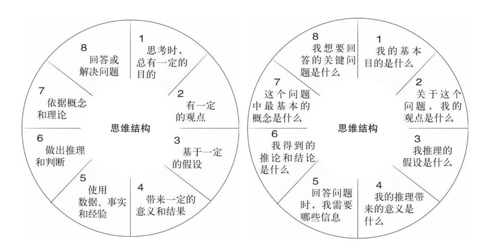

# 批判性的思维


## 信息的失真

在现实世界中，信息的产生，传播，还有接收是会不断发生畸变的。

1. 传播者的局限性：信息的最初传播者会有客观的知识盲区和主观的思维偏见。

2. 传播媒介的局限性：传播信息的媒介（网络，媒体）很难获取完整信息的客观条件和其本身的偏好，会让信息发生畸变。

3. 接收者的局限性：作为信息的接收者，我们有客观的认知盲区和主观上的偏见喜好。这会让我们无意识的对信息加工。导致信息的失真。


## 批判性的思维

**批判性思维是针对相信什么或做什么的决定，而进行的理性的反省思维**。其内核是以用开放性和包容性的思想对得到的信息进行怀疑，探究和实证。批判性的思维的入门可以通过**提问**。

### 提问的方法

#### 5 WHY提问法

利用5Why进行根本原因分析时，一定要把握好一些基本原则：
1）回答的理由是受控的；
2）询问和回答是在限定的一定的流程范围内；
3）从回答的结果中，我们能够找到行动的方向。


#### 苏格拉底式提问法

**澄清问题**：即明确问题的概念和边界，发问方式包括：这个问题的意思是什么？为什么会有这样的问题？是什么让你有这样的问题？
**澄清假设**：即明确问题的假设，发问方式为：你这个问题的假设是什么？为什么会有这样的假设？你如何证明这个假设？
**明确推论**：即明确是如何推论的，发问方式为：你是如何得出这一结论的？你为什么相信这是真的？是否有理由怀疑这一结果呢？
**探索其他观点**：即找出是否有不同的观点，发问方式为：对这个问题，其他人有什么看法？别的不同的观点是什么？还有其他的可能吗？
**探究结果**：发问方式为：这个问题会带来什么结果呢？会有什么隐藏的影响吗？这个结果真的有发生的可能吗？
**回归原问题**：发问方式为：最初的那个问题，有新的答案了吗？


#### 思维结构提问法




## 思维的评判标准

在进行思维活动时要用这9个标准来判断自己的思维标准

**清晰性**：表述的信息是否清晰，是否会有歧义；
**准确性**：信息是否是准确的、无误的、真实的；
**精确性**：是否达到必要的精确程度，比如小明过年长胖了，与事实相符，是准确信息，但不精确，小明过年长胖了5斤，则更加精确了，给了更多细节信息；
**相关性**：信息是否与问题相关；
**深度**：信息是否达到必要的深度；
**广度**：信息是否具有足够的广度；
**逻辑性**：信息本身是否符合逻辑，是否具有一致性；
**重要性**：信息是否重要，还是无关的细节；
**公正性**：信息是否全面，是否考虑了各个方面的因素；


## 思维的谬论

* **人身攻击**：不阐述原因，而直接攻击、侮辱其人。这种思维方式不能引起任何有意义的、建设性的讨论，只会带来对立和纷争。

* **晕轮效应**： 使用模糊、情绪化的美德词汇让我们不经仔细思考就接受观点。用美好的情感化表达，让人接收他们可能非常有争议的观点。

* **滑坡谬误**：如果某事发生，则相关的很多事情肯定会发生。这种思维，无限制的将事件的影响扩大化，造成一个荒诞的后果，从而表达负面的意见。

* **妄求完美**：如果某方法不能彻底解决某问题，就不采用此方法。这种思维谬误，主要出现在一种完美主义者身上。例如，高考是有缺陷的，所以要取消高考；

* **诉诸公众**：利用公众的观点，公众支持的就是合理的。

* **诉诸权威**：对于权威，一定不能盲信，要辩证地来认识，即接受又不盲从，养成独立思考的习惯。

* **稻草人谬误**：稻草人谬误，就是歪曲对方的观点，攻击其并不存在的观点。反对的一方，设立一个并不存在的观点（也就是稻草人），然后进行大力的批判。

```
小明：国家应该投入更多的预算来发展教育行业。
小红：想不到你这么不爱国，居然想减少国防开支，让外国列强有机可乘。
```

* **诉诸情感**: 通过操作别人的感情来取代一个有力的论述。

* **两难困境**: 刻意制造一个虚假的两难困境，实际上还有很多的选择。


