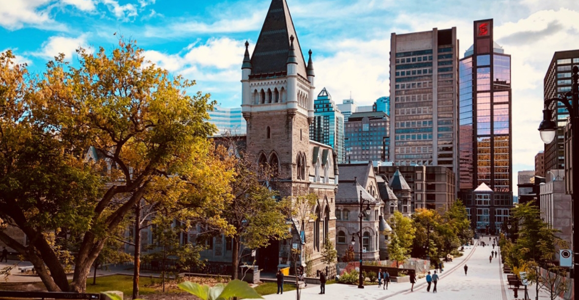

# 我的大学

2013-2018，大学也读了整整五年。18岁进去，23岁出来。中间哭了，笑过，失落过，惊喜过，刷过夜，醉过酒....总体来说还算圆满。毕业前总归要随便写些什么来总结下大学的生活吧。

初入大学的时候，对大学并没有太多期望。只是希望能接受一个正统的通识教育，然后能从中找到自己喜欢的职涯。单从这点来说，大学至少没有留下过多遗憾。这五年上过的课包括了矿物处理，炼金，塑料，生物材料，地理，高等数学，管理学，哲学，金融，数据分析，编程....基本也一知半解了人类知识发展至今的大多数职业分支。从中也能根据自己GPA的高低，明白自己的兴趣以及能力所在。加上几份不同领域的实习也对自己的未来有了更加清晰的规划。

 

## 专业

但是人总归是贪心的吧。明白了自己的喜欢的职业，就总是会觉得过往的很多的尝试都是浪费光阴。再加上在社会上沾染了少许功利，让我在这之前也总是抱怨自己当年选择的专业。抱怨的理由无非也就是源自于工业和学术届过大的隔阂。北美不发达的工业限制了大学学会的专业技能。以至于无法找到对口的高薪的工作。在大学的时候经历过三份实习。 第一份是在西门子实习的时候，总体感觉无所事事。每天早上从挤公交，到上班，到下班，再到回家。脸上也不过堆砌着迷茫、疲惫、麻木。无聊。又因为在一个法语为主的环境中，内心孤独，却又无从倾诉。只能日复一日地数着实习结束的日子。再最后还要像国内一样想办法从日常打杂的工作中挤出一篇几千字的项目报告。第二份是在学校实验室的工作，可以深切的感觉到科研的过程就是穷举的过程。在这期间接触到了图像处理，所以也开始了对电脑科学的兴趣。最后一份实习是在一个创业公司。在这公司也认识到了人们真的会因为缺少事业，能力的发展，让无处安放的多余精力容易用在相互监视，嫉妒和倾轧之中。还有与之对应的是小公司本身就是资不抵债所以会导致的对员工吝啬和苛刻。这三份不满意的实习经历可以说是我离开材料专业的主推动力吧。与之对应的是学习电脑编程时候产生的成就感。因为在写每一个程序的时候真的感觉像曾经玩游戏的体验。感觉自己在创造一个生命，而我需要的是去教会这个孩子他所需要的技能。在学汇编的时候，第一次从电路开始学会了如何实现编程的最基本逻辑。 在学functional programming的时候，发现了可以如此高雅的表达一段程序。在学机器学习的时候，我更是发现之前学会大部分技能未来都会被机器学习所取代。

 

在大学的这些年，除了学业，也变得独立，坚强了许多。曾经应该是一个非常爱哭的小孩吧。有些玻璃心吧，受到一些委屈，眼泪就会开始在眼眶里面打转。这些年，深夜一个人因为生病怕死，又不懂怎么去医院默默哭过。送父母去温哥华后抱着妹妹的玩具也是一路带着眼泪坐车回家。大二连续几次的挂考试也哭过。面试的时候被嘲讽浪费别人时间，也哭过。后悔自己专业选择也哭过。但是每次都是只能擦干眼泪继续朝着前方迷惘的努力着。当年听着Leon说一定要逃离自己的舒适区而选择了Montreal。这些年一个人找工作，熬夜，刷题，考证，我经历过孤单。而独立在我心中的定义也改变了不少。从大一的时候刻意追求自己的独立而不和父母说一句话，到现在每周都和父母视频。独立对我来说的定义也从远离父母到承担责任。

 

很多人说留学带给我们的是在世界任何角落都能活下去的能力。曾经我也被这鸡汤给鼓舞过。但是细细思考，任何生物都是有求生的本能。所以活下去的本身并不是什么值得骄傲的事情。重点是在任何时候都能真正热爱生活。在留学的时候，好多时候都会因为繁重的学业压力和金钱的压力让生活将就了。但是幸运的是这段留学的经历能让我逐渐适应如何在压力下也要努力呈现生活的质量。

 

## 中国

初中的我应该算是是个愤青吧。每天总是喜欢在QQ空间里面发表些抨击社会的言论企图改变世界。离开了中国后，每次听到别人评论它的不好就会不开心。这就像很多人说的那样出国了就更加爱国了吧。这种爱大概是因为理解吧。我开始理解中国发展的难处，对它的报怨变少了，所以更爱它了。但是在未来应该不会回国工作了。这里面有许多考量。但综合来说，加拿大给予的平台是比国内更高。这不是说明加拿大比国内好，只是说明在国内那么好的平台已经挤满了人罢了。而我是没有信心与他们竞争的。

