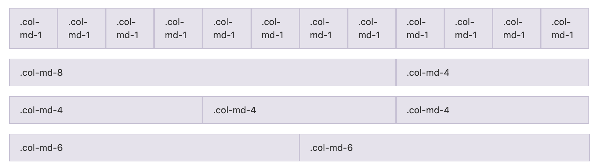
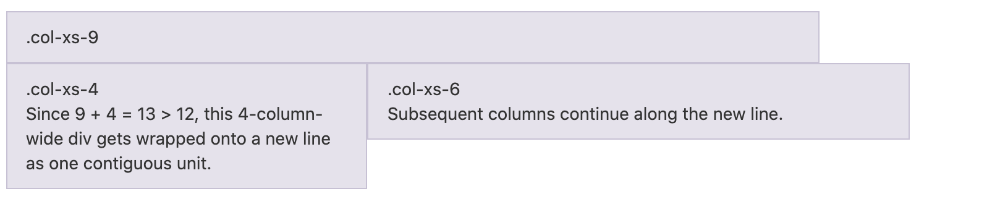

# BootStrap


## Reference

https://v3.bootcss.com/css/

## 什么是Bootstrap？
Bootstrap是一个开源的基于HTML、CSS、JavaScript的前端框架。它统一了命名规范并且主要支持响应式布局。

## 如何引用BootStrap

Bootstrap 依赖于jQuery和popper.js。 所以这两个library需要在BootStrap之前引用。

```html
<!DOCTYPE html>
<html lang="en">
<head>
    <meta charset="utf-8">
    <meta name="viewport" content="width=device-width, initial-scale=1, shrink-to-fit=no">
    <title>Basic Bootstrap Template</title>
    <!-- Bootstrap CSS file -->
    <link rel="stylesheet" href="https://stackpath.bootstrapcdn.com/bootstrap/4.5.0/css/bootstrap.min.css">
</head>
<body>
    <h1>Hello, world!</h1>
    <!-- JS files: jQuery first, then Popper.js, then Bootstrap JS -->
    <script src="https://code.jquery.com/jquery-3.5.1.min.js"></script>
    <script src="https://cdn.jsdelivr.net/npm/popper.js@1.16.0/dist/umd/popper.min.js"></script>
    <script src="https://stackpath.bootstrapcdn.com/bootstrap/4.5.0/js/bootstrap.min.js"></script>
</body>
</html>
```

## 布局容器 container

.container 类用于固定宽度并支持响应式布局的容器。

```html
<div class="container">
  ...
</div>
```

.container-fluid 类用于 100% 宽度，占据全部视口（viewport）的容器。

```html
<div class="container-fluid">
  ...
</div>
```

**由于 padding 等属性的原因，这两种 容器类不能互相嵌套。**


## 栅格系统和媒体查询 Grid and Media Query

栅格系统用于通过一系列的行（row）与列（column）的组合来创建页面布局，栅格系统中的列是通过指定**1到12**的值来表示其跨越的范围。最多12列。例如，三个等宽的列可以使用三个 .col-md-4 来创建。


超小屏幕 手机(<768px) .col-xs- 
小屏幕 平板 (≥768px) .col-sm-
中等屏幕 桌面显示器 (≥992px) 
.col-md-
大屏幕 大桌面显示器 (≥1200px) .col-lg-

```html
<div class="row">
    <div class="col-md-4" style="border: 1px solid black">占据前面三分之一</div>
    <div class="col-md-4" style="border: 1px solid black">占据中间三分之一</div>
    <div class="col-md-4" style="border: 1px solid black">占据后面三分之一</div>
</div>
```


* 如果在一个 .row 内包含的列（column）大于12个，包含多余列（column）的元素将作为一个整体单元被另起一行排列。




* 使用 `.col-md-offset-*` 类可以将列向右侧偏移。

```html
<div class="row">
  <div class="col-md-4">.col-md-4</div>
  <div class="col-md-4 col-md-offset-4">.col-md-4 .col-md-offset-4</div>
</div>
<div class="row">
  <div class="col-md-3 col-md-offset-3">.col-md-3 .col-md-offset-3</div>
  <div class="col-md-3 col-md-offset-3">.col-md-3 .col-md-offset-3</div>
</div>
<div class="row">
  <div class="col-md-6 col-md-offset-3">.col-md-6 .col-md-offset-3</div>
</div>
```

* 为了使用内置的栅格系统将内容再次嵌套，可以通过添加一个新的`.row`元素和一系列`.col-sm-*`元素到已经存在的       
`.col-sm-*` 元素内。

```html
<div class="row">
  <div class="col-sm-9">
    Level 1: .col-sm-9
    <div class="row">
      <div class="col-xs-8 col-sm-6">
        Level 2: .col-xs-8 .col-sm-6
      </div>
      <div class="col-xs-4 col-sm-6">
        Level 2: .col-xs-4 .col-sm-6
      </div>
    </div>
  </div>
</div>
```

* 通过使用 `.col-md-push-*` 和 `.col-md-pull-*` 类就可以改变列（column）的顺序。

```html
<div class="row">
  <div class="col-md-9 col-md-push-3">.col-md-9 .col-md-push-3</div>
  <div class="col-md-3 col-md-pull-9">.col-md-3 .col-md-pull-9</div>
</div>
```

BootStrap可以用media query分辨不同的设备

```html
/* 超小屏幕（手机，小于 768px） */
/* 没有任何媒体查询相关的代码，因为这在 Bootstrap 中是默认的（还记得 Bootstrap 是移动设备优先的吗？） */

/* 小屏幕（平板，大于等于 768px） */
@media (min-width: @screen-sm-min) { ... }

/* 中等屏幕（桌面显示器，大于等于 992px） */
@media (min-width: @screen-md-min) { ... }

/* 大屏幕（大桌面显示器，大于等于 1200px） */
@media (min-width: @screen-lg-min) { ... }
```

在媒体查询代码中包含 max-width 可以将 CSS 的影响限制在更小范围的屏幕大小之内。

```html
@media (max-width: @screen-xs-max) { ... }
@media (min-width: @screen-sm-min) and (max-width: @screen-sm-max) { ... }
@media (min-width: @screen-md-min) and (max-width: @screen-md-max) { ... }
@media (min-width: @screen-lg-min) { ... }
```


### 响应式列重置 Responsive ClearFix

有时候会出现下面的情况。这个时候建议用clearfix。

![clearfix]clearfix.png

<div class="row">
  <div class="col-xs-6 col-sm-3">.col-xs-6 .col-sm-3</div>
  <div class="col-xs-6 col-sm-3">.col-xs-6 .col-sm-3</div>

  <!-- Add the extra clearfix for only the required viewport -->
  <div class="clearfix visible-xs-block"></div>

  <div class="col-xs-6 col-sm-3">.col-xs-6 .col-sm-3</div>
  <div class="col-xs-6 col-sm-3">.col-xs-6 .col-sm-3</div>
</div>


## 排版

### 标题

HTML 中的所有标题标签，`<h1>` 到 `<h6>` 均可使用。另外，还提供了 .h1 到 .h6 类，
为的是给内联（inline）属性的**文本**赋予标题的样式。

```html
<h1>h1. Bootstrap heading</h1>
<h2>h2. Bootstrap heading</h2>
<h3>h3. Bootstrap heading</h3>
<h4>h4. Bootstrap heading</h4>
<h5>h5. Bootstrap heading</h5>
<h6>h6. Bootstrap heading</h6>
```
在标题内还可以包含 `<small>` 标签或赋予 .small 类的元素，可以用来标记副标题。

```html
<h1>h1. Bootstrap heading <small>Secondary text</small></h1>
<h2>h2. Bootstrap heading <small>Secondary text</small></h2>
<h3>h3. Bootstrap heading <small>Secondary text</small></h3>
<h4>h4. Bootstrap heading <small>Secondary text</small></h4>
<h5>h5. Bootstrap heading <small>Secondary text</small></h5>
<h6>h6. Bootstrap heading <small>Secondary text</small></h6>
```


### 页面主体

Bootstrap 将全局 font-size 设置为 14px，line-height 设置为 1.428。这些属性直接赋予 `<body>` 元素和所有段落元素。另外，`<p>` （段落）元素还被设置了等于 1/2 行高（即 10px）的底部外边距（margin）。

```html
<p>...</p>
```

### 中心内容

通过添加 .lead 类可以让段落突出显示。

```html
<p class="lead">...</p>
```

### 内联文本元素

1. 使用mark标签标记文本
2. 对于被删除的文本使用 `<del>` 标签。
3. 对于没用的文本使用 `<s>` 标签。
4. 额外插入的文本使用 `<ins>` 标签。
5. 为文本添加下划线，使用 `<u>` 标签。
6. 小号字体，使用 `<small>` 标签包裹，其内的文本将被设置为父容器字体大小的 85%。
7. 着重标签strong
8. 用斜体 `em` 强调一段文本。

### 文本对齐

1. text-left 左对齐
2. text-center 居中
3. text-right 右对齐
4. text-justify 两端对齐
5. text-nowrap 不换行

```html
<p class="text-left">Left aligned text.</p>
<p class="text-center">Center aligned text.</p>
<p class="text-right">Right aligned text.</p>
<p class="text-justify">Justified text.</p>
<p class="text-nowrap">No wrap text.</p>
```

### 改变大小写

1. text-lowercase 全小写
2. text-uppercase 全大写
3. text-capitalize 首字母全大写

```html
<p class="text-lowercase">Lowercased text.</p>
<p class="text-uppercase">Uppercased text.</p>
<p class="text-capitalize">Capitalized text.</p>
```

### 缩略语

当鼠标悬停在缩写和缩写词上时就会显示完整内容，Bootstrap 实现了对 HTML 的 `<abbr>` 元素的增强样式。


#### 基本缩略语

`<abbr title="attribute">attr</abbr>`

#### 首字母缩略语

**包裹的单词会全变成大写**
`<abbr title="HyperText Markup Language" class="initialism">HTML</abbr>`

### 地址

在每行结尾添加 `<br>` 可以保留需要的样式。

```html
<address>
  <strong>Twitter, Inc.</strong><br>
  1355 Market Street, Suite 900<br>
  San Francisco, CA 94103<br>
  <abbr title="Phone">P:</abbr> (123) 456-7890
</address>
```

### 引用

将任何 HTML 元素包裹在 `<blockquote>` 中即可表现为引用样式。对于直接引用，建议用 `<p>` 标签。
添加 `<footer>` 用于标明引用来源。来源的名称可以包裹进 `<cite>` 标签中。
通过赋予 .blockquote-reverse 类可以让引用呈现内容右对齐的效果。

#### 列表

移除了默认的 list-style 样式和左侧外边距的一组元素（只针对直接子元素）。
`<ul class="list-unstyled">
  <li>...</li>
</ul>`
通过设置 display: inline-block; 并添加少量的内补（padding），将所有元素放置于同一行。
`<ul class="list-inline">
  <li>...</li>
</ul>`
.dl-horizontal 可以让 `<dl>` 内的短语及其描述排在一行。
**通过 text-overflow 属性，水平排列的描述列表将会截断左侧太长的短语。**

## 代码

1. 通过 `<code>` 标签包裹内联样式的代码片段。

```html
For example, <code>&lt;section&gt;</code> should be wrapped as inline.
```

2. 通过 `<kbd>` 标签标记用户通过键盘输入的内容

```html
To switch directories, type <kbd>cd</kbd> followed by the name of the directory.<br>
To edit settings, press <kbd><kbd>ctrl</kbd> + <kbd>,</kbd></kbd>
```

3. 多行代码可以使用 `<pre>` 标签。为了正确的展示代码，注意将尖括号做转义处理。

```html
<pre>&lt;p&gt;Sample text here...&lt;/p&gt;</pre>
```

**使用 .pre-scrollable 类，其作用是设置 max-height 为 350px ，并在垂直方向展示滚动条。**


4. 通过 `<var>` 标签标记变量。
   
5. 通过 `<samp>` 标签来标记程序输出的内容。

## 表格 Table

1. 为任意 `<table>` 标签添加 .table 类可以为其赋予基本的样式 — 少量的内补（padding）和水平方向的分隔线。
2. 通过 .table-striped 类可以给 `<tbody>` 之内的每一行增加斑马条纹样式。
3. 添加 .table-bordered 类为表格和其中的每个单元格增加边框。   
4. 通过添加 .table-hover 类可以让 `<tbody>` 中的每一行对鼠标悬停状态作出响应。
5. 通过添加 .table-condensed 类可以让表格更加紧凑，单元格中的内补（padding）均会减半。


```html
<table class="table">
  ...
</table>

<table class="table table-striped">
  ...
</table>

<table class="table table-bordered">
  ...
</table>

<table class="table table-hover">
  ...
</table>

<table class="table table-condensed">
  ...
</table>
```

### 通过以下状态类可以为行或单元格设置颜色。

1. active 鼠标悬停在行或单元格上时所设置的颜色
2. success 标识成功或积极的动作
3. info 标识普通的提示信息或动作
4. warning 标识警告或需要用户注意
5. danger 标识危险或潜在的带来负面影响的动作

```html
<!-- On rows -->
<tr class="active">...</tr>
<tr class="success">...</tr>
<tr class="warning">...</tr>
<tr class="danger">...</tr>
<tr class="info">...</tr>

<!-- On cells (`td` or `th`) -->
<tr>
  <td class="active">...</td>
  <td class="success">...</td>
  <td class="warning">...</td>
  <td class="danger">...</td>
  <td class="info">...</td>
</tr>
```

### 响应式表格

将任何 .table 元素包裹在 .table-responsive 元素内，即可创建响应式表格，
其会在小屏幕设备上（小于768px）水平滚动。当屏幕大于 768px 宽度时，水平滚动条消失。
```html
<div class="table-responsive">
  <table class="table">
    ...
  </table>
</div>
```

## 表单 Form

所有设置了 .form-control 类的 `<input>`、`<textarea>` 和 `<select>` 元素
都将被默认设置宽度属性为 width: 100%;。

```html
<form>
  <div class="form-group">
    <label for="exampleInputEmail1">Email address</label>
    <input type="email" class="form-control" id="exampleInputEmail1" placeholder="Email">
  </div>
  <div class="form-group">
    <label for="exampleInputPassword1">Password</label>
    <input type="password" class="form-control" id="exampleInputPassword1" placeholder="Password">
  </div>
  <div class="form-group">
    <label for="exampleInputFile">File input</label>
    <input type="file" id="exampleInputFile">
    <p class="help-block">Example block-level help text here.</p>
  </div>
  <div class="checkbox">
    <label>
      <input type="checkbox"> Check me out
    </label>
  </div>
  <button type="submit" class="btn btn-default">Submit</button>
</form>
```


### 内联表单

为 `<form>` 元素添加 .form-inline 类可使其内容左对齐并且表现为 inline-block 级别的控件。只适用于视口（viewport）至少在 768px 宽度时（视口宽度再小的话就会使表单折叠）。

```html
<form class="form-inline">
  <div class="form-group">
    <label for="exampleInputName2">Name</label>
    <input type="text" class="form-control" id="exampleInputName2" placeholder="Jane Doe">
  </div>
  <div class="form-group">
    <label for="exampleInputEmail2">Email</label>
    <input type="email" class="form-control" id="exampleInputEmail2" placeholder="jane.doe@example.com">
  </div>
  <button type="submit" class="btn btn-default">Send invitation</button>
</form>
```

### 水平排列的表单

通过为表单添加 .form-horizontal 类，并联合使用 Bootstrap 预置的栅格类，可以将 label 标签和控件组水平并排布局。这样做将改变 .form-group 的行为，使其表现为栅格系统中的行（row）

```html
<form class="form-horizontal">
  <div class="form-group">
    <label for="inputEmail3" class="col-sm-2 control-label">Email</label>
    <div class="col-sm-10">
      <input type="email" class="form-control" id="inputEmail3" placeholder="Email">
    </div>
  </div>
  <div class="form-group">
    <label for="inputPassword3" class="col-sm-2 control-label">Password</label>
    <div class="col-sm-10">
      <input type="password" class="form-control" id="inputPassword3" placeholder="Password">
    </div>
  </div>
  <div class="form-group">
    <div class="col-sm-offset-2 col-sm-10">
      <div class="checkbox">
        <label>
          <input type="checkbox"> Remember me
        </label>
      </div>
    </div>
  </div>
  <div class="form-group">
    <div class="col-sm-offset-2 col-sm-10">
      <button type="submit" class="btn btn-default">Sign in</button>
    </div>
  </div>
</form>
```

### 表单控件

表单布局实例中展示了其所支持的标准表单控件。

#### 输入框 

包括大部分表单控件、文本输入域控件，还支持所有 HTML5 类型的输入控件： text、password、datetime、datetime-local、date、month、time、week、number、email、url、search、tel 和 color。


```html
<input type="text" class="form-control" placeholder="Text input">
```

#### 文本域

`<textarea class="form-control" rows="3"></textarea>`


#### 多选框与单选框

多选框（checkbox）用于选择列表中的一个或多个选项，而单选框（radio）用于从多个选项中只选择一个。

```html
<div class="checkbox disabled">
  <label>
    <input type="checkbox" disabled>
    Option two is disabled
  </label>
</div>
<div class="radio disabled">
  <label>
    <input type="radio" disabled>
    Option three is disabled
  </label>
</div>
```
#### 内联单选和多选框

```html
<label class="checkbox-inline">
  <input type="checkbox" id="inlineCheckbox1" value="option1"> 1
</label>
<label class="radio-inline">
  <input type="radio" name="inlineRadioOptions" id="inlineRadio1" value="option1"> 1
</label>
```

### 下拉列表 Select

multiple 属性默认显示多选项。
```html
<select class="form-control">
  <option>1</option>
  <option>2</option>
  <option>3</option>
  <option>4</option>
  <option>5</option>
</select>
```


### 静态控件
如果需要在表单中将一行纯文本和 label 元素放置于同一行，为 `<p>` 元素添加 .form-control-static 类即可。

```html
<form class="form-horizontal">
  <div class="form-group">
    <label class="col-sm-2 control-label">Email</label>
    <div class="col-sm-10">
      <p class="form-control-static">email@example.com</p>
    </div>
  </div>
  <div class="form-group">
    <label for="inputPassword" class="col-sm-2 control-label">Password</label>
    <div class="col-sm-10">
      <input type="password" class="form-control" id="inputPassword" placeholder="Password">
    </div>
  </div>
</form>
```


### 禁用状态

为输入框设置 disabled 属性可以禁止其与用户有任何交互（焦点、输入等）。被禁用的输入框颜色更浅，并且还添加了 not-allowed 鼠标状态。

```html
<input class="form-control" id="disabledInput" type="text" placeholder="Disabled input here..." disabled>
```
**为 `<fieldset>` 设置 disabled 属性,可以禁用 `<fieldset>` 中包含的所有控件。`<fieldset disabled>`**

```html
<form>
  <fieldset disabled>
    <div class="form-group">
      <label for="disabledTextInput">Disabled input</label>
      <input type="text" id="disabledTextInput" class="form-control" placeholder="Disabled input">
    </div>
    <div class="form-group">
      <label for="disabledSelect">Disabled select menu</label>
      <select id="disabledSelect" class="form-control">
        <option>Disabled select</option>
      </select>
    </div>
    <div class="checkbox">
      <label>
        <input type="checkbox"> Can't check this
      </label>
    </div>
    <button type="submit" class="btn btn-primary">Submit</button>
  </fieldset>
</form>
```


### 只读状态

为输入框设置 readonly 属性可以禁止用户修改输入框中的内容。
```html
<input class="form-control" type="text" placeholder="Readonly input here…" readonly>
```


## 按钮

1. 通过给按钮添加 .btn-block 类可以将其拉伸至父元素100%的宽度，而且按钮也变为了块级（block）元素。
2. 激活状态
```html
<button type="button" class="btn btn-default btn-lg active">Button</button>
<a href="#" class="btn btn-default btn-lg active">Link</a>
```
3. 为 `<button>` 元素添加 disabled 属性，使其表现出禁用状态。
为基于 `<a>` 元素创建的按钮添加 .disabled 类。**没有禁用的效果，但是点击不了**

## 图片

1. 通过为图片添加 .img-responsive 类可以让图片支持响应式布局。
2. 让使用了.img-responsive 类的图片水平居中，使用 .center-block 类
3. 形状：img-rounded  img-circle  img-thumbnail


## 文本颜色

```html
<p class="text-muted">...</p>
<p class="text-primary">...</p>
<p class="text-success">...</p>
<p class="text-info">...</p>
<p class="text-warning">...</p>
<p class="text-danger">...</p>
```

## 背景颜色

```html
<p class="bg-primary">...</p>
<p class="bg-success">...</p>
<p class="bg-info">...</p>
<p class="bg-warning">...</p>
<p class="bg-danger">...</p>
```

## 关闭按钮

`<button type="button" class="close"><span>&times;</span></button>`

## 三角符号

`<span class="caret"></span>`

## 浮动

```html
<div class="pull-left">...</div>
<div class="pull-right">...</div>
```
### 清除浮动

通过为父元素添加 .clearfix 类可以很容易地清除浮动

### 显示或隐藏内容

```html
<div class="show">...</div>
<div class="hidden">...</div>
```

**使用 .text-hide 类或对应的 mixin 可以用来将元素的文本内容替换为一张背景图。**

### 响应式可见与隐藏

`.visible-*-* .hidden-*` 
可用的 `.visible-*-*` 类是：`.visible-*-block、.visible-*-inline 和 .visible-*-inline-block`


## 组件

### 字体图标

```html
<button type="button" class="btn btn-default">
  <span class="glyphicon glyphicon-align-left"></span>
</button>
```

### 下拉菜单

`<div class="dropdown">`
`<button class="btn btn-default dropdown-toggle" type="button" data-toggle="dropdown">`
`<ul class="dropdown-menu"`
`<li class="divider"></li>`

* 通过为下拉菜单的父元素设置 .dropup 类，可以让菜单向上弹出（默认是向下弹出的）。
* 右对齐 `<ul class="dropdown-menu dropdown-menu-right">`
* 下拉菜单标题`<li class="dropdown-header">Dropdown header</li>`
* 禁用 `<li class="disabled"><a href="#">Disabled link</a></li>`

### 按钮组

1. `<div class="btn-group">`
2. 把一组 `<div class="btn-group">` 组合进一个 `<div class="btn-toolbar">` 中就可以做成更复杂的组件。
3. 尺寸 btn-group-lg 默认尺寸 btn-group-sm  btn-group-xs
4. 嵌套：想要把下拉菜单混合到一系列按钮中，只须把 .btn-group 放入另一个 .btn-group 中。
5. 垂直排列：btn-group-vertical
6. 两端对齐：a标签只须将一系列 .btn 元素包裹到 .btn-group.btn-group-justified 中即可。
            button标签需要包在一个btn-group中

### 输入框组

1. 为 .input-group 赋予 .input-group-addon 或 .input-group-btn 类，可以给 .form-control 的前面或后面添加额外的元素。
2. 尺寸：.input-group-lg 默认尺寸 .input-group-sm

## 导航

1. `<ul class="nav nav-tabs">`
2. `<li class="active"><a href="#">Home</a></li>`
3. 胶囊式标签页`<ul class="nav nav-pills">`
4. 垂直方向堆叠排列 .nav-stacked
5. 两端对齐
```html
<ul class="nav nav-tabs nav-justified">
  ...
</ul>
<ul class="nav nav-pills nav-justified">
  ...
</ul>
```

### 导航条

1. 品牌图标 `<a class="navbar-brand" href="#">`
2. 将表单放置于 .navbar-form 之内可以呈现很好的垂直对齐
3. 不包含在 `<form>` 中的 `<button>` 元素，加上 .navbar-btn 后，可以让它在导航条里垂直居中。  
4. 把文本包裹在 .navbar-text中时，为了有正确的行距和颜色，通常使用 `<p>` 标签。   
5. 使用 .navbar-link 类可以让链接有正确的默认颜色和反色设置。
6. 通过添加 .navbar-left 和 .navbar-right 工具类让导航链接、表单、按钮或文本对齐。
7. 添加 .navbar-fixed-top 类可以让导航条固定在顶部;添加 .navbar-fixed-bottom 类可以让导航条固定在底部
8. 如需创建能随着页面一起滚动的导航栏，添加.navbar-static-top
9. 通过添加 .navbar-inverse 类可以改变导航条的外观。(黑色)

## 路径导航

`<ol class="breadcrumb">`

## 分页

1. `<ul class="pagination">`  左双尖括号`&laquo;`  右双尖括号`&raquo;`
2. 尺寸：.pagination-lg/默认尺寸/.pagination-sm
3. 翻页：`<ul class="pager">`
4. 对齐链接
```html
<li class="previous"><a href="#"><span>&larr;</span> Older</a></li>
<li class="next"><a href="#">Newer <span>&rarr;</span></a></li>
```
5. 禁用`<li class="previous disabled">`

## 标签

```html
<span class="label label-default">Default</span>
<span class="label label-primary">Primary</span>
<span class="label label-success">Success</span>
<span class="label label-info">Info</span>
<span class="label label-warning">Warning</span>
<span class="label label-danger">Danger</span
```

## 徽章

给链接、导航等元素嵌套 `<span class="badge">` 元素，可以很醒目的展示新的或未读的信息条目。

#### 巨幕，大荧幕---- `jumbotron`

## 页头
页头组件能够为 h1 标签增加适当的空间，并且与页面的其他部分形成一定的分隔。
`<div class="page-header">`

### 警告框

```html
<div class="alert alert-success">...</div>
<div class="alert alert-info">...</div>
<div class="alert alert-warning">...</div>
<div class="alert alert-danger">...</div>
```
* 关闭警告框
```html
<!-- 务必给 <button> 元素添加 data-dismiss="alert" 属性。 -->
<div class="alert alert-warning alert-dismissible">
  <button type="button" class="close" data-dismiss="alert"><span>&times;</span></button>
  Warning!
</div>
```
* 用 .alert-link 工具类，可以为链接设置与当前警告框相符的颜色。

### 进度条

```html
<div class="progress">
  <div class="progress-bar" style="width: 60%;">
    60%
  </div>
</div>
```

* 颜色：默认是蓝色的；progress-bar-success progress-bar-info  progress-bar-warning  progress-bar-danger
* 条纹效果 progress-bar-striped
* 为 .progress-bar-striped 添加 .active 类，使其呈现出由右向左运动的动画效果。

### 媒体对象

默认样式的媒体对象组件允许在一个内容块的左边或右边展示一个多媒体内容（图像、视频、音频）。

### 列表组

```html
<ul class="list-group">
  <li class="list-group-item">Cras justo odio</li>
</ul>
<!-- 给列表组加入徽章组件，它会自动被放在右边。 -->
<ul class="list-group">
  <li class="list-group-item">
    <span class="badge">14</span>
    Cras justo odio
  </li>
</ul>
<!-- 用 <a> 标签代替 <li> 标签可以组成一个全部是链接的列表组 -->
<!-- 为 .list-group-item 添加 .disabled 类可以让单个条目显示为灰色，表现出被禁用的效果。 -->
<div class="list-group">
  <a href="#" class="list-group-item disabled">
    Cras justo odio
  </a>
</div>
<!-- 列表组中的元素也可以直接就是按钮 -->
<div class="list-group">
  <button type="button" class="list-group-item">Cras justo odio</button>
</div>
```
* 颜色：list-group-item-success list-group-item-info list-group-item-warning list-group-item-danger

## 面板

```html
<div class="panel panel-default">
  <div class="panel-body">
    Basic panel example
  </div>
</div>
```
通过 .panel-heading 可以很简单地为面板加入一个标题容器。也可以通过添加设置了 .panel-title 类的 `<h1>-<h6>` 标签，添加一个预定义样式的标题。不过，`<h1>-<h6>` 标签的字体大小将被 .panel-heading 的样式所覆盖。
* 标题.panel-heading 内容主体.panel-body 脚注.panel-footer

* 颜色：
```html
<div class="panel panel-primary">...</div>
<div class="panel panel-success">...</div>
<div class="panel panel-info">...</div>
<div class="panel panel-warning">...</div>
<div class="panel panel-danger">...</div>
```
* 带表格的面版 如果没有 .panel-body ，面版标题会和表格连接起来，没有空隙。

### Well 
Well 是一种会引起内容凹陷显示或插图效果的容器

* 尺寸：well-lg/默认尺寸/well-sm


