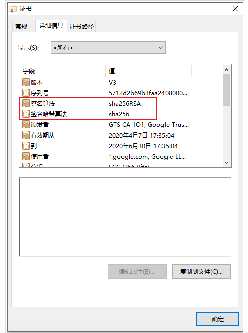

# HTTPS

我们为什么需要HTTPS？
   - HTTPS是什么？SSL/TLS是什么？
   - SSL/TLS发展史
   - SSL/TLS的工作原理

## 什么是HTTP

HTTP协议(HyperText Transfer Protocol，超文本传输协议)是大家最熟悉的一种协议，它是一个用于传输超媒体文档的协议，它位于OSI网络协议模型的应用层。但是它是明文传输协议，是非常不安全的，容易被人篡改和窃取数据。

## 什么是HTTPS
HTTPS(HyperText Transfer Protocol Secure)是建立在SSL/TLS协议之上，信息通信通过SSL/TLS进行加密，最后一个S就是Secure的缩写，代表安全的意思，HTTPS = HTTP + SSL/TLS。

## 什么是 SSL/TLS
SLL(Secure Socket Layer)是Netscape公司设计的主要用于web的安全传输协议。它位于TCP传输层协议和应用层协议之间。之后网景公司将SSL协议的管理权转交给IETF(Internet Engineering Task Force, http://www.ietf.org)。于是IETF将SSL作了标准化，重新命名为TLS.xn （Transport Layer Security）。在1999年，TLS 1.0诞生了。2006年TLS 1.1。2008年TLS 1.2. 但是直到2013年TLS 1.2才被运用到大部分浏览器上面。2018年TLS 1.3 发布了。可以在浏览器设置是否对部分版本TLS进行支持。

## 为什么需要HTTPS

- 保护隐私(Privacy)：所有信息都经过加密处理，保证无法被第三方劫持。

- 数据完整性(Integraty)：HTTPS 保证了数据的完整性。接收方可以知道数据是否经过处理。

- 身份认证(Identification)：HTTPS 保证了服务器是由证书颁发机构（Certificate Authority，简称CA）颁发的安全证书。

## SSL/TLS的工作原理

SSL/TLS的原理是基于两种加密算法，分别是对称加密和非对称加密：

- 对称加密：通信双方使用相同的密钥进行加密。特点是加密速度快，但是缺点是需要保护好密钥，如果密钥泄露的话，那么加密就会被别人破解。常见的对称加密有AES，DES算法。

- 非对称加密：它需要生成两个密钥：公钥(Public Key)和私钥(Private Key)。公钥顾名思义是公开的，任何人都可以获得，而私钥是私人保管的。相信大多程序员已经对这种算法很熟悉了：我们提交代码到github的时候，就可以使用SSH key：在本地生成私钥和公钥，私钥放在本地.ssh目录中，公钥放在github网站上，这样每次提交代码，不用麻烦的输入用户名和密码了，github会根据网站上存储的公钥来识别我们的身份。公钥负责加密，私钥负责解密；或者，私钥负责加密，公钥负责解密。这种加密算法安全性更高，但是计算量相比对称加密大很多，加密和解密都很慢。常见的非对称算法有RSA。

SSL/TLS是利用了对称加密和非对称加密的特点。

1. 当TCP建立连接之后，TLS握手的第一步由客户端发起，发送ClientHello的消息到服务器。
  
   ClientHello消息包含：
- 客户端支持的SSL/TLS版本
- 客户端支持的加密套件(Cipher Suites)
- 会话Idsession id（如果有的值的话，服务器端会复用对应的握手信息，避免短时间内重复握手）
- 随机数client-random

   Example
   TLS_ECDHE_RSA_WITH_AES_256_GCM_SHA256
   密钥交换算法_服务身份验证算法_对称加密算法_握手校验算法

   握手过程中，证书签名使用的RSA算法，如果证书验证正确，再使用ECDHE算法进行密钥交换，握手后的通信使用的是AES256的对称算法分组模式是GCM。验证证书签名合法性使用SHA256作哈希算法检验。

2. 服务器端在收到这个ClientHello，从中选择服务器支持的版本和套件，发送ServerHello消息：
- 服务器所能支持的最高SSL/TLS版本
- 服务器选择的加密套件
- 随机数server-random
- 会话Idsession id(用于下次复用当前握手的信息，避免短时间内重复握手。)

随后服务器发送服务器的安全证书(含公钥)。

如果需要客户端也提供证书的话，还会发出客户端证书请求(Client Certificate Request)，只有少数金融机构才需要客户端也提供客户端证书。

此后客户端发送Server Hello Done消息表示Hello阶段完成。

3. 客户端收到ServerHello后，会对收到的证书进行验证。

为什么可以通过CA(Certificate Authority，证书颁发机构)签发的证书来确认网站的身份？

当我们安装操作系统或者浏览器的时候，会安装一组可信任的CA（根证书CA包括GlobalSign、GeoTrust、Verisign等）列表。根CA如GlobalSign就在我们的可信任的CA列表里，你的浏览器或者操作系统含有GlobalSign的公钥。

先来看一下Google的证书，当你访问Google的时候，Google会发给你它的证书。证书中包含颁发机构的签名以及服务器的公钥。

浏览器首先用哈希函数对明文信息的摘要做哈希得到一个哈希值（用到的就是证书中的签名哈希算法SHA256），然后用根CA的公钥对根证书的签名作解密得到另一个哈希值（用到的算法就是RSA非对称算法），如果两个哈希值相等则说明证书没有被篡改过。当然还需校验证书中服务器名称是否合法以及验证证书是否过期.

这样就免受中间人攻击了，因为假如有中间人修改了证书的内容（如将证书中的公钥替换成自己的公钥），那么将获得不同的哈希值，从而两个哈希值不匹配导致验证失败。如果要绕过这个机制，中间人必须要也替换签名，使签名也相匹配。而做到这一点就需要破解到了根证书的密钥（而这是不可能的，中间人必然会失败）。浏览器会出现以下画面，告诉你正在遭受中间人攻击，因为证书被篡改了：

如果通过验证，客户端生成一个随机数pre-master，用于密钥交换过程。

4. 密钥交换过程：客户端用第三步中服务器的证书中拿到服务器的公钥，用这个公钥加密（算法是加密套件中的密钥交换算法，譬如ECDHE算法）生成密文发送给服务器。

5. 客户端用server-random + client-random + pre-master一起计算出对称密钥master secret。

6. 服务器收到第四步的信息之后，用服务器的私钥对密文进行解密得到密钥pre-master。

因为只有服务器有私钥，可以针对客户端发出的加密过的信息进行解密得到pre-master，这样就保证了只有服务器和客户端知道pre-master。服务器端也可以用server-random + client-random + pre-master一起计算出对称密钥master secret。

   为什么不能只用一个pre-master作为之后加密的对称密钥？
   虽然只有服务器有私钥，能够解密pre-master呀，但仅用它作为master secret是不够安全的，这是因为要以防客户端的pre-master并不是随机数的情况。加上另外两个随机数client-random以及server-random（而这两个随机数和时间有相关性），这样就能保证最后生成的master secret一定是随机数。

7. 现在客户端和服务器均有密钥master secret了，后面就可以用它来进行加密和解密了。

8. 服务器端也回发了一条用master secret加密的握手完成的消息。

9. 当两方都收到对方发送的握手消息之后，也成功解密后，就可以用master secret愉快的开始数据加密和解密了。

综上，整个握手过程主要是通过一系列步骤通过非对称加密的算法交换得到了master secret，这个步骤通常需要几百毫秒，但是就是这一顿猛操作之后使得只有服务器和客户端知道master secret。之后的通信又利用了高效的对称算法对所有信息进行加密和解密，虽然加密和解密也需要耗时耗流量，不过信息是完全不可能被别人篡改和破解的，这一点损耗还是值得的。

Reference：
https://stephanietang.github.io/
