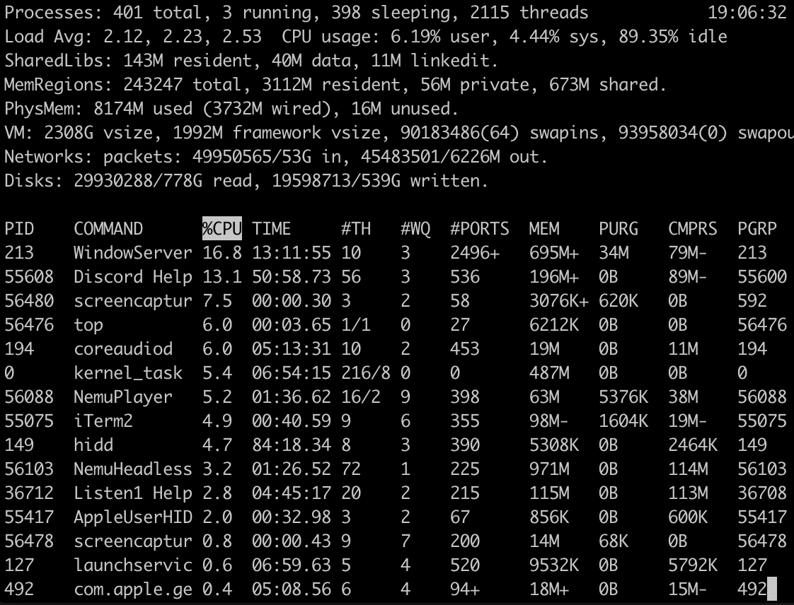

# Java 调参


Java 应用性能的瓶颈点非常多，比如磁盘、内存、网络 I/O 等系统因素，Java 应用代码，JVM GC，数据库，缓存。一般来说，Java 性能优化分为 4 个层级：应用层、数据库层、框架层、JVM 层。每一层的调参难度都是逐级增加，并且涉及的知识和解决的问题也会不同。


* 应用层需要理解代码逻辑，通过 Java 线程栈定位有问题代码行等
* 数据库层面需要分析 SQL、定位死锁等；
* 框架层需要懂源代码，理解框架机制；
* JVM 层需要对 GC 的类型和工作机制有深入了解，对各种 JVM 参数作用了然于胸。


## OS 诊断

OS 的诊断主要关注的是 CPU、Memory、I/O 三个方面。

### CPU 诊断

对于 CPU 主要关注平均负载（Load Average），CPU 使用率，上下文切换次数（Context Switch）。


#### 平均负载(Load Average)和CPU 使用率

通过 top 命令可以查看系统平均负载和 CPU 使用率。



2.12，2.23，2.53，分别表示过去 1 分钟、5 分钟、15 分钟机器的负载。**若数值小于 0.7*CPU 个数, 则表示系统正常**。若超过这个值，甚至达到 CPU 核数的四五倍，则系统的负载就明显偏高。这就需要定位具体原因了。


#### 上下文切换 Context Switch

上下文切换次数发生的场景主要有如下几种：

1）时间片用完，CPU 正常调度下一个任务；
2）被其它优先级更高的任务抢占；
3）执行任务碰到 I/O 阻塞，挂起当前任务，切换到下一个任务；
4）用户代码主动挂起当前任务让出 CPU；
5）多任务抢占资源，由于没有抢到被挂起；
6）硬件中断。

Java 线程上下文切换主要来自共享资源的竞争。一般单个对象加锁很少成为系统瓶颈，除非锁粒度过大。但在一个访问频度高，对多个对象连续加锁的代码块中就可能出现大量上下文切换，成为系统瓶颈。比如在我们系统中就曾出现 log4j 1.x 在较大并发下大量打印日志，出现频繁上下文切换，大量线程阻塞，导致系统吞吐量大降的情况，其相关代码如下所示，升级到 log4j 2.x 才解决这个问题。


```Java
for (Category c = this; c != null; c=c.parent) {
    // Protected against simultaneous call to addAppender, removeAppender,…
    synchronized(c) {
        if (c.aai != null) {
            write += c.aai.appendLoopAppenders(event);
        }
        …
    }
}
```

#### Memory

从操作系统角度，内存关注应用进程是否足够，可以使用 `free –m` 命令查看内存的使用情况。通过 `top` 命令可以查看进程使用的虚拟内存 VIRT 和物理内存 RES，根据公式 VIRT = SWAP + RES 可以推算出具体应用使用的交换分区（Swap）情况，使用交换分区过大会影响 Java 应用性能，可以将 swappiness 值调到尽可能小。因为对于 Java 应用来说，占用太多交换分区可能会影响性能，毕竟磁盘性能比内存慢太多。


#### IO

I/O 包括磁盘 I/O 和网络 I/O，一般情况下磁盘更容易出现 I/O 瓶颈。通过 iostat 可以查看磁盘的读写情况，通过 CPU 的 I/O wait 可以看出磁盘 I/O 是否正常。如果磁盘 I/O 一直处于很高的状态，说明磁盘太慢或故障，成为了性能瓶颈，需要进行应用优化或者磁盘更换。
除了常用的 top、 ps、vmstat、iostat 等命令，还有其他 Linux 工具可以诊断系统问题，如 mpstat、tcpdump、netstat、pidstat、sar 等。


### Java应用层优化

应用代码性能问题是相对好解决的一类性能问题。通过一些应用层面监控报警，如果确定有问题的功能和代码，直接通过代码就可以定位；或者通过 top+jstack，找出有问题的线程栈，定位到问题线程的代码上，也可以发现问题。对于更复杂，逻辑更多的代码段，通过 Stopwatch 打印性能日志往往也可以定位大多数应用代码性能问题。

常用的 Java 应用诊断包括线程、堆栈、GC 等方面的诊断。

#### jstack

jstack 命令通常配合 top 使用，通过 top -H -p pid 定位 Java 进程和线程，再利用 jstack -l pid 导出线程栈。由于线程栈是瞬态的，因此需要多次 dump，一般 3 次 dump，一般每次隔 5s 就行。将 top 定位的 Java 线程 pid 转成 16 进制，得到 Java 线程栈中的 nid，可以找到对应的问题线程栈。


#### JProfiler

JProfiler 可对 CPU、堆、内存进行分析。


#### GC 诊断

Java GC 解决了程序员管理内存的风险，但 GC 引起的应用暂停成了另一个需要解决的问题。JDK 提供了一系列工具来定位 GC 问题，比较常用的有 jstat、jmap，还有第三方工具 MAT 等。


#### jstat

jstat 命令可打印 GC 详细信息，Young GC 和 Full GC 次数，堆信息等。其命令格式为
jstat –gcxxx -t pid


#### jmap
jmap 打印 Java 进程堆信息 jmap –heap pid。通过 jmap –dump:file=xxx pid 可 dump 堆到文件，然后通过其它工具进一步分析其堆使用情况


#### MAT
MAT 是 Java 堆的分析利器，提供了直观的诊断报告，内置的 OQL 允许对堆进行类 SQL 查询，功能强大，outgoing reference 和 incoming reference 可以对对象引用追根溯源。


MAT 有两列显示对象大小，分别是 Shallow size 和 Retained size，前者表示对象本身占用内存的大小，不包含其引用的对象，后者是对象自己及其直接或间接引用的对象的 Shallow size 之和，即该对象被回收后 GC 释放的内存大小，一般说来关注后者大小即可。对于有些大堆 (几十 G) 的 Java 应用，需要较大内存才能打开 MAT。通常本地开发机内存过小，是无法打开的，建议在线下服务器端安装图形环境和 MAT，远程打开查看。或者执行 mat 命令生成堆索引，拷贝索引到本地


为了诊断 GC 问题，建议在 JVM 参数中加上-XX:+PrintGCDateStamps。


对于 Java 应用，通过 top+jstack+jmap+MAT 可以定位大多数应用和内存问题，可谓必备工具。有些时候，Java 应用诊断需要参考 OS 相关信息，可使用一些更全面的诊断工具，比如 Zabbix（整合了 OS 和 JVM 监控）等。在分布式环境中，分布式跟踪系统等基础设施也对应用性能诊断提供了有力支持。


1）基础性能的调优
这里的基础性能指的是硬件层级或者操作系统层级的升级优化，比如网络调优，操作系统版本升级，硬件设备优化等。比如 F5 的使用和 SDD 硬盘的引入，包括新版本 Linux 在 NIO 方面的升级，都可以极大的促进应用的性能提升；
2）数据库性能优化
包括常见的事务拆分，索引调优，SQL 优化，NoSQL 引入等，比如在事务拆分时引入异步化处理，最终达到一致性等做法的引入，包括在针对具体场景引入的各类 NoSQL 数据库，都可以大大缓解传统数据库在高并发下的不足；
3）应用架构优化
引入一些新的计算或者存储框架，利用新特性解决原有集群计算性能瓶颈等；或者引入分布式策略，在计算和存储进行水平化，包括提前计算预处理等，利用典型的空间换时间的做法等；都可以在一定程度上降低系统负载；
4）业务层面的优化
技术并不是提升系统性能的唯一手段，在很多出现性能问题的场景中，其实可以看到很大一部分都是因为特殊的业务场景引起的，如果能在业务上进行规避或者调整，其实往往是最有效的。
