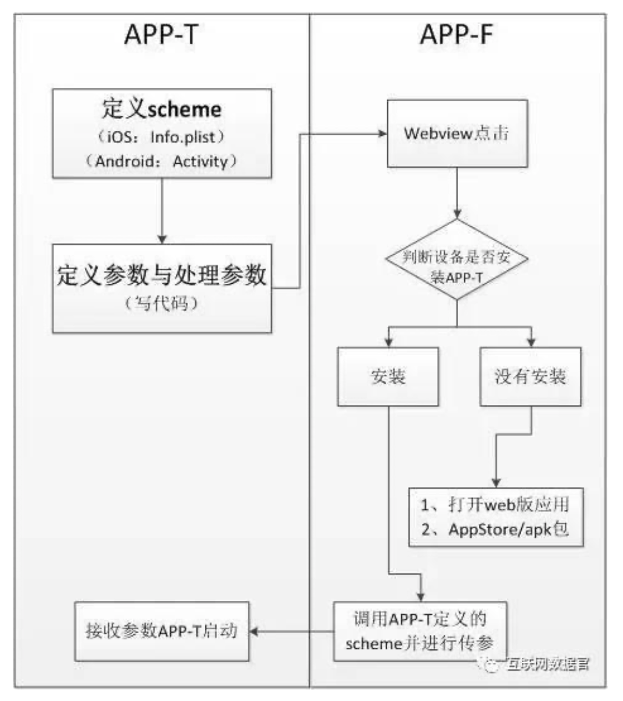
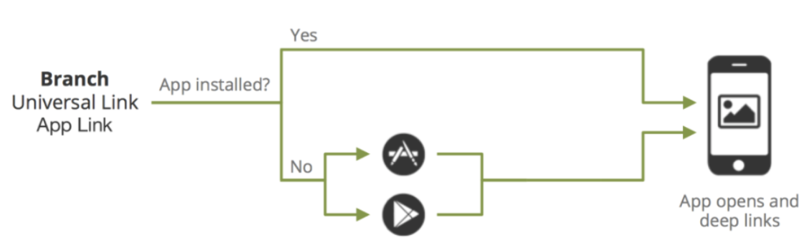

# Deep Linking


Deeplink，简单讲，就是你在手机上点击一个链接之后，可以直接链接到app内部的某个页面，而不是app正常打开时显示的首页。不似web，一个链接就可以直接打开web的内页，app的内页打开，必须用到deeplink技术。那什么是deeplink技术？如何实现的？

Deepling的核心在URL SCHEMES。



- 1) APP-T要进行自定义scheme的配置（iOS是info文件，Android是activity），并进行参数处理的coding。

- 2）APP-F进行调用，首先判断设备是否安装APP-T。

- 3）如果未安装，则跳转到APP-T的web版应用（假设他提供web版）或者是跳转到AppStore等应用市场进行下载。

- 4）如果已安装，则调用APP-T配置好的URL SCHEME，直接打开APP-T的相关界面。



什么是URL Schemes：

URL，我们都很清楚，http://www.apple.com 就是个 URL，也叫它链接或网址；Schemes，表示的是一个 URL 中的一个位置——最初始的位置，即 ://之前的那段字符。比如 http://www.apple.com 这个网址的 Schemes 是 http。

我们可以像定位一个网页一样，用一种特殊的 URL 来定位一个应用甚至应用里某个具体的功能。而定位这个应用的，就应该这个应用的 URL 的 Schemes 部分，也就是开头儿那部分。但是需要注意的是应用的URL Schemes 并不唯一，也就是说一个应用可以“起多个名“，不同应用的URL Schemes也可能因为名字一样发生冲突。

iOS系统级应用，有一些已经定义了URL Schemes，比如短信是 sms:、

通话是tel:、iBooks是ibooks:，在定义自己APP的URL Schemes的时候要避免跟系统应用名称一样。

与URL一样，URL Schemes也可以通过传参打开特定的APP界面。

URL：http://images.google.com/images?q=关键字

URL Schemes：weixin://dl/moments（打开微信朋友圈）

所以，这一段总结一下。

1） APP要想被其他APP直接打开，自身得支持，让自己具备被人打开的能力。（URL Schemes）

2） APP要想打开其他的APP，自身也得支持。（判断设备是否安装、各种跳转的处理）


## Deferred deeplink

相比deeplink，它增加了判断APP是否被安装，用户匹配的2个功能；

1.当用户点击链接的时候判断APP是否安装，如果用户没有安装时，引导用户跳转到应用商店下载应用。
2.用户匹配功能，当用户点击链接时和用户启动APP时，分别将这两次用户Device Fingerprint（设备指纹信息）传到服务器进行模糊匹配，使用户下载且启动APP时，直接打开相应的指定页面。

通过上面的2个技术方案，不仅：①可以让被分享者更快更便捷的回到APP，且回到指定的活动页面，而且：②可以引导未安装APP的用户下载APP、③分享者和被分享者的关系链会通过设备指纹信息记录下来，在业务场景中给出相应的奖励。


1、 标准&生态

URL Schemes从技术虽然可以解决这个问题，但是，仍有诸多问题，以下列举几个

1） 跨平台，不同系统间的无缝链接

2） 数据传输标准

3） URL Schemes命名规范

4） 传参与解析标准

举几个例子，比如跨平台，假如手机里收到好友分享的一些URL Schemes链接，但是你们俩不是一个平台，那就会出现一些想不到的问题。如下图：短信形式发送的APP的链接，但是Android和IOS系统的隔阂会导致链接的失败。


## Android DeepLink

当单击链接或编程请求调用Web URI意图时，Android系统按顺序依次尝试以下每一个操作，直到请求成功为止：

打开用户首选的应用程序，它可以处理URI，如果指定的话。
打开可以处理URI的惟一可用应用程序。
允许用户从对话框中选择应用程序。

意思也就是用户可以自己写一串字符串，系统会对该字符串进行解析，然后调起注册过相应scheme的应用，如果有多个注册了，那么就会弹出对话框让用户选择。

### Implementation

```xml
<activity
    android:name="com.example.android.GizmosActivity"
    android:label="@string/title_gizmos" >
    <intent-filter android:label="@string/filter_view_http_gizmos">
        <action android:name="android.intent.action.VIEW" />
        <category android:name="android.intent.category.DEFAULT" />
        <category android:name="android.intent.category.BROWSABLE" />
        <!-- Accepts URIs that begin with "http://www.example.com/gizmos” -->
        <data android:scheme="http"
              android:host="www.example.com"
              android:pathPrefix="/gizmos" />
        <!-- note that the leading "/" is required for pathPrefix-->
    </intent-filter>
    <intent-filter android:label="@string/filter_view_example_gizmos">
        <action android:name="android.intent.action.VIEW" />
        <category android:name="android.intent.category.DEFAULT" />
        <category android:name="android.intent.category.BROWSABLE" />
        <!-- Accepts URIs that begin with "example://gizmos” -->
        <data android:scheme="example"
              android:host="gizmos" />
    </intent-filter>
</activity>
```
或者
```xml
<intent-filter>
  ...
  <data android:scheme="https" android:host="www.example.com" />
  <data android:scheme="app" android:host="open.my.app" />
</intent-filter>
```

但是后者的缺陷在于 除了组合https://www.example.com和app://open.my.app外app://www.example.com和 https://open.my.app也是满足上面的 `<intent-filter ..>` 而分开写的时候，不存在上面的问题。

当注册了`<intent-filter..>`后，便可以在Activity的中获取其他应用传过来的intent值，具体调用如下：

```java
@Override
public void onCreate(Bundle savedInstanceState) {
    super.onCreate(savedInstanceState);
    setContentView(R.layout.main);

    Intent intent = getIntent();
    String action = intent.getAction();
    Uri data = intent.getData();
}
```

getIntent可以在Activity的生命周期的任何时段进行获取，不过一般别人应用要调你应用，肯定都是希望进入你的应用某个界面，或实现某个功能。其他应用会把该传的信息都传给你，最好的解析地方肯定是onCreate（或onStart但onStart还是会晚一些）。对于这个官方给了以下建议：

打开应用后应该直接到内容，不要有任何提示，间接的页面，或登录。确保用户可以看到应用程序的内容，即使他们以前从未打开过应用程序。可以在随后的交互中提示用户，或者在启动程序中打开应用程序。这与网站第一次点击免费体验的原理是相同的。
遵循导航与后退和向上描述的设计指南，使您的应用程序与用户通过向后链接进入您的应用程序的深度导航的期望相符。

实现上面代码后就可以进行测试了。在测试时可以使用adb的shell命令进行测试，语法格式如下：

```bash
$ adb shell am start
        -W -a android.intent.action.VIEW
        -d <URI> <PACKAGE>
```
```
$ adb shell am start
        -W -a android.intent.action.VIEW
        -d "example://gizmos" com.example.android
```

上面的intent也可以通过浏览器里面的网页进行设置，现在浏览器都会解析这个intent然后调起对应的应用，即可以直接在网页中调起应用。

DeepLink使得开发网站和自己的App能很好的相互交互。而且一个intent字符串也好发送，比如你想推广你的App，你就可以把这个intent发给广告商，然后点击的时候就把这个intent给手机浏览器，通过浏览器调起你自己的应用。这个最好的应用还在搜索上，在搜索的时候，当用户搜到对应内容的时候，现在一般都是跳网站。但是如果有DeepLink，那么就可以直接通过DeepLink的intent直接跳转到你自己的App，这既方便了用户，也方便了开发者。


