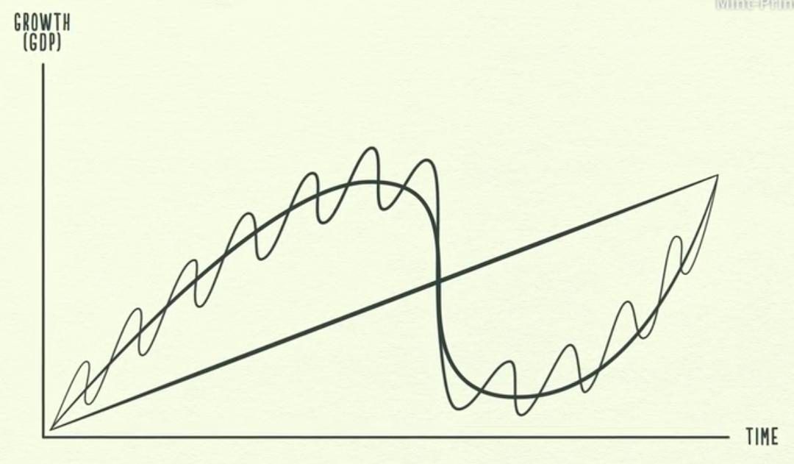
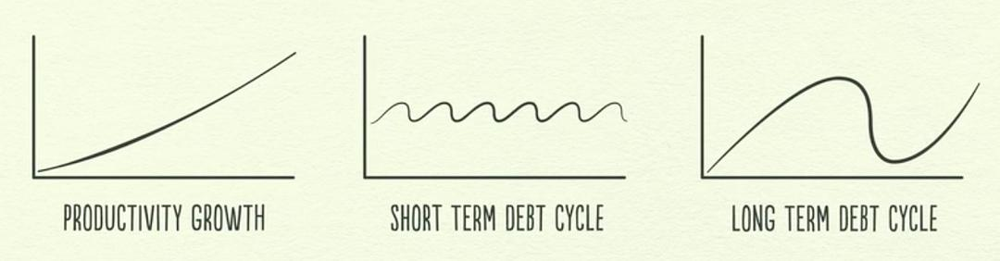

# 经济机器是怎样运行的

经济是由市场中的交易来形成的。交易是是指买方用货币或信用，与卖方交易商品/服务/金融资产。

信贷和交易相同。贷款人和借款人就是交易市场的买方和卖方。信贷产生的原因是贷款人希望自己的钱生出更多的钱，而借款人则想购买当前无法负担的某种东西，比如房子、汽车或是进行投资，比如开办企业，借贷可以同时满足贷款人和借款人的需要。借款人保证偿还借款称为本金，并支付额外的款额称为利息。如果借款人保证偿还债务而且贷款人相信这一承诺，信贷就产生了。信贷一旦产生，立即成为债务。债务是贷款人的资产，是借款人的负债，等到借款人今后偿还了贷款并支付了利息，这些资产和负债将消失，交易得以完成。

但当借款人获得信贷的时候，便可以增加自己的支出。而支出是经济的驱动力，这是因为一个人的支出是另一个人的收入。如果某人收入增加，其信用度就会提高，贷款人就更愿意把钱借给他。信用良好的借款人具备两个条件，**偿还能力**和**抵押物**。收入债务比率高，借款人就具备偿还能力，如果无法偿还，借款人还可以用有价值可以出售的资产作为抵押物，这样贷款人可以放心的把钱借给他们。所以收入增加使得借贷也增加，从而能够增加支出。由于一个人的支出是另一个人的收入，这将导致借贷进一步增加，并不断循环，**这一自我驱动的模式导致经济增长，也正是因为如此才产生了经济周期**。

经济增长现象：收入增加→借贷增加→支出增加→另一个人收入增加→另一个人借贷增加。以此循环

经济变化的现象是由三个驱动力形成的

1、生产率的提高
2、短期债务周期
3、长期债务周期

1. 生产率的提高：

从长期来看，经济增长是取决于我们生产率的提升水平。但经济的上下起伏则取决于社会中信贷的总量。因为现实生活中大部分所谓钱实际上是信贷，美国国内的信贷总额大约50万亿美元，而货币总额只有大约3万亿美元。

2. 短期债务周期，持续5-8年：

1、经济扩张：信贷导致支出增加，如果支出和收入的增长速度超过所生产商品的生产速度，价格就会上涨，产生通货膨胀。

2、宏观调控：央行需要控制通货膨胀。所以看到价格上涨，就会调高利率

3、经济衰退：借钱的人减少，债务成本上升，一个人的支出减少，另一个人的收入也会下降，价格将会下跌，产生通货紧缩。

4、宏观调控：央行看到经济活动减少，衰退严重，就会降低利率，加速经济活动。

总结：**在短期债务周期中，限制周期的唯一因素是贷款人和借款人的贷款和借款意愿。当信贷易于获得，经济就会扩张，信贷不易获得，经济就会衰退，这个周期主要由央行控制。短期债务周期不断重复，在每个周期的低谷和高峰后，经济的增长和债务都超过前一个周期，因为人性具有借更多钱和花更多钱的倾向，但是不喜欢偿还债务。**

### 长期债务周期

1. 经济扩张：随着短期债务周期带来的信贷增加，人们的支出增加，当过渡消费时就会出现泡沫。贷款机构看眼前经济形势很好，继续放款。人们的债务增加，不过收入也以相近的速度增加，从而抵消债务。债务负担=收入/债务，当收入上升，债务可以承受，资产价值上升，人们倾向大量借钱购买资产，因为投资促使资产价格日益升高，从而使信用增加，大家感觉很富有。

2. 到达顶峰：当有一天，偿债成本的增加速度超过收入，人们削减支出，收入开始下降，信用降低，借贷减少，偿债成本继续增加，支出更少，周期开始逆转，这时是长期债务的顶峰 。2008年的美国和欧洲，1989年的日本，美国的1929年，都是同样原因发生了这一情况 

3. 去杠杆化：随着支出和收入的下降，信贷开始消失，资产价格下跌，无法偿还债务，人们出售资产，支出下降的同时，出售市场充斥代售资产，由于信用降低，大家感觉自己很穷。

4. 宏观调控：在衰退的时候，可以通过降低利率刺激贷款。但是在去杠杆化的过程中，降低利率不起作用，因为利率已经很低，接近为0，丧失了刺激功能。美国1930年、2008年去杠杆化区间利率下降到0。去杠杆化时期借款人的债务过重，无法通过降低利率减轻，整个经济体和个人都失去信用度。

5. 如何应对去杠杆化：
   1. 个人、企业、政府，削减支出;
      1. 但是当社会所有人的支出开始减少时，会导致所有人的收入也开始下降。这种消减支出的做法会引起失业和通货紧缩。
   2. 通过债务违约和重组减少债务；
      1. 债务重组，债务重组意味着贷款人得到的还款减少或偿还期延长，或利率低于当初商定的水平，无论如何合约被破坏，结果是债务减少。这意味着收入和资产价值会开始消失。
   3. 财富再分配，将财富从富人转给穷人；
      1. 政府之后会开始增加对富人的征税，以帮助经济中的财富再分配，把财富从富人那里转给穷人。正在困苦当中的穷人开始怨恨富人，承受经济疲弱、资产贬值和增税压力的富人，开始怨恨穷人。如果萧条继续下去就会爆发社会动荡，不仅国家内部的紧张加剧，而且国家之间也会这样。债务国和债权国之间尤其如此。这种局势可以导致政治变革，有时是极端的变革。1930年代这种局势导致希特勒掌权，欧洲爆发战争和美国的大萧条，要求采取行动来结束萧条的压力越来越大。
   4. 央行发行更多货币。
      1. 央行通过用这些货币购买金融资产，帮助推升了资产价格从而提高了人们的信用，但是这仅仅有助于那些拥有金融资产的人。你看，央行可以发行货币，但是只能购买金融资产，而另一方面，中央政府可以购买商品和服务，可以向人民送钱，但是无法印钞票，因此为了刺激经济，央行和政府必须合作。央行通过购买政府债券，其实是把钱借给政府使其能够运行赤字预算，并通过刺激计划和失业救济金来增加购买商品和服务的支出。**这增加了人们的收入，也增加了政府的债务，但是这个办法将降低经济中的总债务负担**。

在去杠杠化的时候，政府是处于一个风险很大的时刻，决策者需要平衡考虑降低债务负担的四种办法，必须平衡兼顾通货紧缩的办法和通货膨胀的办法以便保持稳定，如果取成适当的平衡就可以带来和谐的去杠杆化，所以说去杠杆化可以是痛苦的也可以是和谐的。

对于普通人来说，在现在社会中需要注意的三个原则：

1. 不要让债务增长速度超过收入，因为债务最终会把你压垮。

2. 不要让收入的增长速度超过生产率，因为会使你失去竞争力。

3. 尽一切努力提高生产率，它在长期里起着最关键的作用。

Reference：

How The Economic Machine Works by Ray Dalio
