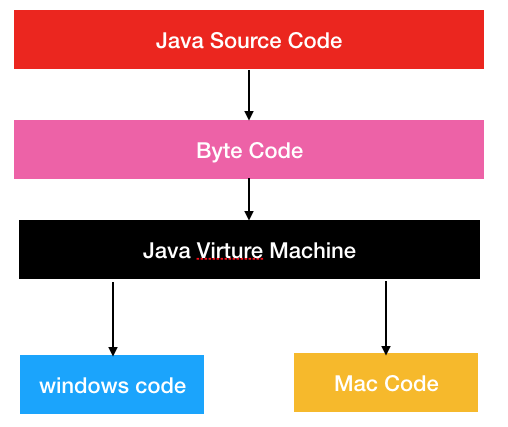

# JVM Study Notes(1)

## Java 运行环境

JRE（Java Runtime Environment）仅包含运行 Java 程序的必需组件，包括 Java 虚拟机以及 Java 核心类库等。而 JDK（Java Development Kit）除了包含 JRE外，还附带了一系列开发、诊断工具。
如果只需要运行 Java 程序，那么你安装 JRE 即可。但如果你要进行 Java 程序的开发，那么你就需要安装 JDK。

## J2SE(Java SE)、J2EE(Java EE)、J2ME(Java ME)

### J2SE

**J2SE** 称之为标准版技术体系（Java 2 Standard Edition），它包含了构成 Java 语言核心的类，例如：数据库连接、网络编程、接口定义等。J2SE 技术体系主要用于桌面应用软件的编程。正因为 J2SE 包含了 JDK 核心类，所以在我们下载 JDK 时，你会看到其实下载处的文字说明是「Java SE 11.0.1 is the latest release for JDK 11」。J2SE 和 Java SE 

### J2EE

**J2EE** 称之为企业版技术体系（Java 2 Enterprise Edition），它除了包含 J2SE 中的类，还包含用于开发企业级应用的类，比如：Servlet、JSP、EJB 等。J2EE 技术体系主要用于分布式的网络程序的开发，如电子商务网站等。

### J2ME

**J2ME** 称之为嵌入式技术体系（Java 2 Micro Edition），它包含 J2SE 中的一部分类。J2ME 技术体系主要用于消费类电子产品的软件开发，例如：手机、PDA、寻呼机等。

