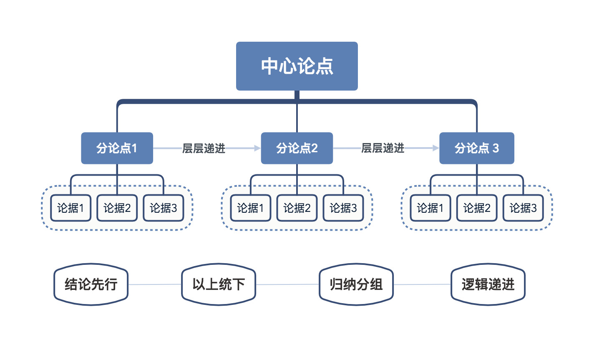
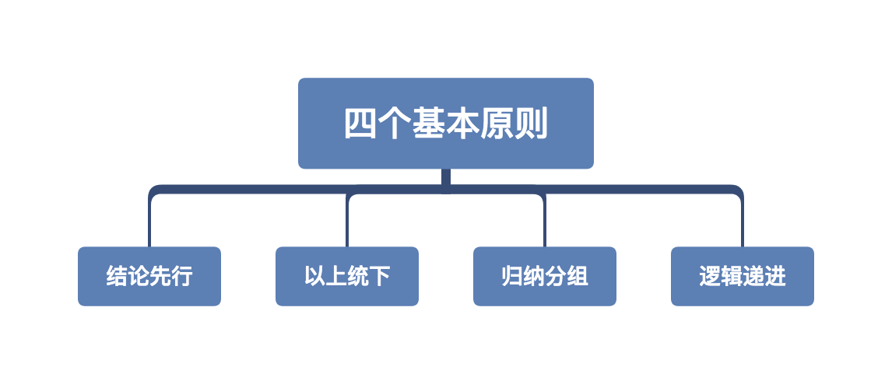
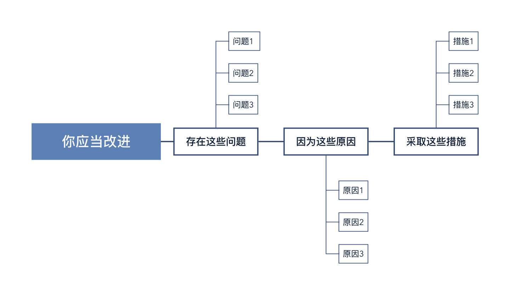
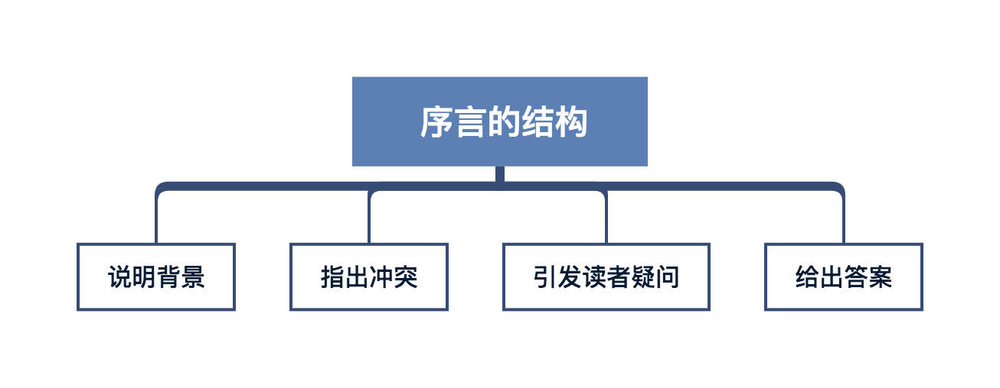

# 金字塔原理

## 金字塔原理

* 任何事情都可以归纳出一个中心论点，而此**中心论点可由三至七个论据**支持，这些一级论据本身也可以是个论点，被**二级的三至七个论据支持**，如此延伸，状如金字塔。

## 金字塔原理的四个基本原则

1. **结论先行**：每篇文章只有一个中心思想，并放在文章的最前面。
2. **以上统下**：每一层次上的思想必须是对下一层次思想的总结概括。最下层要用客观事实或数据来支撑。
3. **归类分组**：每一组中的思想必须属于同一逻辑范畴。
4. **逻辑递进**：每一组中的思想必须按照逻辑顺序排列。

## 金字塔内部结构的逻辑关系

### 纵向结构（疑问 / 回答式对话）

纵向关系能很好地吸引读者的注意力，通过纵向联系，可以引导一种疑问 / 问答式的对话。一来可以引发读者兴趣，二来可以让读者按照你的思路产生符合逻辑的反应。

当你要论证一个观点的时候，可以通过不断的追问和回答，来推进整体的论述。比如下面“猫适合当宠物”的观点。

### 横向结构 （演绎 / 归纳，MECE 原则）

在金字塔的横向结构中，同一组中的思想之间存在着逻辑顺序。具体的顺序取决于该组想法之间的逻辑关系是演绎推理关系，还是归纳推理关系。一般来说，**归纳推理优于演绎推理**。

**演绎推理**: 1)出现的问题或存在的现象. 2)产生问题的根源 / 原因. 3)解决问题的方案

**归纳推理**: 将具有共同点的事实、思想或观点归类分组，并概括其共同性。

其中在归纳时，应遵循 MECE 原则：

各部分之间相互独立，相互排斥，没有重叠。（Mutually Exclusive ）
所有部分完全穷尽，没有遗漏。（Collectively Exhaustive）

### 序言结构

让读者察觉到相关性，才能有效地吸引读者的注意力。因为读者只有在需要了解问题的答案时才会去找答案。序言可以用讲故事的方式，类似**背景-冲突-疑问-问答**的呈现方式。

1. 给出背景
2. 冲突
   1. 将事物大方面的冲突片面具象化
   2. 突出忧虑，激发挑战
   3. 指明大众对某种事物有错误的认知
3. 疑问
4. 问题

## 如何构建金字塔结构

### 自上而下法

1. 提出主题思想

2. 设想受众的主要疑问

3. 写序言：背景-冲突-疑问-回答

4. 与受众进行疑问 / 回答式对话

5. 对受众的新疑问，重复进行疑问 / 回答式对话

### 自下而上法

1. 尽可能列出所有思考的要点

2. 找出关系，进行分类（找出要点间的逻辑关系，利用 MECE 原则归类分组）

3. 总结概括要点，提炼观点

4. 观点补充，完善思路
