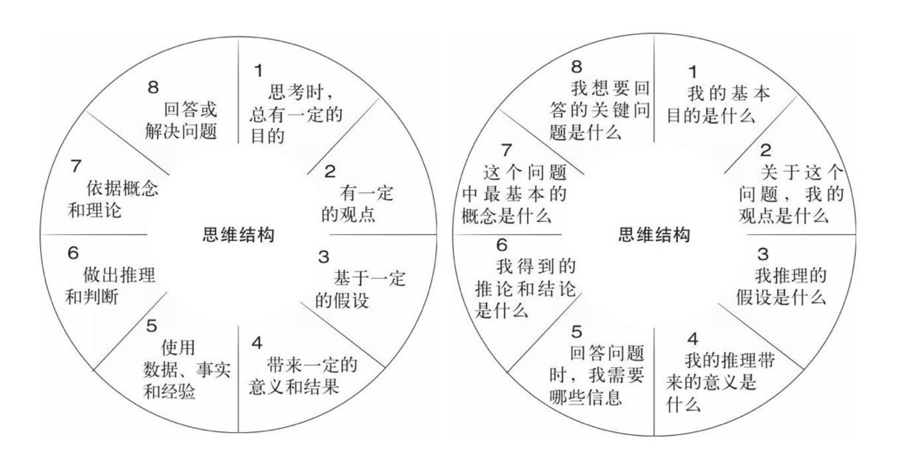

# 批判性的思维

## 信息的失真

在现实世界中，信息的产生，传播，还有接收是会不断发生畸变的。

1. 传播者的局限性：信息的最初传播者会有客观的知识盲区和主观的思维偏见。

2. 传播媒介的局限性：传播信息的媒介（网络，媒体）很难获取完整信息的客观条件和其本身的偏好，会让信息发生畸变。

3. 接收者的局限性：作为信息的接收者，我们有客观的认知盲区和主观上的偏见喜好。这会让我们无意识的对信息加工。导致信息的失真。

## 批判性的思维

**批判性思维是针对相信什么或做什么的决定，而进行的理性的反省思维**。其内核是以用开放性和包容性的思想对得到的信息进行怀疑，探究和实证。批判性的思维的入门可以通过**提问**。

### 提问的方法

#### 5 WHY提问法

利用5Why进行根本原因分析时，一定要把握好一些基本原则：
1）回答的理由是受控的；
2）询问和回答是在限定的一定的流程范围内；
3）从回答的结果中，我们能够找到行动的方向。

#### 苏格拉底式提问法

**澄清问题**：即明确问题的概念和边界，发问方式包括：这个问题的意思是什么？为什么会有这样的问题？是什么让你有这样的问题？
**澄清假设**：即明确问题的假设，发问方式为：你这个问题的假设是什么？为什么会有这样的假设？你如何证明这个假设？
**明确推论**：即明确是如何推论的，发问方式为：你是如何得出这一结论的？你为什么相信这是真的？是否有理由怀疑这一结果呢？
**探索其他观点**：即找出是否有不同的观点，发问方式为：对这个问题，其他人有什么看法？别的不同的观点是什么？还有其他的可能吗？
**探究结果**：发问方式为：这个问题会带来什么结果呢？会有什么隐藏的影响吗？这个结果真的有发生的可能吗？
**回归原问题**：发问方式为：最初的那个问题，有新的答案了吗？

#### 思维结构提问法

